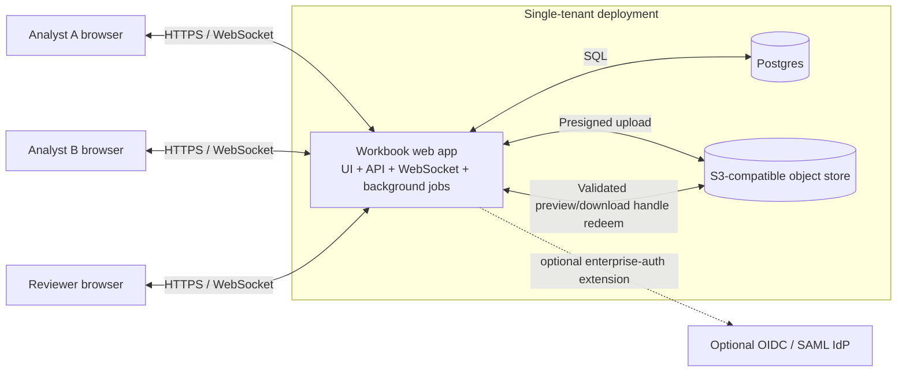
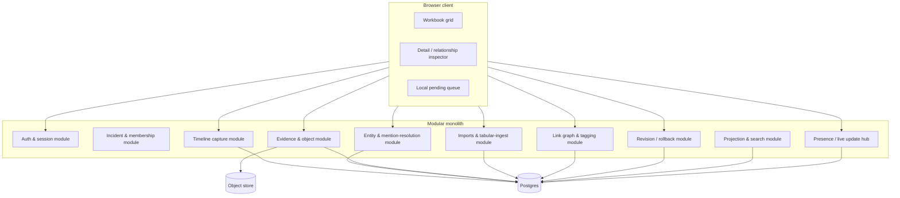
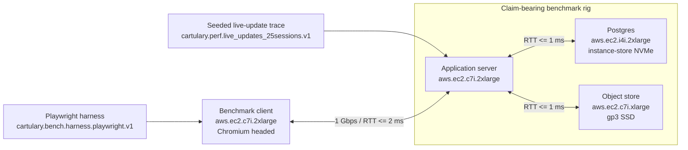

# Appendix B: Architecture Diagrams and Explanatory Source Extract

This appendix is **non-normative**.

It preserves the architecture-oriented explanatory material, diagrams, tables, and rationale from the exploratory source artifact.

## 4. Recommended architecture

### Primary recommendation

The controlling current-profile topology contract is Core 01 §1. This subsection preserves explanatory rationale and diagrams only.

The exploratory source recommended a **single web application container** (UI + API + WebSocket hub + background jobs) with **Postgres** and **S3-compatible object storage** as separate services. That recommendation corresponds to the current normative modular-monolith topology rather than creating a second authority.

### System context diagram



### Container/component diagram



### Major components

| Component                   | Concrete responsibility                                                                                |
| --------------------------- | ------------------------------------------------------------------------------------------------------ |
| Browser client              | Virtualized grid, keyboard navigation, paste handling, inspector, evidence preview, presence UI        |
| Auth module                 | Local accounts, sessions, MFA, and optional OIDC/SAML provider mapping                                  |
| Timeline module             | Rapid row creation, inline edits, rough capture storage                                                |
| Entity module               | Host/identity records, aliases, unresolved mentions, resolution workflows                              |
| Evidence module             | Evidence lifecycle, upload finalization, object metadata, same-origin handle issuance and redemption, safe preview transforms, blocked preview states, linking evidence to records        |
| Imports & tabular-ingest module | CSV/XLSX adaptation, workbook inspection, preview/header mapping, provenance capture, compatibility shims, and background import apply |
| Link graph & tagging        | Typed relationships and lightweight labels                                                             |
| Revision module             | Change sets, mutation-entry history, row-centric revisions, rollback                                   |
| Projection & search         | Build `*_grid_projection` tables and search vectors for sheet-like views                               |
| Reference data module       | Reference-pack manifests, type/icon registries, framework mappings, integrity verification             |
| Reporting & snapshot module | Immutable incident snapshots, canonical export-model generation, self-contained report/render pipeline |
| Collaboration hub           | WebSocket presence and live row updates                                                                |

#### Illustrative local pending queue realization note

One conformant realization is an in-memory queue keyed by `(incident_id, client_instance_id, enqueue_seq)`. A not-yet-authoritative local row may carry a provisional local row token until the first authoritative create succeeds. Same-record coalescing can replace queued units in place only within one contiguous same-record run and only without changing queue order. The base profile does not require reload durability, cross-tab sharing, IndexedDB, Service Workers, or any other named client mechanism.

### Preferred architecture pattern

This appendix preserves the rationale for the Core 01 §1 modular-monolith choice. The exploratory source argued that a **modular monolith** is the right fit. This problem’s complexity is in mutation semantics, projections, and UX; microservices would add operational and debugging cost without helping the hardest problem. A single codebase with clear module boundaries is easier to deploy in a flyaway kit, easier to reason about during incident work, and easier to ship with deterministic versions.

### Module boundaries

I would define internal module boundaries as:

- `auth`
- `incidents`
- `timeline`
- `entities`
- `evidence`
- `imports`
- `links`
- `revisions`
- `projections`
- `reference_data`
- `reporting`
- `collaboration`

These are internal packages/modules with explicit service interfaces, not separate deployables.

The exploratory source drew one boundary especially sharply: clipboard interaction stays on the core workbook hot path, while file-based import sits behind a dedicated `imports` module. Clipboard, CSV, and XLSX adapters can still normalize into the same canonical `TabularSource` and shared mapping engine, but parser drift, workbook-shape heuristics, preview/header mapping, and other spreadsheet-compatibility maintenance sit with the imports module in that realization.

The exploratory source treated a bounded import contract as more realistic than “Excel support” in the abstract. Its initial file-based onboarding path focused on CSV and selected-sheet or selected-region XLSX import, preserved provenance and unknown columns, treated formulas as inert input, and warned, downgraded, or rejected unsupported workbook features instead of leaking those semantics into the core workbook modules.

#### Upload-envelope implementation note

For the three upload-style extension routes `POST /api/v1/import-sessions`, `POST /api/v1/reference-packs/import`, and `POST /api/v1/incident-bundles/import`, the exploratory source concentrated envelope parsing in one shared ingress utility rather than three family-specific parsers. In that realization, request handling terminated at the wire boundary: the utility required `multipart/form-data`, exactly one `metadata` part plus one `file` part, early rejection of duplicate or unexpected parts, and handoff to the owning module as a parsed metadata object plus raw file bytes or a staged byte stream.

A streaming parser is compatible with that contract, but it still needs fail-closed behavior before durable state or job admission. In practice that means rejecting a second `metadata` or `file` part, rejecting nested multipart bodies, rejecting non-UTF-8 or BOM-bearing metadata, and rejecting malformed JSON or duplicate metadata keys before durable resource creation, idempotency commit, or background-job creation.

In that realization, a language or JSON library that accepts duplicate object keys by last-write-wins still required an additional duplicate-key check on the raw metadata bytes, or a parser mode that rejected them. Filenames and multipart headers remained advisory metadata only, and file-type trust came from byte-level verification in the owning import, reference-pack, or incident-bundle module after envelope acceptance.

### Storage choices

- **Postgres** stores all structured records, metadata, links, revisions, tags, saved views, projections, reference-pack manifests, and snapshot metadata.
- **S3-compatible object storage** stores binary evidence and optional rendered export artifacts. In flyaway/on-prem, use **MinIO**. In cloud, use native S3/GCS/Azure Blob behind the same abstraction.
- **Reference packs** such as ATT&CK/D3FEND/VERIS mappings, host/evidence type registries, and other optional vocabularies version separately from incident records. Their manifests and integrity metadata belong in Postgres; pack payloads may live on local disk or object storage behind the same abstraction.
- Do **not** store large binary evidence in Postgres. It bloats backups, complicates restore times, and makes portability worse.

### Deployment configuration examples

The examples below are illustrative only. Core 04 §12 remains the normative owner of the deployment-configuration contract.

#### Example 1: disconnected `config.toml`

```toml
config_schema_id = "cartulary.deployment_config.v1"
deployment_profile = "disconnected"
bootstrap.first_admin_manifest_path = "/run/secrets/cartulary-bootstrap-admin.json"

[roots.database_storage]
binding_kind = "filesystem_root"
path = "/var/lib/cartulary/postgres"

[roots.object_storage]
binding_kind = "filesystem_root"
path = "/var/lib/cartulary/object-store"

[roots.backup_storage]
binding_kind = "filesystem_root"
path = "/var/lib/cartulary/backups"

[roots.reference_pack_storage]
binding_kind = "filesystem_root"
path = "/var/lib/cartulary/reference-packs"

[roots.temporary_work]
binding_kind = "filesystem_root"
path = "/var/lib/cartulary/tmp"

[roots.export_outputs]
binding_kind = "filesystem_root"
path = "/var/lib/cartulary/exports"
```

#### Example 2: externalized `config.toml`

```toml
config_schema_id = "cartulary.deployment_config.v1"
deployment_profile = "cloud"
bootstrap.first_admin_manifest_path = "/run/secrets/cartulary-bootstrap-admin.json"

[roots.database_storage]
binding_kind = "managed_service"
service_ref = "postgres.primary"

[roots.object_storage]
binding_kind = "managed_service"
service_ref = "object.primary"

[roots.backup_storage]
binding_kind = "managed_service"
service_ref = "backup.primary"

[roots.reference_pack_storage]
binding_kind = "filesystem_root"
path = "/var/lib/cartulary/reference-packs"

[roots.temporary_work]
binding_kind = "filesystem_root"
path = "/var/lib/cartulary/tmp"

[roots.export_outputs]
binding_kind = "filesystem_root"
path = "/var/lib/cartulary/exports"
```

#### Example 3: disconnected container mounts

```yaml
services:
  app:
    volumes:
      - /etc/cartulary/config.toml:/etc/cartulary/config.toml:ro
      - /var/lib/cartulary/bootstrap/cartulary-bootstrap-admin.json:/run/secrets/cartulary-bootstrap-admin.json:ro
      - /var/lib/cartulary/backups:/var/lib/cartulary/backups
      - /var/lib/cartulary/reference-packs:/var/lib/cartulary/reference-packs
      - /var/lib/cartulary/tmp:/var/lib/cartulary/tmp
      - /var/lib/cartulary/exports:/var/lib/cartulary/exports

  postgres:
    volumes:
      - /var/lib/cartulary/postgres:/var/lib/postgresql/data

  minio:
    volumes:
      - /var/lib/cartulary/object-store:/data
```

Missing required runtime-root keys remain invalid at runtime even when the official disconnected examples use canonical paths.

The read-only bootstrap manifest mount above remains conformant because one-time bootstrap semantics derive from persisted deployment-local completion state, not from deleting or mutating the manifest file after consumption.

#### Example 3a: illustrative bootstrap-admin manifest

```json
{
  "bootstrap_schema_id": "cartulary.bootstrap_admin.v1",
  "bootstrap_artifact_id": "00000000-0000-0000-0000-000000000001",
  "email": "admin@example.com",
  "display_name": "Deployment Admin",
  "initial_password": "correct horse battery staple 123",
  "mfa_required": true
}
```

#### Illustrative operator note: bootstrap failure modes

- `bootstrap_manifest_path_missing`: the configured path does not exist when bootstrap is required.
- `bootstrap_manifest_schema_invalid`: the file parses but does not satisfy `cartulary.bootstrap_admin.v1`.
- `bootstrap_email_conflict`: the manifest email already exists on a local user row.
- `bootstrap_recovery_not_supported`: the deployment has no active deployment admin but already has a persisted bootstrap-completion marker.

#### Example 4: illustrative resource-limit registry excerpt

```toml
[limits.object_blobs]
max_declared_byte_size = 536870912

[limits.imports]
max_csv_source_bytes = 33554432
max_xlsx_source_bytes = 67108864
max_rows = 100000
max_columns = 256
max_cells = 5000000

[limits.archives]
default_max_extracted_bytes = 2147483648
max_compression_ratio = 100
max_members = 10000

[limits.reference_packs]
max_extracted_bytes = 536870912

[limits.incident_bundles]
max_extracted_bytes = 68719476736

[limits.previews]
max_previewable_payload_bytes = 33554432
max_text_inline_bytes = 1048576
```


### Illustrative benchmark topology and benchmark-manifest example

The examples below are illustrative only. Core 05 remains the normative owner of the claim-bearing benchmark profile, benchmark-manifest contract, and measurement-predicate registry. These examples do not create alternate thresholds or alternate profile identifiers.

#### Example 5: claim-bearing benchmark topology



#### Example 6: illustrative `benchmark_manifest.json`

```json
{
  "benchmark_manifest_schema_id": "cartulary.benchmark_manifest.v1",
  "benchmark_profile_id": "cartulary.perf.desktop_ref.v1",
  "criterion_ids": ["AC-043", "AC-044"],
  "measurement_predicate_ids": [
    "perf.selection_change.v1",
    "perf.focus_change.v1",
    "perf.typing_ack.v1",
    "perf.timeline_blank_row_create.v1",
    "perf.view_change.first_useful_viewport.v1",
    "perf.view_change.stable_viewport.v1"
  ],
  "fixture_ids": ["fixture_a"],
  "traffic_trace_id": "cartulary.perf.live_updates_25sessions.v1",
  "seed": 20260405,
  "warmup_passes": 1,
  "browser_engine": "chromium",
  "browser_build": "134.0.6998.35",
  "client_runner_id": "aws.ec2.c7i.2xlarge",
  "client_os_image_id": "cartulary.bench.ubuntu_24_04_client.2026q1",
  "app_runner_id": "aws.ec2.c7i.2xlarge",
  "app_os_image_id": "cartulary.bench.ubuntu_24_04_app.2026q1",
  "postgres_runner_id": "aws.ec2.i4i.2xlarge",
  "postgres_os_image_id": "cartulary.bench.ubuntu_24_04_postgres.2026q1",
  "postgres_storage_class": "instance_store_nvme",
  "object_store_runner_id": "aws.ec2.c7i.xlarge",
  "object_store_os_image_id": "cartulary.bench.ubuntu_24_04_object.2026q1",
  "object_store_storage_class": "gp3_ssd",
  "benchmark_harness_id": "cartulary.bench.harness.playwright.v1",
  "benchmark_harness_version": "2026.04.0",
  "run_started_at": "2026-04-05T12:00:00Z",
  "run_completed_at": "2026-04-05T12:08:00Z",
  "sample_count": 100,
  "artifact_bundle_sha256": "3c4e14d2c8f4d19c2f8c9a04d5f0b90d5d8e4fca6b6ef1bc6a4e2a7c3a35d8f1",
  "security_controls_state": "enabled"
}
```

#### Example 7: illustrative network-shaping recipe

```bash
# Cap client-to-app throughput at 1 Gbps and apply symmetric delay so effective RTT
# stays at or below 2 ms with jitter at or below 1 ms and no packet loss.
tc qdisc replace dev eth0 root handle 1: tbf rate 1000mbit burst 256kb limit 1mbit
tc qdisc add dev eth0 parent 1:1 handle 10: netem delay 1ms 0.5ms loss 0%

# Apply the same recipe in the reverse direction on the paired link.
```

### Reference packs, type registries, and view contracts

- Incident records, evidence envelopes, revisions, saved views, and report snapshots are **incident data**.
- Framework mappings, type/icon registries, evidence vocabularies, and optional enrichment datasets are **reference packs** that version independently of incidents.
- Each built-in sheet or system view is declared by a **`view_schema`** contract that names the source record types, computed columns, required reference packs, default sort key, filter semantics, and write-back rules.
- For required base coordination surfaces `cartulary.view.comm_log.v1`, `cartulary.view.handoff.v1`, `cartulary.view.status_review.v1`, and `cartulary.view.lesson.v1`, the `view_schema_id` is the canonical public workbook-surface identity. Helper or preset saved views over the same schema are separate, non-canonical objects.
- The current core does not standardize pack-dependent ATT&CK, D3FEND, or VERIS workbook `view_schema` surfaces.
- The exploratory source treated any future framework workbook surface as a separate standardized contract problem, with its own canonical `view_schema_id`, required pack keys, field registry, discoverability, writeability, degradation, and export behavior.
- The same source assumed the core workbook remained usable when optional reference packs were absent: missing packs could degrade overlays or labels, but they did not block capture or editing.
- Verification and activation were treated as integrity-checked steps rather than ad hoc file loading.

### Backup, restore, portability, failure modes

Operational backup and restore are current-profile deployment-local recovery contracts. Incident portability is separate and transfers one incident's authoritative state between trusted deployments; it is not a substitute for retained deployment backups.

One useful operational model is:

- **`backup_set`**: one retained operational backup unit that binds one Postgres restore anchor and one object-store restore anchor to one declared `consistency_point_at`.
- **`backup_attestation`**: one durable structured metadata record for a successful `backup_set`, carrying the selected restore anchors, retention floor, and restore-verification state.
- **Projection tables**: disposable caches. They may be rebuilt and are not authoritative backup inputs.
- **Deployment-local runtime state**: sessions, presigned URLs, temporary work files, export outputs, client-local drafts, and similar caches remain outside the authoritative backup set.

Illustrative `backup_attestation` object:

```json
{
  "backup_set_id": "bset_2026_04_06_0001",
  "consistency_point_at": "2026-04-06T11:45:00Z",
  "postgres_restore_anchor": "pg:base-2026-04-06T11:45:00Z",
  "object_store_restore_anchor": "obj:versioned-bucket-2026-04-06T11:45:00Z",
  "created_at": "2026-04-06T11:46:12Z",
  "retained_until": "2026-05-06T11:46:12Z",
  "verification_state": "verified",
  "last_verified_restore_at": "2026-04-06T18:30:00Z"
}
```

Equivalent-mechanism examples:

- Postgres base backup plus WAL archiving paired with object-store bucket versioning or snapshotting.
- A crash-consistent snapshot group that captures the Postgres volume, the object-store volume or namespace restore anchor, and the matching `backup_attestation` for one declared consistency point.
- Managed Postgres snapshots paired with object-store versioned restore anchors, provided the deployment can prove one named `backup_set`, one retained consistency point, and the same restore-verification contract.

Illustrative restore-drill checklist:

1. Select one retained `backup_set` and verify its attestation plus integrity material.
2. Restore Postgres from that `backup_set`.
3. Restore object-store bytes from that same `backup_set`.
4. Rebuild projections.
5. Open at least one incident and run at least one built-in workbook query.
6. Confirm no evidence/blob invariant violations before treating the restore as ready.

Arbitrary cross-store point-in-time restore to an operator-supplied timestamp is future scope rather than a base requirement. The current profile standardizes coherent restore of retained `backup_set` objects. That keeps the contract portable across filesystem, snapshot, and managed-service realizations without forcing one vendor-specific PITR mechanism.

- **Portability**: the exploratory source treated whole-incident export/import as a manifest plus NDJSON/CSV plus referenced blobs archive. Portability bundles remained distinct from retained `backup_set` recovery artifacts.
- **Failure modes**:
  - App container down: sessions drop, no data loss.
  - Postgres down: system unavailable.
  - Object store down: rows remain editable, but evidence upload/download fails.
  - Missing or mismatched `backup_set` artifacts or integrity material: restore fails before the environment is ready.
  - Projection corruption: rebuild from source tables; source of truth remains intact.

### Projections for grid-like views

The exploratory source argued against using Postgres materialized views for hot workbook screens because their refresh semantics were too coarse for row-by-row collaborative editing. It instead used **projection tables** such as:

- `timeline_grid_projection`
- `host_grid_projection`
- `identity_grid_projection`
- `artifact_grid_projection`
- `evidence_grid_projection`
- `indicator_grid_projection` over canonical indicator records, with observation-derived counts and lifecycle summaries

In that realization, each projection table is **one row per primary record**, denormalized for sheet use. For the Indicators system view, the primary record is the canonical indicator, not the source artifact or observation row. The app updated affected projection rows in the same transaction as the source write. Every projection row exposed to the client carried the stable `record_id` and `row_version` used for optimistic writes, and the client did not infer identity from row position or displayed values. If needed, a rebuild command regenerated the projections.

### Report and presentation export direction

The exploratory source treated reports and presentation artifacts as a **subsystem**, not as direct ad hoc reads from live workbook tables. In that model, the system captured a `snapshot_at`, materialized a canonical export model such as `incident_report_model.json`, and rendered derivative outputs like Markdown reports, Mermaid diagram sources, Slidev decks, and HTML reports from that immutable view.

In that model, UI visualizations, report sections, framework rollups, and future exports all consumed the same canonical derivation/query layer, or an explicitly versioned snapshot of it. That kept filtering, counts, and inclusion semantics consistent across interactive and exported surfaces, provided stable exported identifiers and ordering, and created a clean place to apply redaction rules. It also left room for operator-facing reenactment surfaces, such as Asciinema-style terminal walkthroughs generated from selected command-line evidence, while maintaining a clear distinction between source evidence and generated presentation material.

In that model, generated report artifacts were **self-contained**: they did not depend on remote JS, CSS, or font assets at render time. Report builds, snapshot generation, and heavy presentation rendering ran as background jobs so live grid editing remained responsive.

### Long-running operations and background jobs

The exploratory source treated lookups, imports, reference-pack refreshes, snapshot generation, report builds, and evidence processing as background jobs with progress, cancellation, retry-safe status, and non-blocking UI behavior. Grid editing and row creation remained responsive while those jobs ran.
