# Appendix D: Workflow and UI Illustrations Source Extract

This appendix is **non-normative**.

It preserves the workflow sequence diagrams, UI mockups, and explanatory interaction notes from the exploratory source artifact.

## 8. Record lifecycle and IR workflow model

### Lifecycle

The workflow phrase below is explanatory only. The authoritative contract is Core 03 §6.

**rough capture → enriched → linked → reviewed → superseded / rolled back**

In the current profile, `linked` is a derived milestone rather than a persisted `capture_state`, and `rolled back` is a reviewer-history outcome rather than a persisted lifecycle state. The important point is that the rough capture remains recoverable. Normalization adds structure; it does not erase the original analyst input.

### 1. Rapid creation of a timeline event

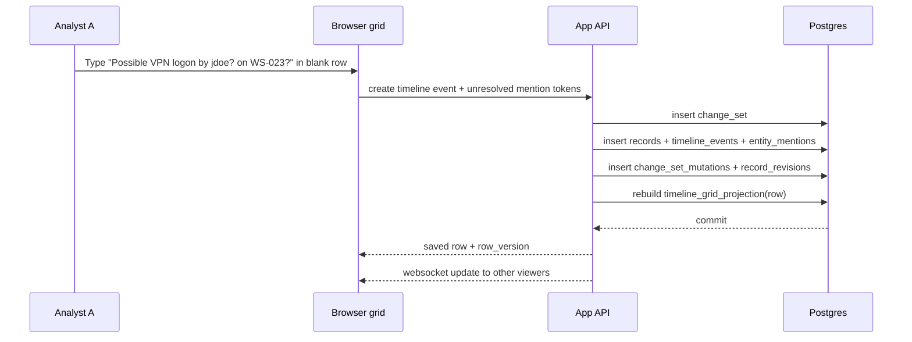

Concrete scenario: Analyst A creates a row with a nullable `occurred_at`, summary text, and raw mention tokens `jdoe?` and `WS-023?`. The system does **not** block on missing canonical identity/host.

### 2. Attachment of a screenshot or other evidence object

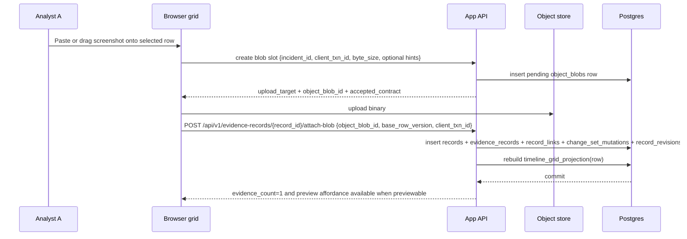

Important design choice: upload is **two-step** so incomplete uploads do not leave fake evidence attached. The create request carries the incident anchor, an idempotency key, one declared size contract, and optional advisory or integrity hints, and the response echoes `accepted_contract` so later finalization can compare against one server-accepted contract. When finalizing onto an existing evidence record, the public step-2 route is `POST /api/v1/evidence-records/{record_id}/attach-blob`, and that step uses record-scoped optimistic concurrency via `base_row_version` plus route-scoped `client_txn_id` idempotency. Replaying the same create request across a lost response returns the same slot; replay does not refresh an expired target; terminal size or expected-hash mismatch at finalization fails the slot rather than attaching evidence anyway. Abandoned pending blobs are cleaned up later. The same evidence model also supports requested-but-not-yet-received evidence: an evidence record can be created in `requested` or `pending_receipt` state with no blob, then later advanced to `received` or `available` as custody events and uploads occur.

### 2a. Evidence preview and download access

```mermaid
sequenceDiagram
    participant UI as Browser grid / inspector
    participant App as App API
    participant PG as Postgres
    participant OBJ as Object store

    UI->>App: POST /preview-handle {} or POST /download-handle {}
    App->>PG: validate session, incident membership, evidence/blob state
    App-->>UI: opaque same-origin href + expires_at + single_use + preview/media metadata
    UI->>App: GET /api/v1/evidence-handles/{handle_token}
    App->>PG: re-check session, membership, and current evidence/blob state
    alt redeem allowed
        App->>OBJ: fetch source bytes or derived safe preview bytes
        OBJ-->>App: bytes
        App-->>UI: inline preview bytes or validated download response
    else blocked or unsupported
        App-->>UI: explicit error; no silent fallback
    end
```

The handle returned to the browser is same-origin and opaque. The browser redeems it through the application, not by constructing raw object-store URLs, and blocked preview states surface explicitly instead of silently collapsing into download. Handle issuance intentionally uses `{}` only, does not take `client_txn_id`, and mints a fresh handle on each success rather than using issuance idempotency.

### 2b. Canonical full-row and sparse patch examples

The examples below are illustrative only. The authoritative wire contract remains Core 01 §3.3.4, §3.3.5, §3.3.10, and §7.4.

#### Example: Evidence query row as `view_row_v1`

```json
{
  "record_id": "rec_evidence_01",
  "row_version": 12,
  "cells": {
    "evidence.title": { "value": "EDR package for WS-023" },
    "evidence.collector_party_text": { "value": "IR Vendor" },
    "evidence.collector_party_id": { "value": null },
    "evidence.source_party_text": { "value": "Endpoint team" },
    "evidence.source_party_id": { "value": "pty_22" },
    "evidence.upload_state": { "value": "available" }
  }
}
```

#### Example: Row-refreshing create or patch success

```json
{
  "data": {
    "view_schema_id": "cartulary.view.evidence.v1",
    "change_set_id": "chg_01",
    "row": {
      "record_id": "rec_evidence_01",
      "row_version": 13,
      "cells": {
        "evidence.title": { "value": "EDR package for WS-023" },
        "evidence.collector_party_text": { "value": "IR Vendor" },
        "evidence.collector_party_id": { "value": null },
        "evidence.source_party_text": { "value": "Endpoint team" },
        "evidence.source_party_id": { "value": "pty_22" },
        "evidence.upload_state": { "value": "available" }
      }
    }
  }
}
```

#### Example: Replayable sparse collaboration patch as `view_row_patch_v1`

```json
{
  "view_schema_id": "cartulary.view.evidence.v1",
  "change_kind": "patch",
  "patch_cells": {
    "record_id": "rec_evidence_01",
    "row_version": 14,
    "cells": {
      "evidence.collector_party_id": { "value": null },
      "evidence.edited_at": { "value": "2026-04-06T11:57:00Z" }
    }
  }
}
```

#### Example: Canonical `presence_snapshot`

```json
{
  "type": "presence_snapshot",
  "incident_id": "inc_01",
  "event_id": "evt_01",
  "emitted_at": "2026-04-06T12:00:00Z",
  "payload": {
    "presences": [
      {
        "connection_id": "conn_01",
        "user_id": "usr_01",
        "display_name": "Analyst A",
        "sheet_ref": {
          "kind": "view_schema",
          "id": "cartulary.view.timeline.v1"
        },
        "mode": "editing",
        "record_id": "rec_timeline_01",
        "field_key": "timeline.summary",
        "observed_at": "2026-04-06T12:00:00Z",
        "expires_at": "2026-04-06T12:00:45Z"
      },
      {
        "connection_id": "conn_02",
        "user_id": "usr_02",
        "display_name": "Analyst B",
        "sheet_ref": {
          "kind": "view_schema",
          "id": "cartulary.view.timeline.v1"
        },
        "mode": "viewing",
        "observed_at": "2026-04-06T12:00:01Z",
        "expires_at": "2026-04-06T12:00:46Z"
      }
    ]
  }
}
```

#### Example: Canonical `record_changed` patch envelope

```json
{
  "type": "record_changed",
  "incident_id": "inc_01",
  "event_id": "evt_02",
  "emitted_at": "2026-04-06T12:00:02Z",
  "stream_seq": 1842,
  "payload": {
    "record_id": "rec_evidence_01",
    "row_version": 14,
    "change_set_id": "chg_02",
    "actor_user_id": "usr_01",
    "changed_field_keys": [
      "evidence.collector_party_id",
      "evidence.edited_at"
    ],
    "affected_views": [
      {
        "view_schema_id": "cartulary.view.evidence.v1",
        "change_kind": "patch",
        "patch_cells": {
          "record_id": "rec_evidence_01",
          "row_version": 14,
          "cells": {
            "evidence.collector_party_id": { "value": null },
            "evidence.edited_at": { "value": "2026-04-06T11:57:00Z" }
          }
        }
      }
    ]
  }
}
```

#### Example: Lifecycle-only `record_changed` with empty `changed_field_keys[]`

```json
{
  "type": "record_changed",
  "incident_id": "inc_01",
  "event_id": "evt_03",
  "emitted_at": "2026-04-06T12:00:03Z",
  "stream_seq": 1843,
  "payload": {
    "record_id": "rec_evidence_01",
    "row_version": 15,
    "change_set_id": "chg_03",
    "actor_user_id": "usr_02",
    "changed_field_keys": [],
    "affected_views": [
      {
        "view_schema_id": "cartulary.view.evidence.v1",
        "change_kind": "invalidate"
      }
    ]
  }
}
```

Default-hidden party-reference fields such as `evidence.collector_party_id`, `evidence.source_party_id`, and `task.requester_party_id` supplement preserved text fields. They still travel on full row payloads even when not shown in the default grid, and sparse patch rows omit them only when unchanged rather than because they are hidden.

### 3. Later linkage of the event to canonical host and identity records

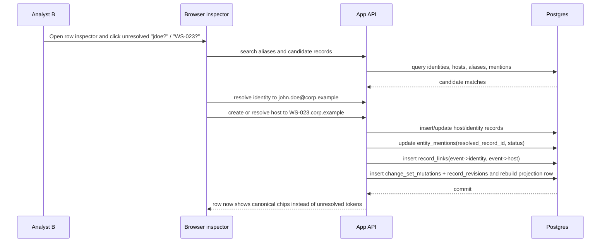

This is the core progressive-structuring workflow. The timeline row stays fast to create, but later becomes relationally useful.

#### Example: Manual Timeline resolution persists `confidence: null`

The example below is illustrative only. The authoritative contract remains Core 01 §3.3.5, Core 01 §7.4.1, and Core 02 §12.3.

```http
PATCH /api/v1/records/{record_id}
```

```json
{
  "view_schema_id": "cartulary.view.timeline.v1",
  "base_row_version": 42,
  "client_txn_id": "txn_timeline_manual_host_link_01",
  "changes": [
    {
      "field_key": "timeline.host_refs",
      "action_payload": {
        "kind": "collection_actions_v1",
        "actions": [
          {
            "op": "resolve_item",
            "item_ref": "entity_mention:em_01",
            "resolved_record_id": "rec_host_01"
          }
        ]
      }
    }
  ]
}
```

Illustrative resulting persisted link metadata:

```json
{
  "record_link_id": "lnk_01",
  "link_type": "observed_on_host",
  "provenance": "manual",
  "confidence": null
}
```

#### Example: Relationship mutation that illegally includes `confidence`

The example below is illustrative only. The authoritative contract remains Core 01 §3.3.5 and Core 01 §7.4.

```http
PATCH /api/v1/records/{record_id}
```

```json
{
  "view_schema_id": "cartulary.view.timeline.v1",
  "base_row_version": 42,
  "client_txn_id": "txn_timeline_manual_host_link_bad_01",
  "changes": [
    {
      "field_key": "timeline.host_refs",
      "action_payload": {
        "kind": "collection_actions_v1",
        "actions": [
          {
            "op": "resolve_item",
            "item_ref": "entity_mention:em_01",
            "resolved_record_id": "rec_host_01",
            "confidence": 88
          }
        ]
      }
    }
  ]
}
```

```json
{
  "error": {
    "code": "invalid_mutation_payload"
  }
}
```

### 3.0 Bootstrap first deployment admin during startup

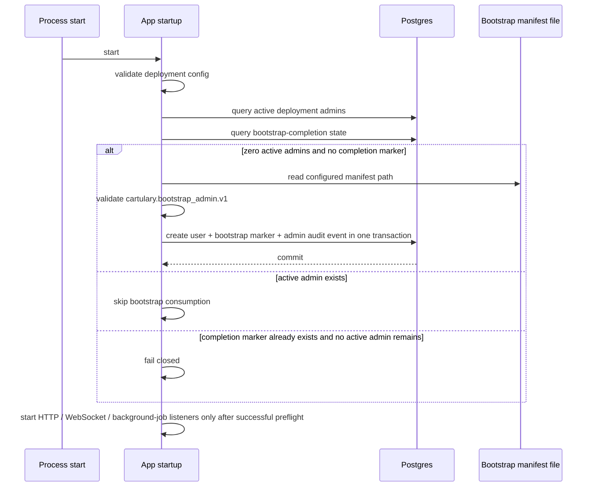

The bootstrap-created user's first login then follows the existing TOTP setup flow in **3A. First login requiring TOTP setup** unchanged.

### 3A. First login requiring TOTP setup

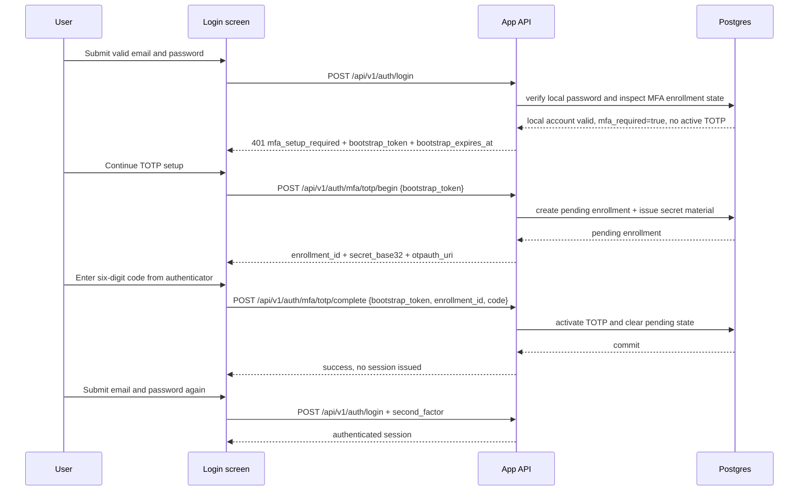

This keeps the base profile on an administrator-assisted recovery model while still making first-time MFA enrollment deterministic and interoperable.

### 3B. Lost-device recovery through administrator TOTP reset

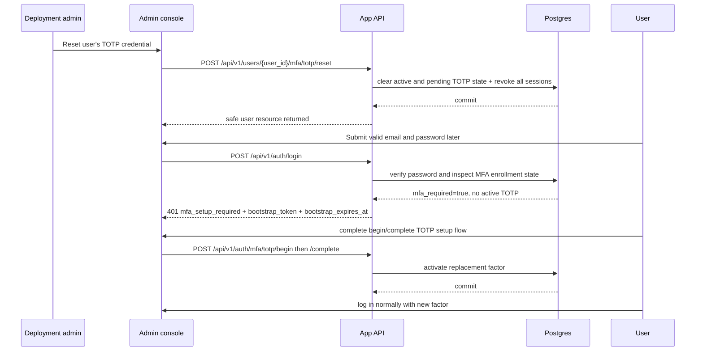

This recovery path stays outside the workbook hot path and keeps deployment-local credential recovery distinct from incident-scoped authorization.

### 3a. Create party from requester or source text

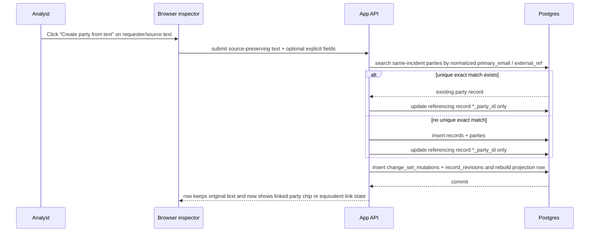

This flow preserves the raw requester or source wording while adding a stable same-incident `party_id`.

### 3b. Link existing party without blocking row capture

```mermaid
sequenceDiagram
    participant A as Analyst
    participant UI as Browser inspector
    participant App as App API
    participant PG as Postgres

    A->>UI: Open requester/collector/source field on an already-saved row
    UI->>App: query existing incident-scoped parties
    App->>PG: search `party_grid_projection` + canonical party records
    PG-->>App: candidate parties
    A->>UI: Select existing party
    UI->>App: patch only the hidden *_party_id field
    App->>PG: update referencing record without rewriting preserved text
    App->>PG: insert change_set_mutations + record_revisions and rebuild projection row
    PG-->>App: commit
    App-->>UI: row remains in place; text stays visible; linked party is now available for pivots or queues
```

This flow layers canonical linkage over already-captured text without requiring the analyst to leave the workbook surface or re-enter the row.

### 3c. Clear requester, collector, or source party link with `value: null`

The examples below are illustrative only. The authoritative wire contract remains Core 01 §18B, Core 01 §19, and the shared mutation rules in Core 01 §3.3.5.

#### Example: clear `task.requester_party_id`

```http
PATCH /api/v1/records/{record_id}
```

```json
{
  "view_schema_id": "cartulary.view.task_requests.v1",
  "base_row_version": 22,
  "client_txn_id": "txn_task_requester_party_clear_01",
  "changes": [
    {
      "field_key": "task.requester_party_id",
      "value": null
    }
  ]
}
```

#### Example: clear `evidence.collector_party_id`

```http
PATCH /api/v1/records/{record_id}
```

```json
{
  "view_schema_id": "cartulary.view.evidence.v1",
  "base_row_version": 9,
  "client_txn_id": "txn_evidence_collector_party_clear_01",
  "changes": [
    {
      "field_key": "evidence.collector_party_id",
      "value": null
    }
  ]
}
```

#### Example: clear `evidence.source_party_id`

```http
PATCH /api/v1/records/{record_id}
```

```json
{
  "view_schema_id": "cartulary.view.evidence.v1",
  "base_row_version": 10,
  "client_txn_id": "txn_evidence_source_party_clear_01",
  "changes": [
    {
      "field_key": "evidence.source_party_id",
      "value": null
    }
  ]
}
```

### 3d. Clear both preserved party text and linked party ref in one patch

```http
PATCH /api/v1/records/{record_id}
```

```json
{
  "view_schema_id": "cartulary.view.task_requests.v1",
  "base_row_version": 23,
  "client_txn_id": "txn_task_requester_clear_both_01",
  "changes": [
    {
      "field_key": "task.requester_party_text",
      "value": null
    },
    {
      "field_key": "task.requester_party_id",
      "value": null
    }
  ]
}
```

This example shows the ordinary `Clear both` shape: one record patch with two direct-write field changes and no bespoke action route.

### 3e. Clear `task.decision_record_id` with `value: null`

```http
PATCH /api/v1/records/{record_id}
```

```json
{
  "view_schema_id": "cartulary.view.task_requests.v1",
  "base_row_version": 24,
  "client_txn_id": "txn_task_decision_clear_01",
  "changes": [
    {
      "field_key": "task.decision_record_id",
      "value": null
    }
  ]
}
```

### 3f. Coordination collection patch examples

The examples below are illustrative only. The authoritative wire contract remains Core 01 §19 plus the shared mutation rules in Core 01 §3.3.5.

#### Example: add one audience party ref on `comm_log.audience_party_ids`

```http
PATCH /api/v1/records/{record_id}
```

```json
{
  "view_schema_id": "cartulary.view.comm_log.v1",
  "base_row_version": 12,
  "client_txn_id": "txn_comm_log_party_01",
  "changes": [
    {
      "field_key": "comm_log.audience_party_ids",
      "action_payload": {
        "kind": "collection_actions_v1",
        "actions": [
          { "op": "add_party_ref", "party_id": "pty_01" }
        ]
      }
    }
  ]
}
```

Matching read-side fragment:

```json
{
  "field_key": "comm_log.audience_party_ids",
  "value": {
    "kind": "collection_value_v1",
    "ordered": false,
    "items": [
      {
        "item_ref": "party_ref:pty_01",
        "item_kind": "party_ref",
        "display_text": "Email Distribution Team",
        "party_id": "pty_01"
      }
    ]
  }
}
```

#### Example: add one pending evidence ref on `status_review.pending_evidence_ids`

```http
PATCH /api/v1/records/{record_id}
```

```json
{
  "view_schema_id": "cartulary.view.status_review.v1",
  "base_row_version": 7,
  "client_txn_id": "txn_status_review_evidence_01",
  "changes": [
    {
      "field_key": "status_review.pending_evidence_ids",
      "action_payload": {
        "kind": "collection_actions_v1",
        "actions": [
          { "op": "add_record_ref", "linked_record_id": "rec_evidence_01" }
        ]
      }
    }
  ]
}
```

Matching read-side fragment:

```json
{
  "field_key": "status_review.pending_evidence_ids",
  "value": {
    "kind": "collection_value_v1",
    "ordered": false,
    "items": [
      {
        "item_ref": "record_ref:rec_evidence_01",
        "item_kind": "record_ref",
        "display_text": "EDR package for WS-023",
        "linked_record_id": "rec_evidence_01"
      }
    ]
  }
}
```

#### Example: add then remove one open risk ref on `handoff.open_risk_refs`

```http
PATCH /api/v1/records/{record_id}
```

```json
{
  "view_schema_id": "cartulary.view.handoff.v1",
  "base_row_version": 19,
  "client_txn_id": "txn_handoff_risk_add_01",
  "changes": [
    {
      "field_key": "handoff.open_risk_refs",
      "action_payload": {
        "kind": "collection_actions_v1",
        "actions": [
          { "op": "add_risk_ref", "risk_ref_text": "Pending confirmation of outbound data access scope" }
        ]
      }
    }
  ]
}
```

```http
PATCH /api/v1/records/{record_id}
```

```json
{
  "view_schema_id": "cartulary.view.handoff.v1",
  "base_row_version": 20,
  "client_txn_id": "txn_handoff_risk_remove_01",
  "changes": [
    {
      "field_key": "handoff.open_risk_refs",
      "action_payload": {
        "kind": "collection_actions_v1",
        "actions": [
          { "op": "remove_risk_ref", "item_ref": "risk_ref:rsk_01" }
        ]
      }
    }
  ]
}
```

Matching read-side fragment:

```json
{
  "field_key": "handoff.open_risk_refs",
  "value": {
    "kind": "collection_value_v1",
    "ordered": false,
    "items": [
      {
        "item_ref": "risk_ref:rsk_01",
        "item_kind": "risk_ref",
        "display_text": "Pending confirmation of outbound data access scope",
        "risk_ref_id": "rsk_01",
        "risk_ref_text": "Pending confirmation of outbound data access scope"
      }
    ]
  }
}
```

### 4. Review, version inspection, and rollback of a mistaken edit

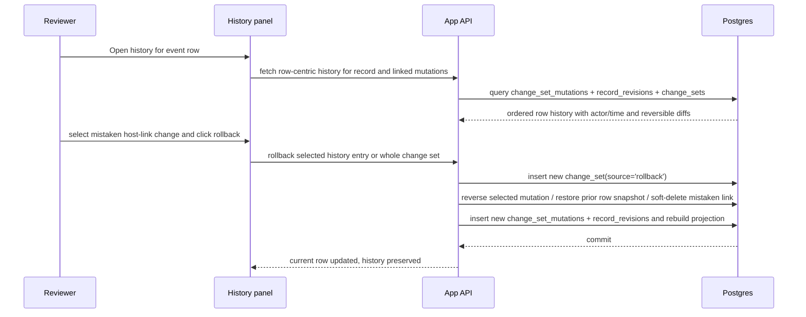

#### Reviewer UI rollback granularity

Core 03 §10 defines reviewer rollback granularity. This mockup shows one conformant row-centric history presentation with actor, timestamp, operation, and a diff summary expanded to changed field, link, mention, tag, and evidence-entry units.

Core 03 §10 also defines when a reviewer can reverse one logical history entry versus invoke whole-row restore or whole-change-set rollback. The illustration below shows one conformant presentation of those owner-defined actions for scalar field edits, link changes, tag changes, mention lifecycle changes, auto-resolution or auto-match results, and evidence attach or detach associations.

Arbitrary user-selected subsets of fields from historical snapshots are not required in MVP. Rollback remains a new attributed action by the reviewer, not a hidden database revert.

#### Destructive-operation contention precedence

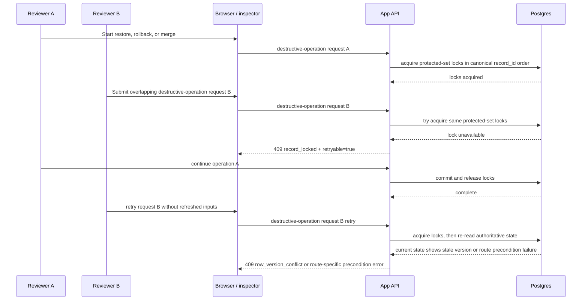

This sequence is explanatory only. The owner contract makes `record_locked` the fail-fast outcome while overlapping destructive work is still in flight on the same protected set. After those locks are released, the same request falls through to the ordinary stale-version or route-precondition path.

### 3c. Entity merge with deterministic identifier carry-forward

Worked success example:

- survivor `rec_host_01` keeps canonical `host.hostname='ws-023'` and has no canonical `host.fqdn`,
- loser `rec_host_02` contributes canonical `host.fqdn='ws-023.corp.example'` plus one `suggestion_only` alias,
- the merge promotes `fqdn` onto the survivor, copies the ordinary alias, preserves loser provenance on the historical loser row, and makes later exact-match reuse on either `hostname='ws-023'` or `fqdn='ws-023.corp.example'` resolve to `rec_host_01`.

Illustrative success payload:

```json
{
  "data": {
    "incident_id": "inc_01",
    "record_type": "host",
    "survivor_record_id": "rec_host_01",
    "loser_record_id": "rec_host_02",
    "survivor_row_version": 43,
    "loser_row_version": 8,
    "change_set_id": "chg_merge_01",
    "merged_into_record_id": "rec_host_01",
    "merge_summary": {
      "exact_match_classes": [
        {
          "identifier_class": "aad_device_id",
          "promoted_count": 0,
          "carried_count": 0,
          "duplicate_noop_count": 0
        },
        {
          "identifier_class": "fqdn",
          "promoted_count": 1,
          "carried_count": 0,
          "duplicate_noop_count": 0
        },
        {
          "identifier_class": "hostname",
          "promoted_count": 0,
          "carried_count": 0,
          "duplicate_noop_count": 0
        }
      ],
      "suggestion_aliases_copied_count": 1,
      "suggestion_alias_duplicate_noop_count": 0,
      "provenance_only_retained_count": 2
    }
  }
}
```

If the survivor already held a different canonical `fqdn`, the same carried-forward rule would surface `carried_count: 1` for that class instead of `promoted_count: 1`.

Worked collision example:

- survivor `rec_host_01` and loser `rec_host_02` are otherwise mergeable,
- loser carries `host.hostname='db-17'`,
- another active same-incident host `rec_host_03` already owns that active exact-match value,
- the merge fails closed rather than dropping or downgrading the loser-side reusable identifier.

Illustrative failure payload:

```json
{
  "error": {
    "code": "merge_precondition_failed",
    "details": {
      "reason_code": "carry_forward_identifier_collision",
      "identifier_class": "hostname",
      "normalized_value": "db-17",
      "blocking_record_id": "rec_host_03"
    }
  }
}
```

### 4a. Timeline supersede with a direct replacement relation

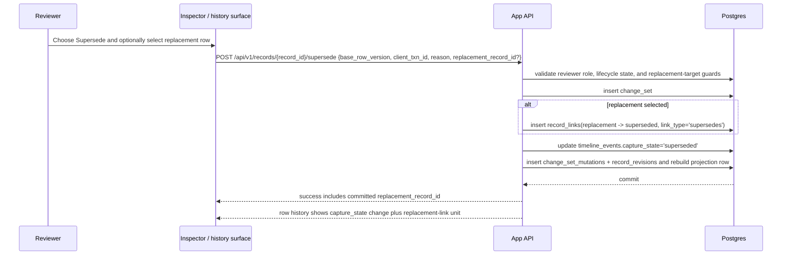

This illustration keeps the UI obligation lightweight: the reviewer invokes supersede from the inspector, history surface, or another reviewer-only non-grid surface; an optional replacement row can be selected there; and when the action succeeds the selected replacement remains recoverable nearby without adding a default visible Timeline column. Correction is rollback and re-supersede rather than direct editing of the hidden replacement field on a superseded row.

### 4b. Pending queue replay after auth expiry or revocation

```mermaid
sequenceDiagram
    participant A as Analyst
    participant UI as Browser grid
    participant App as App API / collaboration
    participant PG as Postgres

    A->>UI: Edit row while transport or auth is unavailable
    UI->>UI: Enqueue replay unit; Status = Syncing
    App-->>UI: queued write fails auth or stream sends session_revoked
    UI->>UI: Preserve local pending queue and same-field drafts
    UI->>App: re-authenticate
    UI->>App: re-query active view if required
    UI->>App: replay queued writes in FIFO order
    alt replay succeeds
        App->>PG: commit replayed writes
        PG-->>App: authoritative rows
        App-->>UI: echoed record_changed clears matching queue units
        UI->>UI: Status = Saved
    else replay hits same-field conflict or terminal failure
        App-->>UI: same_field_conflict or terminal failure
        UI->>UI: blocked unit moves to conflict queue or stays halted; later units remain queued; Status = Conflict
    end
```

This sequence is explanatory only. The normative owner text now fixes same-runtime preservation, FIFO replay after any required re-authentication and HTTP re-query, and stop-on-first-terminal-failure behavior.

### 4c. Pending queue overflow on the 65th replay unit

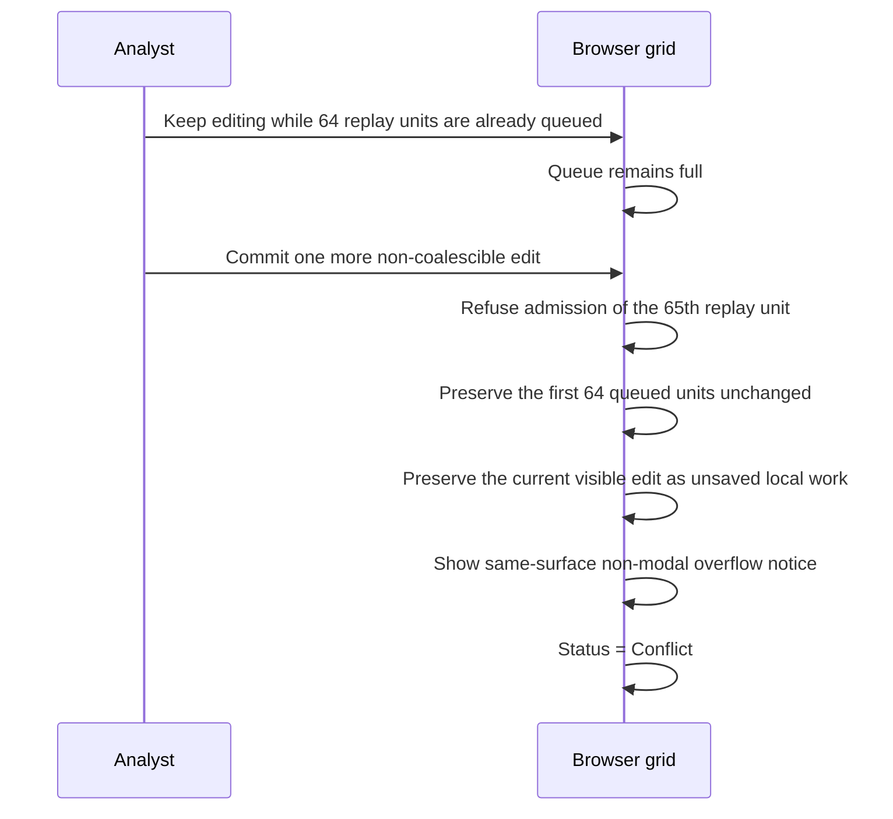

Suggested same-surface overflow copy belongs in the explanatory UI layer rather than the normative core, for example: `Pending local edits are full. Keep this tab open, resolve conflicts, or wait for sync before adding more queued edits.`

### 4d. Folding edits into one queued create for an uncommitted local row

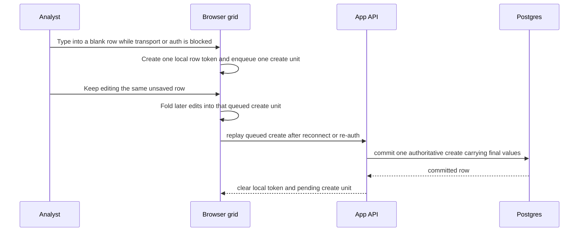

This illustration is explanatory only. The normative owner text closes create folding for still-uncommitted local rows while keeping coalescing for existing rows bounded to one contiguous same-record run.

### Bulk paste/import from existing spreadsheet or clipboard

#### Canonical upload-envelope examples for upload-style extension routes

The examples below illustrate the shared multipart upload-envelope contract now owned by Core 01 §17.1.1. They are non-normative examples of a conformant wire shape, not alternate APIs.

##### `POST /api/v1/import-sessions`

```bash
curl -X POST /api/v1/import-sessions \
  -H 'Accept: application/json' \
  -F 'metadata={"incident_id":"inc_2026_017","client_txn_id":"txn_import_01","assistant_profile":"phase2_workbook_import_v1"};type=application/json' \
  -F 'file=@timeline.csv;type=text/csv'
```

```js
const formData = new FormData();
const metadata = {
  incident_id: "inc_2026_017",
  client_txn_id: "txn_import_01",
  assistant_profile: "phase2_workbook_import_v1"
};
const sourceFile = new File([csvText], "timeline.csv", { type: "text/csv" });
formData.append(
  "metadata",
  new Blob([JSON.stringify(metadata)], { type: "application/json" })
);
formData.append("file", sourceFile);
await fetch("/api/v1/import-sessions", {
  method: "POST",
  body: formData,
  credentials: "include"
});
```

##### `POST /api/v1/reference-packs/import`

```bash
curl -X POST /api/v1/reference-packs/import \
  -H 'Accept: application/json' \
  -F 'metadata={"client_txn_id":"txn_pack_import_01","activation_policy":"staged_only"};type=application/json' \
  -F 'file=@reference-pack.zip;type=application/zip'
```

```js
const packFormData = new FormData();
const packMetadata = {
  client_txn_id: "txn_pack_import_01",
  activation_policy: "staged_only"
};
const packFile = new File([packBytes], "reference-pack.zip", { type: "application/zip" });
packFormData.append(
  "metadata",
  new Blob([JSON.stringify(packMetadata)], { type: "application/json" })
);
packFormData.append("file", packFile);
await fetch("/api/v1/reference-packs/import", {
  method: "POST",
  body: packFormData,
  credentials: "include"
});
```

##### `POST /api/v1/incident-bundles/import`

```bash
curl -X POST /api/v1/incident-bundles/import \
  -H 'Accept: application/json' \
  -F 'metadata={"client_txn_id":"txn_bundle_import_01"};type=application/json' \
  -F 'file=@incident-bundle.tar.gz;type=application/gzip'
```

```js
const bundleFormData = new FormData();
const bundleMetadata = {
  client_txn_id: "txn_bundle_import_01"
};
const bundleFile = new File([bundleBytes], "incident-bundle.tar.gz", { type: "application/gzip" });
bundleFormData.append(
  "metadata",
  new Blob([JSON.stringify(bundleMetadata)], { type: "application/json" })
);
bundleFormData.append("file", bundleFile);
await fetch("/api/v1/incident-bundles/import", {
  method: "POST",
  body: bundleFormData,
  credentials: "include"
});
```

##### Shared worked error examples

Missing `file` part on `POST /api/v1/import-sessions`:

```json
{
  "error": {
    "code": "invalid_import_request",
    "details": {
      "reason_code": "missing_required_part",
      "part_name": "file"
    }
  }
}
```

Wrong `metadata` part content type on `POST /api/v1/reference-packs/import`:

```json
{
  "error": {
    "code": "invalid_reference_pack_request",
    "details": {
      "reason_code": "invalid_part_content_type",
      "part_name": "metadata",
      "received_content_type": "text/plain",
      "allowed_content_types": [
        "application/json",
        "application/json; charset=utf-8"
      ]
    }
  }
}
```

Unexpected extra part on `POST /api/v1/incident-bundles/import`:

```json
{
  "error": {
    "code": "invalid_incident_bundle_request",
    "details": {
      "reason_code": "unexpected_part",
      "part_name": "notes"
    }
  }
}
```


- **Clipboard paste is day-one functionality.**\
  In this illustration, pasting TSV/CSV into the timeline sheet creates or updates multiple rows starting from the selected cell.
- Known columns map directly.
- Unknown columns are stored into `raw_capture.import_columns`.
- Host/identity text from pasted cells follows the same `entity_binding_mode` contract as interactive edits: `mention_origin` fields create unresolved `entity_mentions`; `entity_origin` fields create or upsert host/identity records.
- Repeated identical mention values across different source rows remain separate mention rows with distinct source locators.
- The entire paste is one visible `change_set`, with ordered mutation entries and one row revision per affected record.

Clipboard paste validates the hot-path grid experience. By itself it does not prove brownfield workbook migration readiness.

For file-based onboarding, this illustration keeps workbook interaction on the grid surface and isolates workbook parsing inside a dedicated imports module. Clipboard-driven ingest and file-based import use the same mapping engine and canonical tabular source model so behavior does not drift across intake paths.

For file-based import, the bounded first assistant shown here supports CSV file import plus selected-sheet or selected-region XLSX import, with preview, header mapping, provenance capture, and unknown-column preservation. It prioritizes sheets or regions that map to timeline, systems/hosts, accounts/identities, indicators, evidence tracker, and VERIS-like summaries when present. Mapping contracts, not sheet labels alone, determine whether a source column is `mention_origin` or `entity_origin`.

Formulas, macros, workbook automation, external links, comments, pivot tables, charts, workbook protection, and merged-cell layout semantics are treated here as non-live workbook logic. Formula cells enter as inert values or raw source metadata only, with visible warnings or explicit rejection when a feature is unsupported. File-based import leaves host/account aliases as unresolved mentions until an analyst resolves them explicitly.

#### Example preview payload

```json
{
  "data": {
    "import_session_id": "imp_sess_01",
    "import_unit_id": "imp_unit_03",
    "locator_kind": "xlsx_region",
    "locator": {
      "sheet_name": "Timeline",
      "rect_a1": "A1:C4"
    },
    "source_rect_a1": "A1:C4",
    "header_row_ref": 1,
    "data_start_row_ref": 2,
    "inferred_row_count": 3,
    "inferred_column_count": 3,
    "warning_codes": [],
    "unit_status": "selected",
    "columns": [
      { "source_column_ordinal": 1, "source_header_text": "Occurred At" },
      { "source_column_ordinal": 2, "source_header_text": "Summary" },
      { "source_column_ordinal": 3, "source_header_text": "User" }
    ],
    "preview_rows": [
      {
        "source_row_ref": 2,
        "cells": [
          { "source_column_ordinal": 1, "display_text": "2026-03-14T09:14:00Z", "cell_kind": "datetime" },
          { "source_column_ordinal": 2, "display_text": "VPN login", "cell_kind": "string" },
          { "source_column_ordinal": 3, "display_text": "jdoe", "cell_kind": "string" }
        ]
      },
      {
        "source_row_ref": 3,
        "cells": [
          { "source_column_ordinal": 1, "display_text": "", "cell_kind": "blank" },
          { "source_column_ordinal": 2, "display_text": "Possible follow-up action", "cell_kind": "string" },
          { "source_column_ordinal": 3, "display_text": "asmith", "cell_kind": "string" }
        ]
      }
    ],
    "truncated": false
  }
}
```

#### Example import_session resource

```json
{
  "data": {
    "import_session_id": "imp_sess_01",
    "incident_id": "inc_2026_017",
    "created_by_user_id": "usr_analyst_01",
    "created_at": "2026-03-14T09:10:00Z",
    "source_file_kind": "xlsx",
    "original_filename": "timeline.xlsx",
    "source_content_sha256": "1111111111111111111111111111111111111111111111111111111111111111",
    "parser_profile_id": "example_parser_profile_id",
    "parser_version": "2026-04-02",
    "assistant_profile": "phase2_workbook_import_v1",
    "session_status": "mapped",
    "selected_unit_ids": ["imp_unit_03"],
    "blocking_diagnostics": [
      {
        "code": "import_apply_blocked",
        "reason_code": "unit_not_ready",
        "message": "Selected unit is not ready to apply.",
        "import_unit_id": "imp_unit_04"
      }
    ],
    "nonblocking_warning_codes": []
  }
}
```

#### Example import_unit resource before mapping approval

```json
{
  "data": {
    "import_unit_id": "imp_unit_03",
    "import_session_id": "imp_sess_01",
    "locator_kind": "xlsx_region",
    "locator": {
      "sheet_name": "Timeline",
      "rect_a1": "A1:C4"
    },
    "source_rect_a1": "A1:C4",
    "header_row_ref": 1,
    "data_start_row_ref": 2,
    "inferred_row_count": 3,
    "inferred_column_count": 3,
    "warning_codes": [],
    "unit_status": "selected"
  }
}
```

#### Example import_unit resource after mapping approval

```json
{
  "data": {
    "import_unit_id": "imp_unit_03",
    "import_session_id": "imp_sess_01",
    "locator_kind": "xlsx_region",
    "locator": {
      "sheet_name": "Timeline",
      "rect_a1": "A1:C4"
    },
    "source_rect_a1": "A1:C4",
    "header_row_ref": 1,
    "data_start_row_ref": 2,
    "inferred_row_count": 3,
    "inferred_column_count": 3,
    "warning_codes": [],
    "unit_status": "ready",
    "mapping_fingerprint": "2222222222222222222222222222222222222222222222222222222222222222",
    "approved_mapping": {
      "target_view_schema_id": "cartulary.view.timeline.v1",
      "unknown_column_policy": "preserve_raw_capture",
      "source_columns": [
        {
          "source_column_ordinal": 1,
          "source_header_text": "Occurred At",
          "field_key": "timeline.occurred_at",
          "entity_binding_mode": null,
          "transform_id": null,
          "transform_options": {},
          "empty_value_policy": "write_null"
        },
        {
          "source_column_ordinal": 2,
          "source_header_text": "Summary",
          "field_key": "timeline.summary",
          "entity_binding_mode": null,
          "transform_id": "trim_v1",
          "transform_options": {},
          "empty_value_policy": "omit_field"
        },
        {
          "source_column_ordinal": 3,
          "source_header_text": "User",
          "field_key": "timeline.identity_refs",
          "entity_binding_mode": "mention_origin",
          "transform_id": "trim_v1",
          "transform_options": {},
          "empty_value_policy": "omit_field"
        }
      ]
    }
  }
}
```

#### Example select/skip flow before apply

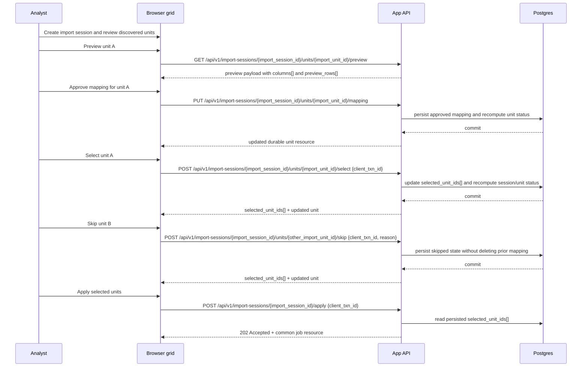

### Illustrative terminal job-result summaries

The fragments below are illustrative only. The authoritative owner is Core 01 §3.3.9.1 and §17.

#### `snapshot_created`

```json
{
  "job_id": "job_snapshot_01",
  "status": "succeeded",
  "result_summary": {
    "code": "snapshot_created",
    "message": "Snapshot created.",
    "resource_refs": [
      {
        "kind": "snapshot",
        "id": "snap_01",
        "route": "/api/v1/snapshots/snap_01"
      }
    ]
  }
}
```

#### `import_session_partially_applied`

```json
{
  "job_id": "job_import_apply_01",
  "status": "succeeded",
  "result_summary": {
    "code": "import_session_partially_applied",
    "message": "Selected units applied with partial success.",
    "resource_refs": [
      {
        "kind": "import_session",
        "id": "imp_01",
        "route": "/api/v1/import-sessions/imp_01"
      }
    ]
  }
}
```

#### `incident_bundle_imported`

```json
{
  "job_id": "job_bundle_import_01",
  "status": "succeeded",
  "result_summary": {
    "code": "incident_bundle_imported",
    "message": "Incident bundle imported.",
    "resource_refs": [
      {
        "kind": "incident",
        "id": "inc_01",
        "route": "/api/v1/incidents/inc_01"
      }
    ]
  }
}
```

#### `job_canceled`

```json
{
  "job_id": "job_any_01",
  "status": "canceled",
  "result_summary": {
    "code": "job_canceled",
    "message": "Job canceled before completion."
  }
}
```

UI note: on receipt of a terminal result, the client keeps the current workbook surface in place, surfaces known refs as non-modal completion chips or links, degrades unknown refs to `message`-only, and never auto-navigates from the incoming `route`.

### Non-Timeline create-policy examples

The examples below illustrate create affordances and minimum-create-signal consequences only. Exact create-time defaults, omitted-versus-`null` behavior, and server-generated initial values remain owned by the corresponding Core 01 surface contract.

- **Example create outcome: linked note from context.** Selecting a Timeline, Host, Identity, or Evidence row can preseed a linked-record reference for `add linked note`, but the note does not commit until `note.title` or `note.body` is non-empty after the bound `single_line_title_v1` or `multiline_body_v1` normalization. A linked but otherwise empty note remains an unsaved draft, not a saved record.
- **Example create outcome: evidence request without a blob.** A blank-row Evidence create with no explicit lifecycle choice commits only when at least one writable evidence field remains present after its bound contract normalization. In the current profile, `evidence.title` uses `single_line_title_v1`, `evidence.storage_ref` uses `locator_text_v1`, and `evidence.collector_party_text` plus `evidence.source_party_text` use `party_text_v1`. Optional hidden `evidence.collector_party_id` and `evidence.source_party_id` links can supplement that text through same-surface enrichment, but they do not by themselves satisfy the minimum create signal and they do not rewrite the preserved text. On a full row query or row-refresh payload, those hidden direct-reference fields still appear inside `cells` even when the default grid keeps them hidden. A create lacking both a qualifying field signal and a finalized blob leaves no evidence row. Exact create-time defaults remain owned by Core 01 §7.4.4.
- **Example create outcome: canonical indicator create gate.** A blank-row Indicators create is refused until canonical identity is determinable from `indicator.indicator_type`, `indicator.value_kind`, `indicator.display_value`, and `indicator.normalized_value` when required. `indicator.hash_algorithm` and `indicator.hash_value` are pairwise; `defanged_value` and `stix_pattern` can be present but do not satisfy the identity gate.
- **Example create outcome: assessment from selected subject.** Creating an assessment from a selected Host or Identity row can preseed `assessment.subject_ref` and `assessment.subject_type`, but the row commits only when `assessment.assessment_state` and non-empty `assessment.rationale` are also present. Exact create-time defaults remain owned by Core 01 §7.4.7.
- **Example create outcome: task request from selected records.** A task-request create flow can preseed `task.linked_record_ids` or `task.decision_record_id`, but the row commits only when `task.title` remains present after `single_line_title_v1` normalization and `task.task_kind` is present. `task.requester_party_text`, `task.blocked_reason`, `task.external_ticket_ref`, and `task.closure_summary` follow `party_text_v1`, `reason_note_v1`, `locator_text_v1`, and `multiline_body_v1` when written. An optional hidden `task.requester_party_id` can supplement `task.requester_party_text`, but it does not by itself satisfy the minimum create signal and it does not rewrite the preserved text. On a full row query or row-refresh payload, `task.requester_party_id` still appears inside `cells` even when the default grid keeps it hidden.
- **Example create outcome: decision from selected support.** A decision create flow can preseed `decision.support_refs`, but the row commits only when `decision.decision_type`, `decision.summary`, and `decision.rationale` remain present after the bound `single_line_title_v1` and `multiline_body_v1` normalization. Exact create-time defaults remain owned by Core 01 §7.4.9.

### Auto-resolution policy for typed host/account strings

Core 03 §12 is the authoritative owner of current-profile auto-resolution eligibility, suppressor grammar, forbidden rewrites, write effects, and workflow scope. This subsection is illustrative only.

| Submitted token | Contract-normalized token | Suppressor matched | Exact alias equality | Eligible workflow | Final outcome |
| --- | --- | --- | --- | --- | --- |
| `WS-023` | `WS-023` | no | yes, alias `WS-023` | yes | Auto-resolve only on an eligible interactive Timeline `Hosts` or `Identities` write. |
| ` vpn   gateway ` | `vpn gateway` | no | yes, alias `VPN Gateway` after the same contract normalization plus case fold | yes | Auto-resolve only on an eligible interactive Timeline `Hosts` or `Identities` write. |
| `WS-023?` | `WS-023?` | yes, ASCII `?` | no; punctuation is preserved | yes | Example outcome under Core 03 §12: remains unresolved. |
| `WS-023??` | `WS-023??` | yes, ASCII `?` | no; punctuation is preserved | yes | Example outcome under Core 03 §12: remains unresolved. |
| `WS-023 ~` | `WS-023 ~` | yes, ASCII `~` | no; punctuation is preserved | yes | Example outcome under Core 03 §12: remains unresolved. |
| `WS-023 approx` | `WS-023 approx` | yes, lexical token `approx` | no; extra token is preserved | yes | Example outcome under Core 03 §12: remains unresolved. |
| `WS-023 likely` | `WS-023 likely` | no | no; matching would require extra-word stripping | yes | Example outcome under Core 03 §12: remains unresolved. |
| `(WS-023)` | `(WS-023)` | no | no; matching would require parenthetical stripping | yes | Example outcome under Core 03 §12: remains unresolved. |

Localized or language-specific uncertainty lexicons remain future-only. In the current profile, the implementation does not translate, strip, or otherwise reinterpret such words; a token auto-resolves only when the full normalized token exactly equals an alias under the Core 03 §12 contract.

### Unknown or ambiguous fields

Examples of rough input that remain valid under the core contract:

- `occurred_at` can remain null.
- summary can remain null if another field or attachment exists.
- host/account text can remain unresolved.
- confidence can be left unset.
- details can remain plain text without structure.

### End-to-end attribution

Every step above writes the actor’s `user_id` into:

- current record envelope,
- `change_sets.actor_user_id`,
- `record_revisions`,
- link and tag creation metadata,
- object blob and evidence metadata.


### Reference-pack lifecycle sketch

The diagram below is explanatory only. The authoritative contract is Core 01 §11.3 and §11.4.

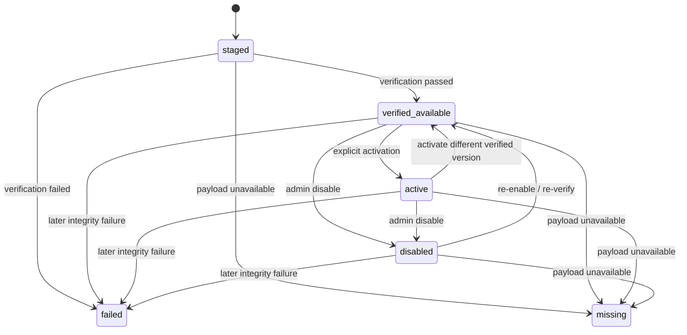

### Snapshot artifact lifecycle sketch

The diagram below is explanatory only. The authoritative contract is Core 01 §10.2 through §10.5 and Core 04 §2.1.

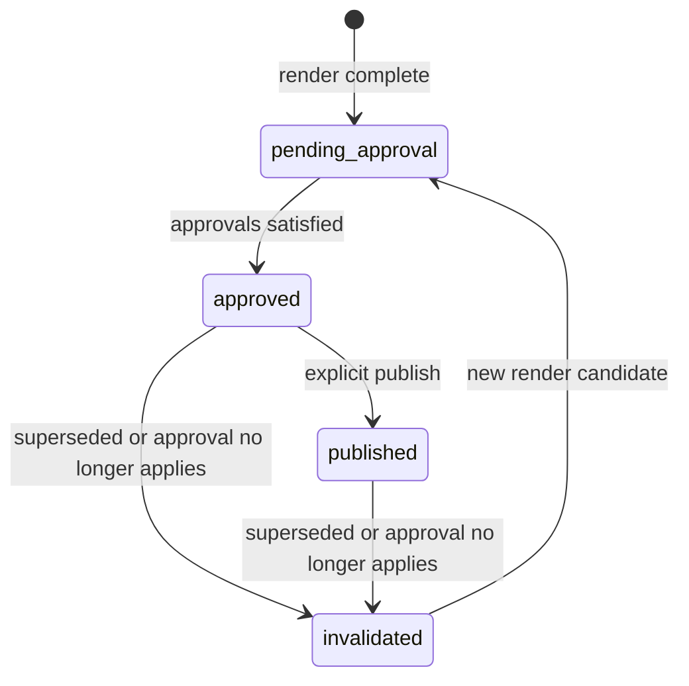

#### Example snapshot resource

```json
{
  "data": {
    "snapshot_id": "snap_2026_017_01",
    "incident_id": "inc_2026_017",
    "created_by_user_id": "usr_reviewer_01",
    "created_at": "2026-03-14T12:00:00Z",
    "snapshot_at": "2026-03-14T12:00:00Z",
    "source_change_set_high_watermark": "cs_000184",
    "derivation_version": "derivation_v1",
    "export_model_sha256": "3333333333333333333333333333333333333333333333333333333333333333"
  }
}
```

#### Example release resource

```json
{
  "data": {
    "release_id": "rel_2026_017_01",
    "incident_id": "inc_2026_017",
    "snapshot_id": "snap_2026_017_01",
    "snapshot_at": "2026-03-14T12:00:00Z",
    "source_change_set_high_watermark": "cs_000184",
    "derivation_version": "derivation_v1",
    "export_model_sha256": "3333333333333333333333333333333333333333333333333333333333333333",
    "template_id": "tmpl_exec_html",
    "template_version": "3",
    "redaction_profile_id": "redact_external_a",
    "redaction_profile_version": "5",
    "output_kind": "html",
    "release_scope": "internal_review",
    "output_sha256": "4444444444444444444444444444444444444444444444444444444444444444",
    "release_state": "pending_approval",
    "created_by_user_id": "usr_reviewer_01",
    "created_at": "2026-03-14T12:03:00Z",
    "approved_at": null,
    "invalidated_at": null,
    "published_at": null,
    "invalidation_reason": null
  }
}
```

#### Example approve success response

```json
{
  "data": {
    "release": {
      "release_id": "rel_2026_017_01",
      "incident_id": "inc_2026_017",
      "snapshot_id": "snap_2026_017_01",
      "snapshot_at": "2026-03-14T12:00:00Z",
      "source_change_set_high_watermark": "cs_000184",
      "derivation_version": "derivation_v1",
      "export_model_sha256": "3333333333333333333333333333333333333333333333333333333333333333",
      "template_id": "tmpl_exec_html",
      "template_version": "3",
      "redaction_profile_id": "redact_external_a",
      "redaction_profile_version": "5",
      "output_kind": "html",
      "release_scope": "internal_review",
      "output_sha256": "4444444444444444444444444444444444444444444444444444444444444444",
      "release_state": "approved",
      "created_by_user_id": "usr_reviewer_01",
      "created_at": "2026-03-14T12:03:00Z",
      "approved_at": "2026-03-14T12:05:00Z",
      "invalidated_at": null,
      "published_at": null,
      "invalidation_reason": null
    },
    "approval_progress": {
      "approval_recorded": true,
      "approval_requirements_satisfied": true,
      "resulting_release_state": "approved"
    }
  }
}
```

### Blob-upload and evidence lifecycle sketch

The diagram below is explanatory only. The authoritative contract is Core 02 §13 and Core 03 §8.

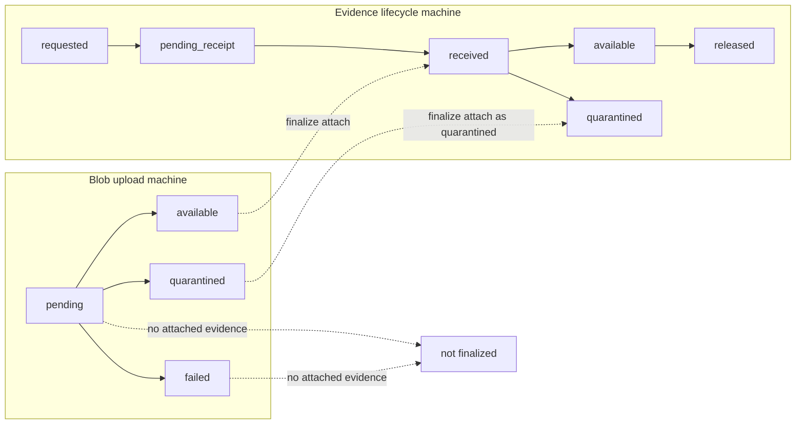


### Benchmark timing-state illustrations

This subsection is illustrative only. Core 04 remains the normative owner of implementation pass/fail semantics, and Core 05 remains the normative owner of claim-bearing benchmark profile and measurement-predicate publication policy.

#### Blank-row creation timing boundary

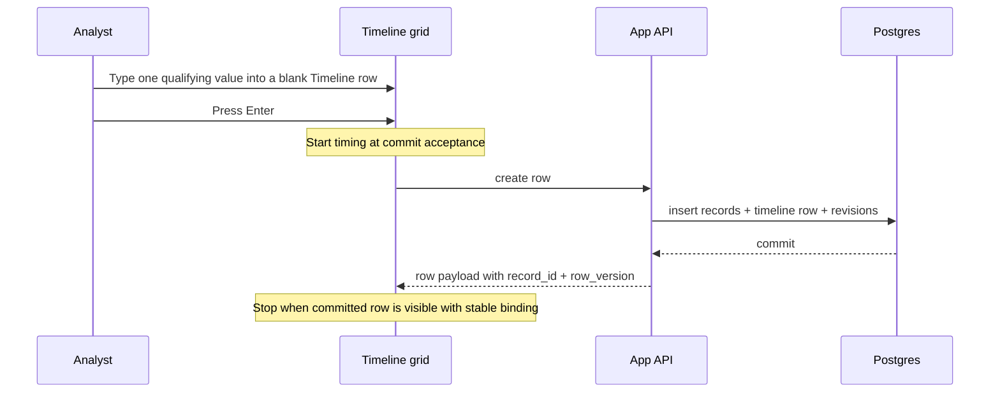

Illustrative start state: authenticated session complete, incident already open, Timeline surface already loaded, and default sort, filter, and grouping state active.

Illustrative stop predicate: the committed row is visible, the entered value is rendered in the target field, and the new row is bound to stable `record_id` plus `row_version`.

#### View-change first-useful versus stable viewport

```mermaid
sequenceDiagram
    participant A as Analyst
    participant UI as Workbook surface
    participant App as App API
    participant PG as Postgres

    A->>UI: Submit sort, filter, or grouping change
    Note over UI: Start timing at submit
    UI->>App: query updated view
    App->>PG: read projection rows
    PG-->>App: first visible block
    App-->>UI: first visible block
    Note over UI: first useful viewport
    App->>PG: finish remaining ordered read
    PG-->>App: final ordered block
    App-->>UI: final ordered viewport state
    Note over UI: stable viewport
```

Illustrative first-useful predicate: the first visible row window for the requested state is rendered with stable `record_id` binding and working keyboard navigation.

Illustrative stable predicate: the visible row window and result ordering now match the final deterministic order, and no further reorder occurs without new user or server input.

#### Snapshot-stable cursor continuation under live change

```mermaid
sequenceDiagram
    participant A as Analyst A
    participant UI as Workbook surface
    participant App as App API
    participant B as Analyst B

    A->>UI: Load page 1
    UI->>App: query {limit, sort, filters}
    App-->>UI: rows + next_cursor bound to snapshot S1

    B->>App: Commit insert or re-sort that changes live order
    App-->>UI: live `record_changed` event
    UI->>UI: Keep the current viewport stable
    UI->>UI: Optional notice: "Results changed. Refresh to see current order."

    A->>UI: Continue the current chain
    UI->>App: query {cursor_token: next_cursor}
    App-->>UI: next page from snapshot S1

    A->>UI: Click Refresh
    UI->>App: query without `cursor_token`
    App-->>UI: page 1 of current live order
```

The important UI consequence is that live collaboration can still update currently visible rows, but continuation does not silently splice new live rows into an existing page chain. Refresh restarts from page 1 without `cursor_token`; continuation keeps the existing chain's snapshot order.

#### Evidence-inspector metadata-shell boundary

```mermaid
sequenceDiagram
    participant A as Analyst
    participant UI as Inspector
    participant App as App API
    participant PG as Postgres

    A->>UI: Open inspector on a Timeline row linked to 100 evidence records
    Note over UI: Start timing at open action
    UI->>App: request inspector data
    App->>PG: fetch row summary + evidence metadata window
    PG-->>App: selected-row summary + evidence count + first list window
    App-->>UI: render inspector metadata shell
    Note over UI: Stop when metadata shell is visible
```

Illustrative metadata-shell predicate: the selected-row summary, total linked-evidence count, and first rendered evidence-list window are visible, and each evidence item in that first rendered window shows filename or media-type label, attachment state, and preview-handle availability. Binary preview bytes are not required for this stop condition.

## 9. UI concepts focused on preserving the spreadsheet feel

In the current profile, the UI is workbook-like, but the sheets are contract-backed workbook surfaces and saved views over projections rather than separate storage silos. The built-in tabs remain intentionally few: Timeline, Hosts, Identities, Evidence, and Notes. Indicators and Assessments are exposed as contract-backed system views over related projections even when canonical indicators or assessments are first-class records underneath. Framework overlays such as ATT&CK or VERIS begin as contract-backed system views and become dedicated tabs only if a later profile justifies that promotion. Required pack-independent base-profile registry surfaces, including `cartulary.view.task_requests.v1`, `cartulary.view.decisions.v1`, `cartulary.view.comm_log.v1`, `cartulary.view.handoff.v1`, `cartulary.view.status_review.v1`, and `cartulary.view.lesson.v1`, are opened and addressed by their standardized `view_schema_id`; a saved view over one of those schemas remains a separate preset or layout surface rather than the required base surface itself.

### UI concept 1: Primary workbook-style timeline view

```text
+------------------------------------------------------------------------------------------------------------------+
| Incident IR-2026-017 | Timeline* | Hosts | Identities | Evidence | Notes | [Search / filter] | A  B  R        |
+------------------------------------------------------------------------------------------------------------------+
| View: [Capture order v]  Sort: [Time v]  Group: [None v]  Filters: [Unresolved] [Has evidence] [Tag: rough]    |
+----+----------+-------------------------------+------------------+------------------+------+-----------+---------+
| #  | Time     | Summary                       | Hosts            | Identities       | Evd. | Tags      | Edited  |
+----+----------+-------------------------------+------------------+------------------+------+-----------+---------+
| 81 | 09:14?   | Possible VPN logon ...        | WS-023?          | jdoe?            | 1    | rough     | B 2m    |
|    |          | screenshot attached           |                  |                  |      |           |         |
| 82 |          | [type here…]                  |                  |                  |      |           |         |
+----+----------+-------------------------------+------------------+------------------+------+-----------+---------+
| Status: Saved | Analyst B is on row 81 | Enter=new row | Tab=next cell | Ctrl+V=paste | Space=preview |
+------------------------------------------------------------------------------------------------------------------+
```

The status bar interpretation shown here is explanatory only:

- `Syncing` includes queued local work waiting for transport or re-authentication.
- `Conflict` includes unresolved same-field conflicts, pending-queue overflow, and replay halted on a terminal failure.
- Suggested overflow banner copy belongs here, not in the normative core.

#### Screen regions

- **Top bar**: incident identity, workbook tabs, search, presence avatars.
- **View bar**: saved view selector, sort, group, filter chips.
- **Grid**: primary work surface.
- **Status bar**: save/conflict state and keyboard hints.
- **Inspector drawer**: collapsible on the right, not shown above.

#### Inline editing behavior

- Selecting a cell and typing edits it immediately.
- Enter commits and moves vertically; Tab commits and moves horizontally.
- Typing in the blank row creates a real record as soon as there is one non-empty value.
- Cells with relationship semantics still accept raw typing; they do not force picker-first interaction.

#### Keyboard-first interactions

- Arrow keys move selection.
- Enter/Shift+Enter navigate rows.
- `Ctrl+V` pastes multi-cell blocks.
- `Ctrl+K` opens quick link/resolve for the current cell.
- `Space` previews linked evidence for the selected row.
- `Alt+H` opens history for the selected row.

#### Copy/paste and bulk editing

- Paste TSV/CSV directly from Excel into the visible grid.
- If the paste range exceeds existing rows, new rows are created automatically.
- Fill-down and multi-row tag assignment are supported from the selection model.
- Bulk edits are mutation batches, not hidden macros.

#### Sorting / filtering / grouping

- Column header click sorts.
- Filter chips apply without leaving the sheet.
- Core 03 §14 defines timeline grouping as a presentation-only transform over the current filtered result set; this illustration does not create, delete, or mutate source records, projection rows, links, or tags.
- Core 03 §14 defines `Group: None` plus exactly one active grouping key in the current profile. This mockup stores the active key as `saved_views.query_json.group_by`, and represents `Group: None` by omission rather than by `null`.
- The current profile's allowed timeline grouping keys are:
  - `timeline.occurred_day` derived from `occurred_at` at day granularity
  - `timeline.recorded_day` derived from `recorded_at` at day granularity
  - `timeline.capture_state`
  - `timeline.has_evidence` where `evidence_count > 0`
  - `timeline.has_unresolved_mentions` where at least one `entity_mentions` row for the source record has `resolution_status='unresolved'`
- dismissed mentions do not contribute to this derived flag, and a row whose remaining mentions are all dismissed groups under `false`
- Grouping keys in this illustration are scalar, contract-backed values. Free-text columns and multi-valued relationship cells such as Hosts, Identities, and Tags are not used as grouping keys.
- Group order in this illustration is deterministic:
  - `timeline.occurred_day` and `timeline.recorded_day` sort by bucket value descending, with null buckets last
  - `timeline.capture_state` sorts `rough`, `enriched`, `reviewed`, `superseded`
  - `timeline.has_evidence` and `timeline.has_unresolved_mentions` sort `true` then `false`
  - the current row sort applies unchanged within each group
- The outline affordance for grouped timeline sheets is limited to one derived group-header level with these operations: `expand group`, `collapse group`, `expand all`, `collapse all`, and `ungroup` via `Group: None`.
- In the current profile, group headers are illustrative derived UI rows only and are not mutation targets, export rows, or revision-history rows.
- Sorting and filtering apply to underlying rows first; grouping is computed second. Edits, conflicts, autosave, and rollback remain row-based and target only underlying records by `record_id` and `base_row_version`.
- In this illustration, a row moves between visible groups only when an edit changes the grouped field value. Dragging a row between groups is not a write path.
- This illustration keeps transient expand/collapse state client-local and not collaborative state. Saved views can persist the default grouping key, but not another user’s live open/closed state.
- Other workbook surfaces whose active `view_schema` declares `grouping_fields` use the same generic grouping boundary, omission-only `Group: None` semantics, derived-header rule, one-outline-level limit, and client-local expand/collapse behavior; Timeline alone adds the current explicit grouping whitelist and group-order override.
- Timeline grouping non-goals:
  - manual row-range grouping or ungrouping
  - nested outline depth greater than `1`
  - subtotal, summary, or spacer rows inserted into the grid
  - pivot-style aggregation or chart-like rollups inside the timeline sheet
  - grouping by formulas, ad hoc expressions, or visible labels
  - merged cells, indent-based hierarchy, or parent/child tree rows
- Views are saveable and shareable within the incident.

Non-normative request example with one user sort override and omitted grouping:

```json
{
  "sort": [
    { "field_key": "timeline.capture_state", "direction": "desc" }
  ],
  "filters": [],
  "limit": 100
}
```

Non-normative response fragment showing the effective applied sort in `meta.query`:

```json
{
  "meta": {
    "query": {
      "sort": [
        { "field_key": "timeline.capture_state", "direction": "desc" },
        { "field_key": "timeline.sort_ts", "direction": "asc" },
        { "field_key": "record_id", "direction": "asc" }
      ],
      "filters": []
    }
  }
}
```

Non-normative normalization examples:

1. Set-like `values[]` collapse by meaning rather than caller order.

Request fragment:

```json
{
  "filters": [
    {
      "field_key": "timeline.capture_state",
      "op": "eq",
      "arg": { "values": ["reviewed", "rough", "reviewed"] }
    }
  ]
}
```

Canonical `meta.query` fragment:

```json
{
  "filters": [
    {
      "field_key": "timeline.capture_state",
      "op": "eq",
      "arg": { "values": ["rough", "reviewed"] }
    }
  ]
}
```

2. `prefix.value` persists in comparison-normalized form.

Request fragment:

```json
{
  "filters": [
    {
      "field_key": "identity.upn",
      "op": "prefix",
      "arg": { "value": "JOHN." }
    }
  ]
}
```

Canonical `meta.query` fragment:

```json
{
  "filters": [
    {
      "field_key": "identity.upn",
      "op": "prefix",
      "arg": { "value": "john." }
    }
  ]
}
```

3. `note.full_text` tokenization examples.

- `svc_account` -> tokens `svc`, `account`
- `john.doe@example.com` -> tokens `john`, `doe`, `example`, `com`
- `WS-023` -> tokens `ws`, `023`
- `café` -> token `café`
- `---___...` -> zero tokens; reject with `400 error.code='invalid_view_query'` and `error.details.reason_code='empty_full_text_after_tokenization'`

Duplicate query tokens coalesce, query-token order is non-semantic, and the canonical persisted `arg.query` is the sorted unique token list joined by one ASCII space.

Column-header note: clicking the visible `Time` header emits the stable sort key `timeline.sort_ts`, not `timeline.occurred_at`.

#### Quick-add patterns

- Blank trailing row.
- Keyboard shortcut for new row.
- Paste image from clipboard onto selected row to create or attach evidence.
- Typing into Hosts/Identities cells creates unresolved mentions if nothing matches.

#### Creating and surfacing links

Linked entities surface as chips in cells:

- **resolved canonical link**: plain chip; auto-resolved links add an inspectable auto-match marker
- **unresolved mention**: dotted/outlined chip with raw text
- **ambiguous**: warning badge on chip

When an inline edit or interactive paste auto-resolves a token, the sheet shows a same-surface non-modal disclosure with `Undo` and `Review`.

That lets the grid display relational state without making the user think about join tables.

#### Evidence access without breaking flow

The Evidence column shows a count and preview affordance. Clicking or pressing Space opens a bottom or side preview, not a separate page. Screenshot attachment is drag/drop or clipboard-paste onto the current row.

#### Authorship and version history with low friction

- Row `Edited` column shows last editor and relative time.
- Cell hover can show “last changed by B at 10:14”.
- Full history lives in the inspector, one keypress away.

#### Multi-user presence

Presence is ambient:

- sheet-level avatars in header,
- row-level badge in gutter,
- same-cell indicator when relevant.

No locking banners for normal work.

#### Excel-like qualities and deliberate differences

**Excel-like qualities:**

- tabular grid
- direct typing
- paste
- fill-down
- keyboard navigation
- flexible sorting/filtering

**Deliberate differences:**

- relationship cells render chips, not raw comma-separated strings forever
- evidence is attached objects, not file paths in cells
- history is built-in
- formulas/macros/merged cells are not part of the model

#### How denormalized timeline views are composed

The timeline sheet reads from `timeline_grid_projection`. The grid does not query raw joins on every paint.

| Timeline column | Read from projection                           | Write-back behavior                                                                                                                                                                                      |
| --------------- | ---------------------------------------------- | -------------------------------------------------------------------------------------------------------------------------------------------------------------------------------------------------------- |
| Time            | `occurred_at`                                  | update `timeline_events.occurred_at`                                                                                                                                                                     |
| Summary         | `summary`                                      | update `timeline_events.summary/details`                                                                                                                                                                 |
| Hosts           | `host_labels + unresolved_host_tokens`         | interactive unique exact normalized alias match → insert resolved `entity_mentions` + create `record_links` (`provenance='auto_match'`, `confidence=100`); otherwise insert unresolved `entity_mentions` |
| Identities      | `identity_labels + unresolved_identity_tokens` | interactive unique exact normalized alias match → insert resolved `entity_mentions` + create `record_links` (`provenance='auto_match'`, `confidence=100`); otherwise insert unresolved `entity_mentions` |
| Evidence        | `evidence_count`                               | create `object_blob` + `evidence_record` + `record_link`                                                                                                                                                 |
| Tags            | `tag_names`                                    | upsert `tags` + `record_tags`                                                                                                                                                                            |

That is the critical design mechanism: **denormalized reads, intent-aware writes**. The same rule applies to every system view and export surface: reads can be denormalized, but write-back and derivation semantics come from explicit contracts, not visible labels.

This illustration assumes the Core 01/Core 03 row-binding contract, under which each visible grid row stays bound to `record_id` and `row_version` from the projection even when the user sorts, filters, or groups the sheet. The visible row number remains presentation only; it is never a mutation target.

### UI concept 2: Entity/evidence workbook view

```text
+------------------------------------------------------------------------------------------------------------------+
| Incident IR-2026-017 | Timeline | Hosts* | Identities | Evidence | Notes                                       |
+------------------------------------------------------------------------------------------------------------------+
| View: [All hosts v]  Filters: [State: stub] [Linked events > 0] [Has unresolved aliases]                       |
+----+------------------------+-------------------------+------------+---------------+----------+----------------+
| #  | Host                   | Aliases                 | State      | Linked Events | Evidence | Last Updated   |
+----+------------------------+-------------------------+------------+---------------+----------+----------------+
| 14 | WS-023.corp.example    | WS-023 ; ws023         | canonical  | 7             | 3        | B 2m           |
| 15 | WS-023?                | observed from row 81   | stub       | 1             | 0        | A 15m          |
+----+------------------------+-------------------------+------------+---------------+----------+----------------+
| Split toggle: [Hosts] [Identities] [Evidence]                                                             [>]   |
+------------------------------------------------------------------------------------------------------------------+
```

#### Screen regions and tab model

This is still workbook-shaped. The “Hosts”, “Identities”, and “Evidence” tabs are peer sheets, each backed by its own projection table.

- Hosts sheet → `host_grid_projection`
- Identities sheet → `identity_grid_projection`
- Evidence sheet → `evidence_grid_projection`
- Notes sheet → `artifact_grid_projection WHERE artifact_type='note'`
- Indicators view → `indicator_grid_projection` over canonical indicator records, with pivots to source-bound observations and lifecycle history
- Assessments, ATT&CK, or VERIS views → contract-backed system views keyed by `view_schema_id`, reusing these projections or dedicated overlay projections as needed

#### Inline editing behavior

- Canonical fields like `display_name`, `hostname`, `upn`, `title` are inline-editable.
- Alias cells behave like chip editors: type to add alias, Backspace to remove alias.
- Relationship-derived columns such as `Linked Events` are read-only and clickable.

#### Keyboard, paste, and bulk editing

- Paste a column of hostnames directly into Hosts.
- Pasting into the aliases column creates alias rows.
- Multi-row state changes (`stub -> canonical`) can be applied to selection.
- Bulk merge is **not** a grid action in MVP; it belongs in the inspector because it is destructive.

#### Sorting/filtering/grouping

- Sort by linked event count, last updated, or state.
- Filter to stub records needing cleanup.
- Saved views like “Unresolved hosts” or “High-value identities” matter more here than arbitrary sheets.

#### Quick-add patterns

- Create stub host/identity directly from pasted names.
- Convert unresolved mentions into a selected host/identity from within the inspector without leaving the current grid context.
- Evidence sheet allows drag/drop upload directly into the sheet as well as attachment from a row.

#### Links and evidence surfacing

Clicking `Linked Events` filters the Timeline sheet to the related rows rather than taking the user to a separate module. Evidence counts and previews are available inline.

#### Authorship, history, and presence

Same model as Timeline: last editor column, history in inspector, row presence in gutter.

#### Excel-like vs deliberate differences

This illustration keeps the surface workbook-like and sortable rather than CMDB-like or identity-management-like. The deliberate difference from Excel is that a host row is a canonical record with aliases and links, not just a text string on a tab.

#### How denormalized entity/evidence views are composed

`host_grid_projection` can aggregate:

- canonical host fields from `hosts`
- aliases from `entity_aliases`
- linked event counts from `record_links`
- evidence counts from `record_links` to evidence records
- tag names and last editor from `records` / `record_tags`

The grid remains denormalized; writes still go back to source tables. In this realization, type chips, icons, and evidence labels resolve through registry keys such as `host_type_key` and `evidence_type_key`, not hard-coded display strings.

### UI concept 3: Detail / relationship inspector

```text
+-------------------------------- Inspector: Timeline row #81 --------------------------------+
| Summary                                                                 [History] [Links]    |
| Possible VPN logon by jdoe? on WS-023?                                                  A   |
|---------------------------------------------------------------------------------------------|
| Tabs: [Details] [Relationships] [Evidence] [History]                                       |
|                                                                                             |
| Relationships                                                                               |
|   Hosts                                                                                     |
|   - WS-023?                    [Resolve] [Create host] [Dismiss]                            |
|   - WS-032.corp.example        linked by B 2m ago                                           |
|                                                                                             |
|   Identities                                                                                |
|   - jdoe?                      [Resolve] [Create identity]                                  |
|   - john.doe@corp.example      linked by B 2m ago                                           |
|                                                                                             |
| Evidence                                                                                    |
|   [signin.png thumbnail]  screenshot  184 KB  uploaded by A 15m ago                         |
|   [Open preview] [Download]                                                                 |
|                                                                                             |
| History                                                                                     |
|   Rev 5  Reviewer 10:22  Rolled back host link WS-032 -> unresolved                         |
|   Rev 4  B        10:18  Linked WS-032.corp.example                                         |
|   Rev 3  B        10:17  Linked john.doe@corp.example                                       |
|   Rev 2  A        10:03  Attached signin.png                                                |
|   Rev 1  A        10:02  Created event                                                      |
+---------------------------------------------------------------------------------------------+
```

#### Screen regions

- Header with current record identity and quick tabs.
- Body tabs for details, relationships, evidence, history.
- Actions stay in-panel; the main grid remains visible.
- `[Open preview]` issues a fresh preview handle and stays in-panel. `[Download]` issues a fresh single-use download handle. If preview is blocked or unsupported, the inspector remains in place and shows an inline explanation plus `[Download]` when allowed.

#### Inline editing and linking

The inspector is where deeper structure happens:

- resolve, dismiss, and restore mentions,
- create stub or canonical host or identity,
- link a raw source value or text span to an existing indicator or create a canonical indicator,
- inspect or edit indicator lifecycle windows,
- add notes or artifacts,
- inspect linked evidence,
- run rollback.

This is enrichment, not primary capture.

#### Keyboard-first behavior

- `Ctrl+K` opens relationship resolution anchored to the current chip.
- `Esc` closes the inspector and returns focus to the previous cell.
- Arrow navigation in the grid updates the inspector contents live if pinned.

#### Copy/paste and bulk actions

The inspector is not the main paste target, but it supports copying hashes, filenames, aliases, and structured details. Bulk resolution actions can be launched from selected rows but executed here.

#### How links are created and surfaced

The inspector shows both:

- **raw mention lineage** (“A typed `WS-023?` at row creation”),
- **dismissed mentions** in a secondary inspector section or toggle with `Restore to unresolved`, while remaining excluded from the active relationship list,
- **raw indicator observation lineage** when a source value or span has been linked to an indicator, and
- **current canonical links**.

Active relationship lists and default unresolved queues exclude dismissed mentions, but this illustration keeps dismissal as inspectable lineage rather than erased state. That distinction is important. It prevents later cleanup from erasing what was actually observed during the incident.

#### Authorship, version history, rollback

The history tab is the reviewer’s primary tool. It shows:

- actor,
- timestamp,
- operation,
- diff summary expanded to changed field/link/mention/tag/evidence-entry units,
- rollback actions for a single logical history entry, whole-row restore, and whole-change-set rollback.

Arbitrary user-selected subsets of fields from historical snapshots are not required in MVP. Core 03 §10 and Core 02 history rules require rollback to append a new revision; this view illustrates that outcome while keeping history intact.

#### Multi-user presence and modal avoidance

If another analyst is editing the same record, the inspector shows that inline, but does not lock them out. This mockup uses a drawer rather than a blocking modal.

#### Why this does not become a rigid case-management app

Because the inspector is optional for common work. Analysts can live in the grid for most of the incident and only open the inspector when they need structure, history, or relationship cleanup.

#### Why this does not become an uncontrolled spreadsheet clone

Because structure lives underneath the sheet:

- mentions are first-class,
- links are typed,
- evidence is attached objects,
- history is immutable,
- tabs are views over source records, not independent data islands.
