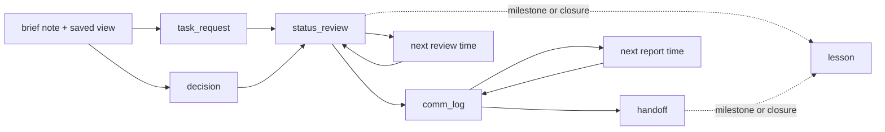
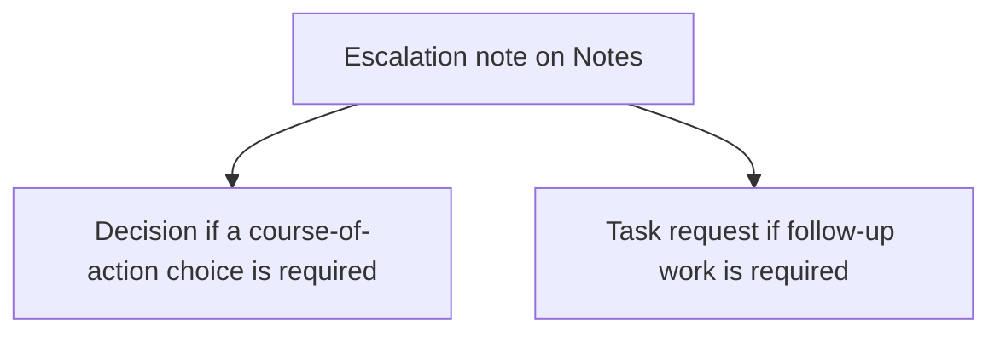
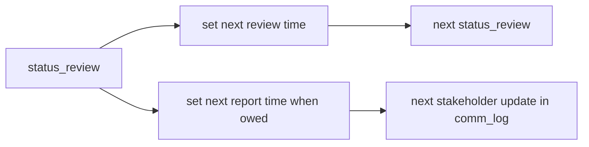
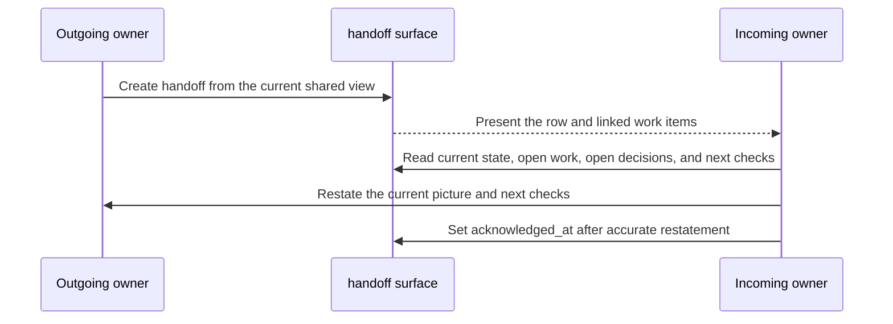
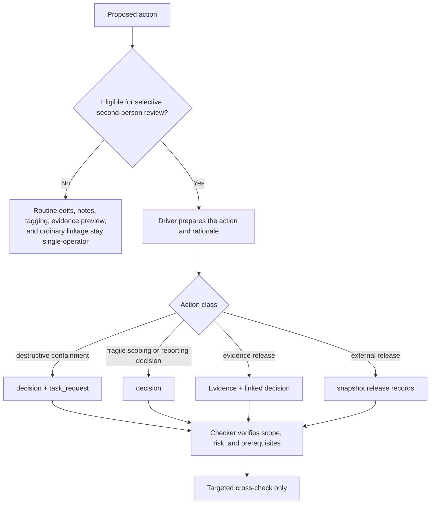

# Incident Coordination Playbook

This playbook is non-normative and operator-facing. It explains how incident teams coordinate inside the current Cartulary profile without redefining product behavior. If this playbook conflicts with the Cartulary normative core, the core wins.[^1][^4][^5][^6]

- Status: Non-normative.
- Default target: Current Cartulary base profile.
- Snapshot and reporting note: Mentioned only where release posture changes.
- Drafting method: Explicit operator contracts, defaults, boundaries, and exit checks, but without claiming NLSpec authority.[^1][^6][^9]

## 1. Purpose, status, and boundary

Use this playbook to decide when to coordinate in workbook-native Cartulary surfaces, what minimum information to record, how cadence and ownership should work, and what work belongs outside the workbook. The product stores the artifacts. This playbook explains when and how to use them.[^4][^6][^8]

This playbook does not change live-workspace visibility, reinterpret saved-view scope as access control, create a generalized approval workflow, add new built-in tabs, or add hot-path ceremony to routine Timeline, Hosts, Identities, Evidence, or Notes capture. Saved-view scope changes only discoverability and mutability of the saved-view object. Recipient-specific withholding remains a snapshot, redaction, render, and release concern rather than a live-workspace hiding pattern.[^4][^5][^6]

The base workbook surfaces remain `cartulary.view.timeline.v1`, `cartulary.view.hosts.v1`, `cartulary.view.identities.v1`, `cartulary.view.evidence.v1`, and `cartulary.view.notes.v1`. The coordination surfaces below are workbook-native system views or implementation-owned `scope='system'` saved views over standardized `view_schema_id` values. Treat them as workbook surfaces, not separate modules.[^2][^4][^6]

## 2. Coordination surface map

Use the current coordination surface set first. The three briefing and escalation patterns below remain note-backed patterns on Notes plus saved views; they are not new first-class objects.[^4][^6]

| Operating need | Primary surface | Current shape | Operator use |
| --- | --- | --- | --- |
| Core timeline capture | `cartulary.view.timeline.v1` | built-in tab | Shared chronology, rough capture, linkage. |
| Host scope | `cartulary.view.hosts.v1` | built-in tab | Canonical or stub host records and host cleanup. |
| Identity scope | `cartulary.view.identities.v1` | built-in tab | Canonical or stub identity records and identity cleanup. |
| Evidence state | `cartulary.view.evidence.v1` | built-in tab | Evidence records, custody state, and evidence linkage. |
| Linked analyst material | `cartulary.view.notes.v1` | built-in tab | Free-form linked notes and note-backed patterns. |
| Work items, asks, blockers, follow-through | `cartulary.view.task_requests.v1` | first-class `task_request` record | Owned action, queueing, due state, blockers. |
| Consequential incident choices | `cartulary.view.decisions.v1` | first-class `decision` record | Scope, containment, communication, evidence, and reporting choices. |
| Stable coordination identity | `cartulary.view.parties.v1` | first-class `party` record | Requester, collector, source, audience, and attendee references. |
| Stakeholder and meeting updates | `cartulary.view.comm_log.v1` | artifact-backed `comm_log` surface | Communication checkpoints, briefings, approvals, and next-report commitments. |
| Ownership transfer | `cartulary.view.handoff.v1` | artifact-backed `handoff` surface | Incoming and outgoing owner transfer with acknowledgement. |
| Review cadence checkpoint | `cartulary.view.status_review.v1` | artifact-backed `status_review` surface | Current state, blockers, pending evidence, open decisions, next report. |
| Durable lessons and follow-through | `cartulary.view.lesson.v1` | artifact-backed `lesson` surface | Lessons linked to follow-up work and closure state. |
| Incident-start brief | `cartulary.view.notes.v1` + saved view | note-backed local pattern | Opening posture, immediate priorities, next regroup point. |
| Phase-change brief | `cartulary.view.notes.v1` + saved view + linked `decision` as needed | note-backed local pattern | Shared transition record when posture changes materially. |
| Escalation note | `cartulary.view.notes.v1` + linked `decision` or `task_request` | note-backed local pattern | Preserve challenge and route it to a live owner. |

Notes stay available for free-form or linked analyst material, but they are not the default home for work items, decisions, communication logs, handoffs, status reviews, or lessons.[^4][^6]

## 3. Role overlays

These overlays describe operating responsibility, not authorization. Incident roles remain `viewer`, `editor`, `reviewer`, and `admin` under the core authorization model.[^4][^5][^6]

### Incident lead

Primary concern: priorities, cadence, phase changes, and external posture. Default surfaces: `status_review`, `decision`, and shared views. Expected outputs: a current working view, an explicit next review time, an explicit next report time when owed, major decisions, and a phase-change brief when posture shifts. Handoff and escalation obligation: ensure challenge items land on a visible `decision` or `task_request`, and ensure ownership changes use `handoff` rather than chat alone.[^6][^7][^8]

### Analyst

Primary concern: capture, linkage, scoping, and follow-through execution. Default surfaces: Timeline, Notes, Evidence, and `task_request`. Expected outputs: rows, links, evidence references, and owned next actions. Handoff and escalation obligation: keep rough facts visible, move actual work onto `task_request`, and preserve material concerns in an escalation note while context is fresh.[^6][^7][^8]

### Stakeholder liaison

Primary concern: internal and external updates, meeting outputs, and next-report commitments. Default surfaces: `comm_log`, `status_review`, and snapshot outputs when the reporting profile exists. Expected outputs: communication rows with audience text, summary, linked decisions or tasks, and next-report timing. Handoff and escalation obligation: do not let stakeholder commitments live only in chat, calendar descriptions, or memory.[^5][^6][^7]

### Evidence custodian

Primary concern: request, receipt, preservation, release posture, and custody-sensitive handling. Default surfaces: Evidence, linked `task_request`, and linked `decision` when release posture is consequential. Expected outputs: evidence state, custody-relevant notes, linked requests, and explicit release rationale when needed. Handoff and escalation obligation: escalate when release changes legal posture, evidentiary value, or integrity risk.[^5][^6]

### Review partner

Primary concern: targeted second-person review on hard-to-reverse or externally consequential actions. Default surfaces: `decision`, history, Evidence plus linked `decision`, and snapshot release records when the reporting profile exists. Expected outputs: a bounded driver/checker cross-check on the governing surface. Handoff and escalation obligation: verify scope, risk, and prerequisites without turning review into a generalized approval layer.[^5][^6][^7]

When stable stakeholder identity matters, create or link an incident-scoped `party` record. Keep requester, collector, source, audience, and attendee text source-preserving first, then add supplemental party links. Ordinary text entry does not auto-create or auto-link parties. Exact-match reuse is conservative: normalized `primary_email` first, then `external_ref`. Use `party.party_kind` values `person`, `team`, `organization`, `distribution_list`, or `other` consistently.[^3][^4][^6]

## 4. Operating rhythm

Use one simple loop: start with a brief note and saved working view, move concrete work into `task_request`, move consequential choices into `decision`, checkpoint on `status_review`, record stakeholder-facing updates in `comm_log`, transfer ownership through `handoff`, and capture durable learning in `lesson`. Set an explicit next review time every time, and set an explicit next report time whenever the team owes an update.[^6][^7]

The default coordination loop is below.[^6]

Use saved views deliberately. Use `private` for personal triage, `shared` for team queues and checkpoint views, and `system` only for implementation-owned or admin-seeded baseline surfaces. Saved-view scope never changes row, evidence, search, or export visibility. Good default shared coordination views are `TASKS - BLOCKED`, `TASKS - NO OWNER`, `TASKS - DUE NEXT 24H`, `DECISIONS - OPEN`, `STATUS - NEXT REPORT`, `HANDOFF - PENDING ACK`, and `LESSONS - OPEN FOLLOW-UP`.[^4][^5][^6]

## 5. Procedure cards

## 5.1 Incident-start brief

### Use when
Use when the workspace moves from intake into active managed response.[^6]

### Do not use when
Do not turn the brief into the permanent home for ongoing tasking, decisions, or stakeholder updates.[^6]

### Primary surface
Use one linked note on `cartulary.view.notes.v1` plus one saved working view. This remains a note-backed local pattern.[^2][^6]

### Actors
Incident lead, active responders, and any stakeholder liaison already participating.[^6][^8]

### Inputs
Current intake facts, opening risks, immediate unknowns, initial responder split, and the first shared working view.[^6]

### Minimum content
Record the lead, current priorities, open risks, current unknowns, initial task split, next review time, and external update posture.[^6]

### Procedure
1. Name the lead and the active responders.
2. State the first priority order and the highest-risk unknowns.
3. Save the initial working view.
4. Create `task_request` rows for concrete asks and follow-up work immediately.
5. Create a `decision` row if the opening posture already depends on an explicit choice.[^6]

### Exit check
Any responder can explain the first objective, biggest risks, key unknowns, and next regroup point without drift.[^6]

### Failure modes
The brief becomes a long-running task tracker, the next review time is implicit instead of explicit, or concrete work stays trapped in note text instead of moving into `task_request` or `decision`.[^6][^7]

### Related views or linked records
Saved working view, `cartulary.view.task_requests.v1`, `cartulary.view.decisions.v1`, and the first `cartulary.view.status_review.v1` row.[^6]

## 5.2 Phase-change brief

### Use when
Use when the incident posture changes materially, for example scoping to containment, containment to recovery, recovery to monitored stabilization, or investigation to formal reporting posture.[^6]

### Do not use when
Do not create a phase-change brief for minor queue movement, routine task completion, or local analytic progress that does not change response posture.[^6]

### Primary surface
Use one linked note on `cartulary.view.notes.v1` plus one saved view, and link the controlling `decision` row when the phase change reflects an explicit choice. This remains note-backed.[^2][^6]

### Actors
Incident lead, analysts carrying the active work, and any stakeholder liaison or review partner needed for the transition.[^6]

### Inputs
Previous phase, intended next phase, controlling decision if any, current saved view, blocking conditions, and current risks.[^6]

### Minimum content
Record from-phase, to-phase, why now, what changed, open risks, exit criteria, and next review time.[^6]

### Procedure
1. State the previous phase and intended next phase.
2. Link the saved view and any controlling `decision`.
3. Record what is true now, what is still blocked, and what must be true before the next phase.
4. Create or update `task_request` rows for concrete exit criteria or gating work.[^6]

### Exit check
A new responder can explain why posture changed, what still blocks progress, and which view or evidence justifies the move.[^6]

### Failure modes
Minor progress gets ritualized into a phase-change brief, the transition has no linked decision when one exists, or gating work stays implicit instead of becoming tasks.[^6]

### Related views or linked records
Saved transition view, linked `decision`, updated `task_request` rows, and the next `status_review` checkpoint.[^6]

## 5.3 Escalation and challenge handling

### Use when
Use when a concern could materially affect containment timing, evidence integrity, legal or stakeholder posture, classification, or business impact.[^6][^7]

### Do not use when
Do not create an escalation artifact for ordinary workbook edits or local analytic disagreement with no operational consequence.[^6][^7]

### Primary surface
Use a linked note on `cartulary.view.notes.v1` for the concern itself, then route the next step to `cartulary.view.decisions.v1` or `cartulary.view.task_requests.v1`. This remains a note-backed pattern.[^2][^6]

### Actors
Raiser of the concern, current owner, incident lead, and any review partner or stakeholder liaison needed for the consequence.[^6][^7]

### Inputs
The fresh concern, why it matters now, required decision time, and any current supporting rows or evidence.[^6]

### Minimum content
Record who raised the concern, current owner, the concern, why it matters now, required decision time, linked decision, linked task, and disposition. Use note-level disposition values `accepted`, `changed`, `deferred`, `rejected`, `watching`, or `superseded` consistently.[^6]

### Procedure
1. Preserve the concern in a note while context is still fresh.
2. Link or create the `decision` row if a course-of-action choice is required.
3. Link or create the `task_request` row if follow-up work is required.
4. Close the escalation only when disposition and next action are visible on the linked surface.[^6][^7]

### Exit check
The concern is no longer trapped in chat or memory, and the team can point to either a live `decision` or a live `task_request` that owns the next step.[^6]

### Failure modes
The concern has no owner, the note records a disposition but no live next step, or the material challenge stays buried in chat.[^6][^7]

### Related views or linked records
Linked `decision`, linked `task_request`, current shared view, and any support rows or evidence refs.[^6]

The escalation routing pattern is below.[^6]

## 5.4 Workload management and follow-through

### Use when
Use `cartulary.view.task_requests.v1` for owned work, asks, blockers, dependencies, and follow-up items.[^4][^6]

### Do not use when
Do not use `task_request` for rationale-bearing choices that need approval, rejection, execution, or supersession semantics. Use `decision` for that.[^3][^6]

### Primary surface
Use `cartulary.view.task_requests.v1`.[^2][^4][^6]

### Actors
Incident lead, analysts, stakeholder liaison for commitments that became work, and evidence custodian for evidence-related asks.[^6][^8]

### Inputs
A concrete next action, linked record context, current owner, due state if relevant, requester text or party ref if relevant, and blocker details when blocked.[^3][^6]

### Minimum content
At minimum, capture a non-empty title and `task_kind`. In practice, also capture owner, status, and linkage. Use `task.task_kind` values `question`, `request`, `collection`, `containment`, and `follow_up`; `task.priority` values `low`, `normal`, `high`, and `urgent`; and `task.status` values `open`, `in_progress`, `blocked`, `done`, and `canceled` consistently.[^3][^6]

### Procedure
1. Create the task as soon as the next step is concrete.
2. Link the supporting rows or `decision` that explain why the task exists.
3. Keep one current owner on every active task.
4. If the task is blocked, record `task.blocked_reason`.
5. If the task is done, ensure `task.completed_at` exists or is filled by commit time.
6. Use shared views to keep blocked, no-owner, due-soon, containment, and external-ticket-linked work visible.[^3][^6]

### Exit check
Every concrete next action has one owner, one state, and enough linkage that another analyst can find the supporting rows without rereading narrative notes.[^6]

### Failure modes
Active tasks are ownerless, blocked tasks have no blocked reason, done tasks have no completion time, or rationale-bearing choices are buried in tasks instead of `decision`.[^3][^6][^8]

### Related views or linked records
Blocked/no-owner/due-soon task views, linked records, linked `decision`, and any external ticket reference.[^6]

## 5.5 Decisioning

### Use when
Use `cartulary.view.decisions.v1` for consequential incident choices, especially scope, containment, communication, evidence, and reporting decisions.[^4][^6]

### Do not use when
Do not use `decision` for routine work assignment, free-form commentary, or narrative status updates.[^6]

### Primary surface
Use `cartulary.view.decisions.v1`.[^2][^4][^6]

### Actors
Incident lead, analysts with supporting evidence, stakeholder liaison for communication decisions, evidence custodian for release decisions, and review partner for high-risk transitions.[^6][^7]

### Inputs
Decision type, concise summary, rationale, current owner, support refs, and any downstream execution task.[^3][^6]

### Minimum content
At minimum, record `decision_type`, `summary`, and `rationale`. In practice, also keep owner, status, and support refs current. Use `decision.decision_type` values `scope`, `containment`, `communication`, `evidence`, and `reporting` consistently. Use `decision.status` values `proposed`, `approved`, `rejected`, `superseded`, and `executed` consistently, but do not treat `superseded` as a direct-write status; supersession happens through the explicit decision-to-decision flow.[^3][^6]

### Procedure
1. Record the choice as soon as it becomes consequential.
2. Link support rows aggressively.
3. Keep the current owner and current status visible.
4. Link a `task_request` when execution work follows from the choice.
5. Use targeted second-person review when the decision is destructive, externally consequential, or evidence-sensitive.[^5][^6][^7]

### Exit check
A reviewer can see the choice, its rationale, its current status, its owner, and the supporting rows without reconstructing it from chat or memory.[^6]

### Failure modes
A consequential choice lives only in chat, support refs are missing, a routine assignment is misfiled as a decision, or the team treats `approved` as a general edit-approval gate.[^3][^6][^7]

### Related views or linked records
`decision.support_refs`, linked `task_request`, linked Evidence or `comm_log` rows, and open-decision views.[^6]

## 5.6 Status review

### Use when
Use `cartulary.view.status_review.v1` on explicit cadence and on major material change.[^4][^6][^7]

### Do not use when
Do not use `status_review` as a rolling note that is edited forever. Create one row per review point.[^6]

### Primary surface
Use `cartulary.view.status_review.v1`.[^2][^4][^6]

### Actors
Incident lead, analysts supplying current blockers or pending evidence, and stakeholder liaison when next-report timing matters.[^6][^8]

### Inputs
Current saved view, changes since the last checkpoint, blocked tasks, pending evidence, open decisions, active risks, and next report time if owed.[^6]

### Minimum content
Record current state summary, blocked task links, pending evidence links, open decision links, active risks summary, and next report time when relevant.[^3][^6]

### Procedure
1. Start from a saved view, not memory.
2. Record only what changed, what is blocked, and what needs escalation.
3. Link the actual blocked tasks, pending evidence, and open decisions.
4. Set `next_report_at` when the team owes another update.
5. Set the next review time explicitly as part of the coordination loop.[^6][^7]

### Exit check
The team can answer what changed since the last checkpoint, what is blocked, what evidence is still pending, which decisions remain open, and when the next report is due.[^6]

### Failure modes
One row gets edited forever, the review is written from memory instead of a saved view, the row restates the workbook without new change or blockers, or the next report time stays implicit when an update is owed.[^6][^8]

### Related views or linked records
Saved checkpoint view, linked blocked tasks, pending evidence, open decisions, and `comm_log` rows for promised next updates.[^6]

Use explicit review and report timing rather than a universal interval. The cadence loop is below.[^6]

## 5.7 Communications and stakeholder updates

### Use when
Use `cartulary.view.comm_log.v1` for stakeholder-facing updates, meetings, approvals, briefings, and communication checkpoints that change posture, commitments, or next-report timing.[^3][^4][^6]

### Do not use when
Do not leave those updates only in chat, calendar descriptions, or oral memory.[^6]

### Primary surface
Use `cartulary.view.comm_log.v1`.[^2][^4][^6]

### Actors
Stakeholder liaison, incident lead, analysts who owe technical inputs, and any attendee or audience party refs needed for stable identity.[^3][^6]

### Inputs
Communication type, audience text, channel or meeting, summary, linked decisions, linked action tasks, next report time, and privilege handling tag when relevant.[^3][^6]

### Minimum content
At minimum, record `comm_type`, `audience`, `channel_or_meeting`, and `summary`. Keep `audience` as required source-preserving text even when you also add `audience_party_ids` or `attendee_party_ids`. Use `comm_log.comm_type` values `meeting`, `notification`, `approval`, `briefing`, and `handoff` consistently.[^3][^6]

### Procedure
1. Record the update on `comm_log` as soon as it changes posture, commitments, or next-report timing.
2. Preserve audience text exactly as communicated.
3. Add party refs only as supplemental structure.
4. Link `decision` rows when the update depended on a choice.
5. Link `task_request` rows when the update created commitments or next actions.
6. Set `next_report_at` when another checkpoint was promised.[^3][^6]

### Exit check
The row says who was updated, how, what changed, what commitments were made, and when the next report is due. If the update created work or relied on a decision, the row links to those records directly.[^6]

### Failure modes
The update exists only in chat or a calendar invite, audience text is lost because only party refs were kept, or commitments were made without linked tasks or linked decisions.[^3][^6]

### Related views or linked records
Linked `decision`, linked `task_request`, `status_review.next_report_at`, and optional party views.[^3][^6]

## 5.8 Shift handoff

### Use when
Use `cartulary.view.handoff.v1` whenever operational ownership changes, including shift end, analyst rotation, or specialist transfer.[^3][^4][^6]

### Do not use when
Do not treat chat review or oral recap alone as the handoff record.[^6]

### Primary surface
Use `cartulary.view.handoff.v1`.[^2][^4][^6]

### Actors
Outgoing owner, incoming owner, incident lead when needed, and any reviewer who needs to confirm high-risk context transfer.[^6]

### Inputs
Current shared view, current state summary, open tasks, open decisions, open risks, next checks, and acknowledgement state.[^3][^6]

### Minimum content
At minimum, record incoming owner and current state summary. In practice, also record open tasks, open decisions, open risks, next checks, and acknowledgement state.[^3][^6]

### Procedure
1. Outgoing owner creates the handoff row from the current shared view.
2. Incoming owner reads the row and linked work items.
3. Incoming owner restates the current picture and next checks.
4. Set `handoff.acknowledged_at` only after accurate restatement.[^6]

### Exit check
The handoff has a named incoming owner, visible open work, visible open decisions, visible next checks, and an acknowledgement state that reflects whether the incoming owner has actually absorbed the transfer.[^6]

### Failure modes
A casual recap substitutes for the handoff row, acknowledgement is set before accurate restatement, or the row has no visible next checks or no visible open work.[^6][^8]

### Related views or linked records
Current shared view, open-task view, open-decision view, latest `status_review`, and any escalation or evidence rows that shape the next checks.[^6]

The transfer sequence is below.[^6]

## 5.9 Closure and debrief

### Use when
Use `cartulary.view.lesson.v1` at closure and at major milestones worth preserving.[^3][^4][^6]

### Do not use when
Do not leave durable follow-through only in free text.[^6]

### Primary surface
Use `cartulary.view.lesson.v1`.[^2][^4][^6]

### Actors
Incident lead, analysts with evidence-backed lessons, stakeholder liaison for communication lessons, and owners of any follow-up work.[^6][^8]

### Inputs
Lesson summary, owner, follow-up tasks, supporting evidence refs, and closure state.[^3][^6]

### Minimum content
At minimum, record a non-empty lesson summary. In practice, also keep owner, follow-up tasks, evidence refs, and closure state current. Use `lesson.closure_state` values `open` and `closed` consistently.[^3][^6]

### Procedure
1. Record the lesson as a durable row.
2. Link supporting evidence or source rows.
3. Create `task_request` rows for required follow-through.
4. Close the lesson only when follow-through is complete or explicitly canceled.[^6]

### Exit check
Each open lesson either has linked follow-up work or is explicitly marked as observational only with no operational follow-through.[^6]

### Failure modes
Lessons are captured only in prose, follow-up work is not linked, or closure happens without either completed follow-through or an explicit observational-only disposition.[^6][^8]

### Related views or linked records
Linked `task_request`, supporting Evidence or source rows, and open-lesson follow-up views.[^6]

## 6. High-risk transitions and selective second-person review

Use selective second-person review only where the action is hard to reverse, externally consequential, or likely to damage evidence if executed poorly. This is a practice pattern, not a new workflow engine.[^5][^6][^7]

### Use when

Use it for destructive containment, evidence release, external release preparation, and a small set of fragile scoping or reporting decisions.[^5][^6]

### Do not use when

Do not use it for routine row edits, note creation, tagging, evidence preview, or ordinary linkage work.[^5][^6]

### Driver/checker split

Keep the split simple: one driver prepares the action and rationale; one checker verifies scope, risk, and prerequisites. The checker does not become a general editor or a standing approver for routine work.[^5][^6]

### Record the check on the governing surface

Record the cross-check on the surface already governing the action:
- `decision` for the go/no-go or rationale-bearing choice.
- `task_request` for the execution item.
- Evidence plus linked `decision` for evidence release posture.
- Snapshot release records for rendered-output publication when the reporting profile exists.[^3][^4][^5][^6]

### High-risk action patterns

- Destructive containment: use a `decision` for the choice and a `task_request` for execution. Link rows that establish scope, preservation posture, impact, and rollback path.[^6][^7]
- Evidence release: use the Evidence surface for the evidence record and a linked `decision` when release posture or integrity risk is consequential. Keep requester, collector, and source identity text-first, then add party links if needed.[^3][^5][^6]
- External release: if the Snapshot and Reporting Extension Profile is present, use the existing artifact-scoped release gate. `internal_review` requires one `reviewer` approval. `external_release` requires distinct `reviewer` and `admin` approvals. Any bound-tuple or output-byte change invalidates prior approvals.[^5][^6]

The decision tree is below.[^6]

Treat raw coordination-record text as non-releasable by default. `task_request`, `decision`, `comm_log`, `handoff`, `status_review`, and `lesson` may inform an external release, but any `external_release` artifact must flow through snapshot, redaction, and curation. Curated narrative carries support refs. Do not invent a second broad approval workflow for ordinary case work.[^5][^6]

## 7. Companion-artifact appendix

Cartulary should own the incident-scoped coordination model, not every adjacent artifact. Keeping these boundaries explicit is part of tracker hygiene and part of avoiding a new spreadsheet of doom inside one workbook.[^7][^8]

### What belongs in Cartulary now

Keep incident-scoped coordination state in Cartulary: tasks, decisions, parties, communication logs, handoffs, status reviews, lessons, note-backed briefs and escalation notes, plus links to evidence and supporting rows.[^4][^6][^8]

### What belongs in a findings document

Put longer-form analytic narrative, excerpts, argumentation, and low-level write-up in a findings document or equivalent narrative working artifact. Do not make workbook surfaces unreadable by turning them into the only home for long-form reasoning.[^6][^8]

### What belongs in evidence storage

Put binary payloads, custody artifacts, and raw collected material in evidence storage. Cartulary keeps evidence references and custody state, not the binary payloads themselves.[^2][^8]

### What belongs in final reporting or the knowledge base

Put curated narrative, sanitized external outputs, recipient-specific releases, reusable cross-incident knowledge, and knowledge-base content outside the live incident workbook. The workbook is not the authoritative CMDB, identity provider, telemetry platform, or polished report as the only narrative artifact.[^5][^8]

## 8. Lightweight validation and misuse signals

The playbook is being used well when concrete actions move onto `task_request`, consequential choices move onto `decision`, status reviews and communication logs start from saved views rather than memory, handoffs are acknowledged after accurate restatement, lessons link to actual follow-up tasks, and selective second-person review stays confined to high-risk transitions.[^6][^7]

Misuse signals are equally clear: duplicate narration across surfaces, repeated “complete” note text with no linked task, note-backed patterns becoming permanent trackers, handoff rows longer than the time they save, status reviews that merely restate the workbook without new change or blockers, and second-person review spreading into ordinary edits.[^6][^8]

### Definition of done for this playbook

This playbook is ready for review and use when all of the following are true:

- It remains one Markdown document and is visibly marked non-normative.
- It states that the normative core remains authoritative.
- It uses current built-in tabs, current record nouns, and current `view_schema_id` values only.
- It labels incident-start brief, phase-change brief, and escalation note explicitly as note-backed.
- It gives every recurring coordination event a full operator contract with trigger, actors, inputs, primary surface, minimum content, procedure, exit check, and failure modes.
- It keeps saved-view scope separate from access semantics.
- It keeps selective second-person review narrow and high-risk only.
- It keeps companion-artifact placement explicit enough that responders know where the next piece of work belongs.
- It can be executed as an operator guide without consulting the research reports.
- It stays shorter than the operating guide by compression, not by vagueness.[^1][^6][^9]

## Sources

[^1]: `00_document_set_status_and_precedence.md`
[^2]: `01_architecture_storage_and_view_contracts.md`
[^3]: `02_domain_model_schema_and_history.md`
[^4]: `03_workbook_interaction_collaboration_and_workflows.md`
[^5]: `04_security_deployment_and_conformance.md`
[^6]: `cartulary_non_normative_operating_model_guidance.md`
[^7]: `R02-cartulary_crm_tem_dfir_research_report.md`
[^8]: `R06-spreadsheet_of_doom_dfir_research_report.md`
[^9]: `nlspec-spec.md`
