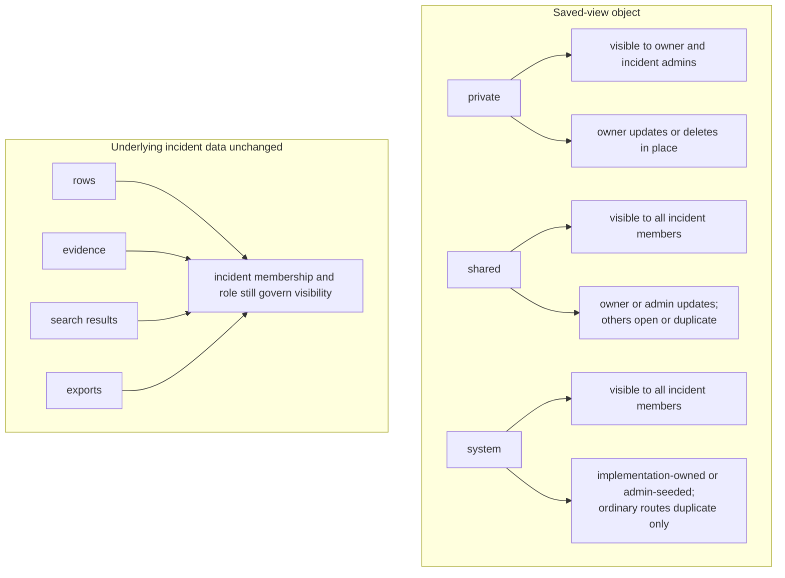
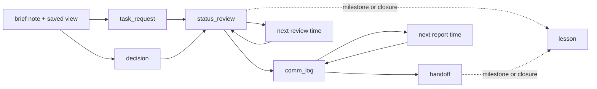
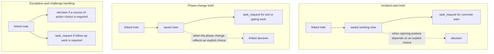
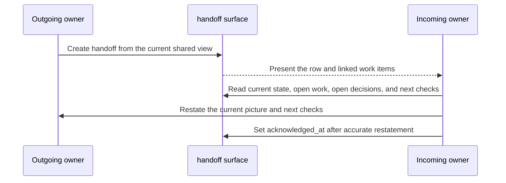
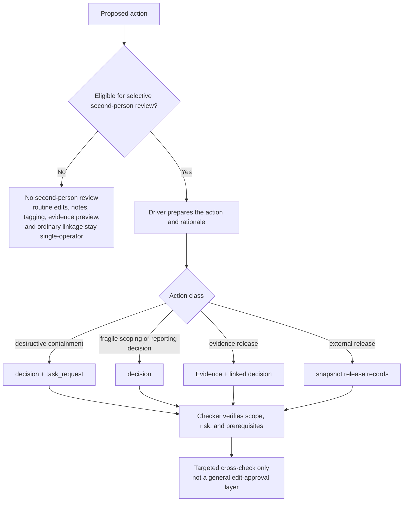

# Cartulary Operating Model Guide for Incident Coordination

This document is **non-normative**.

It is an operating companion to the current Cartulary normative core. It does not change base-profile conformance, add mandatory ceremony to routine workbook capture, widen or narrow live-workspace visibility, or create approval workflows outside the bounded snapshot-release gate.[^1][^2][^3][^4][^5]

## 1. Purpose and scope

Cartulary’s current core is already explicit about workbook interaction, progressive structuring, evidence handling, history, rollback, and collaboration. The remaining operating question is how incident teams should use those surfaces for coordination without smuggling process friction onto the grid hot path. This guide answers that question for the current profile.[^2][^3][^4]

This guide is for incident leads, analysts, reviewers, stakeholder liaisons, and evidence custodians working inside one incident workspace. It assumes the current normative core is the source of truth for current behavior. Roadmap and appendix material remain informative only unless the normative core restates them as active requirements.[^1]

## 2. Relationship to the current core

Use this guide with six boundary rules in mind.

1. Protect the capture path. Routine Timeline, Hosts, Identities, Notes, and Evidence editing stays grid-first and low ceremony.
2. Keep coordination workbook-native. Use workbook surfaces, linked records, saved views, history, and snapshots rather than ad hoc side channels as the system of record.
3. Use current standardized surfaces first. `task_request`, `decision`, `party`, `comm_log`, `handoff`, `status_review`, and `lesson` are already part of the current profile.
4. Keep saved-view scope separate from access. `private`, `shared`, and `system` change discoverability and mutability of the view object only, not access to rows, evidence, or exports.
5. Keep live workspace visibility incident-scoped. Recipient-specific withholding belongs at snapshot, redaction, render, and release time, not in day-to-day live-workspace hiding.
6. Keep release controls narrow. The snapshot release gate is for rendered outputs, not for routine edits or general operating approvals.[^1][^2][^3][^4][^5]

The built-in workbook tabs remain Timeline, Hosts, Identities, Evidence, and Notes. Current coordination work beyond those tabs lives in workbook-native system views or implementation-owned `scope='system'` saved views bound to standardized `view_schema_id` values. Treat those surfaces as part of the workbook, not as separate modules.[^2][^4]

## 3. Current coordination surface map

The current profile no longer treats most coordination surfaces as interim.[^2][^3][^4]

| Operating need | Default surface | Current shape | Notes |
| --- | --- | --- | --- |
| Work items, requests, blockers, follow-through | `cartulary.view.task_requests.v1` | first-class `task_request` record | Use for owned action, queueing, due dates, and blockers. |
| Decisions and rationale | `cartulary.view.decisions.v1` | first-class `decision` record | Use for scope, containment, communication, evidence, and reporting choices. |
| Stable coordination identity | `cartulary.view.parties.v1` | first-class `party` record | Use for requester, collector, source, audience, and attendee references. |
| Stakeholder and meeting updates | `cartulary.view.comm_log.v1` | artifact-backed `comm_log` surface | Audience text stays required even when party refs are added. |
| Ownership transfer | `cartulary.view.handoff.v1` | artifact-backed `handoff` surface | Use for outgoing/incoming owner transfer and acknowledgement. |
| Review cadence checkpoint | `cartulary.view.status_review.v1` | artifact-backed `status_review` surface | Use for current state, blocked work, pending evidence, and open decisions. |
| Lessons and follow-through | `cartulary.view.lesson.v1` | artifact-backed `lesson` surface | Use for milestone learning plus linked follow-up tasks. |
| Incident-start brief | linked note + saved view | local note-backed pattern | Keep brief, link the working view, then move concrete work into tasks and decisions. |
| Phase-change brief | linked note + saved view + linked decision as needed | local note-backed pattern | Use when posture changes and the team needs a shared transition record. |
| Escalation note | linked note plus linked `decision` or `task_request` as needed | local note-backed pattern | Use to preserve challenge and context until it resolves into a decision or assigned work item. |

These mappings reflect the current standardized surface set, current storage shape, and remaining note-backed operating patterns.[^2][^3][^4]

Notes remain available for free-form or linked analyst material. They are not the default home for work items, decisions, communications logs, handoffs, status reviews, or lessons in the current profile.[^2][^3][^4][^5]

## 4. Roles, accountability, and coordination identity

Cartulary authorization remains incident-scoped and role-based: `viewer`, `editor`, `reviewer`, and `admin`. This guide adds operating overlays, not new authorization classes.[^4][^5]

| Operating overlay | Primary concern | Default surface |
| --- | --- | --- |
| Incident lead | priorities, cadence, phase changes, external posture | `status_review`, `decision`, shared views |
| Analyst / investigator | capture, linkage, follow-through execution | Timeline, Notes, Evidence, `task_request` |
| Stakeholder liaison | internal and external updates, meeting outputs | `comm_log`, `status_review`, snapshots |
| Evidence custodian | request, receipt, preservation, release posture | Evidence, linked `task_request`, linked `decision` |
| Review partner | selective second-person check on high-risk transitions | `decision`, history, release gate |

Use `owner_user_id` for accountable internal ownership on coordination objects. Use party references for requester, collector, source, audience, and attendee identity. Do not substitute party refs for accountable internal ownership.[^3][^4]

When you need stable stakeholder identity, create or link an incident-scoped `party` record. Ordinary text entry in requester, collector, source, audience, or attendee fields does **not** auto-create or auto-link a party. Explicit `Create party from text` or `Link existing party` flows do. Exact-match reuse is conservative: normalized `primary_email` first, then `external_ref`. Display name and phone-like text may help suggestion but are not auto-upsert keys.[^3][^4]

Use these `party.party_kind` values consistently: `person`, `team`, `organization`, `distribution_list`, or `other`.[^3]

## 5. Saved views for coordination

Saved views are coordination tools, not access-control objects.[^4][^5] Use them deliberately.

Use a `private` saved view for personal working queues, temporary pivots, or analyst-specific triage. Use a `shared` saved view when the team needs one durable queue or checkpoint view that others can open and duplicate. Use a `system` saved view only for implementation-owned or admin-seeded operating views that should be visible to everyone but not editable in place through ordinary saved-view routes.[^4]

A coordination view should usually be `shared` when it represents a team queue such as blocked tasks, due work, no-owner work, pending evidence, next report checkpoint, or shift handoff focus. A coordination view should usually be `system` when it is the canonical seeded surface for `comm_log`, `handoff`, `status_review`, or `lesson` and the team should duplicate rather than modify the baseline in place.[^2][^4]

Saved-view scope changes only discoverability and mutability of the saved-view object. It does not change who can see rows, evidence, search results, or exported content.[^4][^5]



Recommended shared coordination views:

- `TASKS - BLOCKED`
- `TASKS - NO OWNER`
- `TASKS - DUE NEXT 24H`
- `DECISIONS - OPEN`
- `STATUS - NEXT REPORT`
- `HANDOFF - PENDING ACK`
- `LESSONS - OPEN FOLLOW-UP`

## 6. Operating rhythm

Use a simple current-state rhythm.

1. Open the incident with a brief note and a saved working view.
2. Move concrete work into `task_request` rows immediately.
3. Record consequential choices in `decision` rows immediately.
4. Use `status_review` on an explicit cadence and on material change.
5. Use `comm_log` for stakeholder-facing updates and meetings that change posture, commitments, or next-report timing.
6. Use `handoff` whenever operational ownership changes.
7. Use selective second-person review only for high-risk transitions.
8. Capture milestone learning in `lesson` rows and link each durable follow-up to a `task_request`.[^3][^4][^6]



The lead should always set an explicit next review time and, when applicable, an explicit next report time. Those two checkpoints keep cadence visible without forcing one universal interval across every incident.[^6]

## 7. Incident-start brief

### Use when

Use when the workspace moves from intake into active managed response.

### Do not use when

Do not turn the brief into the permanent home for ongoing tasking, decisions, or stakeholder updates. Move those into `task_request`, `decision`, and `comm_log` once they exist.

### Primary surface

Use one linked note on the Notes surface plus one saved working view. This remains a local note-backed pattern in the current profile.[^2][^4]

### Minimum content

```text
Lead:
Current priorities:
Open risks:
Current unknowns:
Initial task split:
Next review time:
External update posture:
```

### Procedure

1. Name the lead and active responders.
2. State the first priority order and highest-risk unknowns.
3. Save the initial working view.
4. Create `task_request` rows for concrete asks and follow-up work.
5. Create a `decision` row if the opening posture already depends on an explicit choice.

### Exit check

The team can answer, without drift, what it is trying to establish first, what could go wrong if it moves too fast, what remains unknown, and when it will regroup.[^6]

## 8. Phase-change brief

### Use when

Use when the incident posture changes materially, for example scoping to containment, containment to recovery, recovery to monitored stabilization, or investigation to formal reporting posture.

### Do not use when

Do not create a phase-change brief for minor queue movement, routine task completion, or local analytic progress that does not change the response posture.

### Primary surface

Use one linked note plus one saved view, and link the controlling `decision` row when the phase change reflects an explicit decision. This remains note-backed in the current profile.[^2][^4]

### Minimum content

```text
From phase:
To phase:
Why now:
What changed:
Open risks:
Exit criteria:
Next review time:
```

### Procedure

1. State the previous phase and intended next phase.
2. Link the saved view and any controlling `decision`.
3. Record what is true now, what is still blocked, and what must be true before the next phase.
4. Create or update `task_request` rows for concrete exit criteria or gating work.

### Exit check

A new responder can explain why the posture changed, what still blocks progress, and which view or evidence justifies the move.

## 9. Escalation and challenge handling

### Use when

Use when a concern could materially affect containment timing, evidence integrity, legal or stakeholder posture, classification, or business impact.

### Do not use when

Do not create an escalation artifact for ordinary workbook edits or local analytic disagreement with no operational consequence.

### Primary surface

Use a linked note for the concern itself, then use `decision` or `task_request` for the actual resolution path. Escalation remains a note-backed operating pattern, not a separate standardized record type.[^6]

### Minimum content

```text
Raised by:
Current owner:
Concern:
Why it matters now:
Required decision time:
Linked decision:
Linked task:
Disposition:
```

### Recommended disposition vocabulary

Use `accepted`, `changed`, `deferred`, `rejected`, `watching`, or `superseded` for the note-level disposition summary. If the issue becomes a formal incident choice, the authoritative lifecycle should live on the linked `decision` row instead.[^6]

### Procedure

1. Preserve the concern in a note while context is still fresh.
2. Link or create the `decision` row if a course-of-action choice is required.
3. Link or create the `task_request` row if follow-up work is required.
4. Close the escalation only when disposition and next action are visible on the linked surface.

### Exit check

The concern is no longer trapped in chat or memory, and the team can point to either a live `decision` or a live `task_request` that owns the next step.



## 10. Workload management and follow-through with `task_request`

### Use when

Use `task_request` for owned work, asks, blockers, dependencies, and follow-up items.

### Do not use when

Do not use `task_request` for rationale-bearing choices that need approval, rejection, execution, or supersession semantics. Use `decision` for that.

### Primary surface

Use `cartulary.view.task_requests.v1` as the default operating surface for work management.[^2][^3][^4]

### Minimum create signal

A row commits only when `task.title` is non-empty and `task.task_kind` is present after create-time normalization. Preseeded linked records or decision context do not satisfy that minimum signal.[^2][^5]

### Create defaults

When omitted on blank-row create, the server defaults:

- `task.status` -> `open`
- `task.owner_user_id` -> current actor
- `task.priority` -> `normal`

Those defaults do not satisfy the minimum create signal by themselves.[^2][^5]

### Closed values to use consistently

- `task.task_kind`: `question`, `request`, `collection`, `containment`, `follow_up`
- `task.priority`: `low`, `normal`, `high`, `urgent`
- `task.status`: `open`, `in_progress`, `blocked`, `done`, `canceled`[^3]

### Recommended working fields

Use these fields consistently when they help:

- `task.workstream`
- `task.due_at`
- `task.requester_party_text` plus optional `task.requester_party_id`
- `task.blocked_reason`
- `task.external_ticket_ref`
- `task.linked_record_ids`
- `task.decision_record_id`
- `task.closure_summary`

### Lifecycle rules that matter operationally

A blocked task requires `task.blocked_reason`. A done task requires `task.completed_at`. Active tasks cannot be ownerless. Moving out of `blocked` clears `blocked_reason`. Moving out of `done` clears `completed_at`. Setting `status='done'` without an explicit completion time fills `completed_at` from commit time.[^3]

### Recommended views

At minimum, keep shared views for blocked tasks, no-owner tasks, due-soon tasks, containment tasks, and external-ticket-linked tasks.[^4][^6]

### Exit check

Every concrete next action has one owner, one state, and enough linkage that another analyst can find the supporting rows without rereading narrative notes.

## 11. Decisioning with `decision`

### Use when

Use `decision` for consequential incident choices, especially scope, containment, communication, evidence, and reporting decisions.

### Do not use when

Do not use `decision` for routine work assignment, free-form commentary, or narrative status updates.

### Primary surface

Use `cartulary.view.decisions.v1` as the default operating surface for rationale-bearing incident choices.[^2][^3][^4]

### Minimum create signal

A row commits only when `decision.decision_type` is present and both `decision.summary` and `decision.rationale` are non-empty after create-time normalization. Preseeded support refs do not satisfy the minimum signal.[^2][^5]

### Create defaults

When omitted on create, the server defaults:

- `decision.status` -> `proposed`
- `decision.owner_user_id` -> current actor
- `decision.decided_at` -> commit timestamp

Those defaults do not satisfy the minimum create signal by themselves.[^2][^5]

### Closed values to use consistently

- `decision.decision_type`: `scope`, `containment`, `communication`, `evidence`, `reporting`
- `decision.status`: `proposed`, `approved`, `rejected`, `superseded`, `executed`[^3]

### Lifecycle rules that matter operationally

Direct status writes support `proposed -> approved`, `proposed -> rejected`, `proposed -> executed`, and `approved -> executed`. `superseded` is **not** a direct-write status. Supersession happens through the explicit decision-to-decision supersession flow. `approved` is an incident-coordination state, not a generalized approval gate for ordinary row edits.[^3]

### Recommended working fields

Use `decision.support_refs` aggressively. A decision without support links is hard to review, hard to revisit, and easy to misquote later.

### Exit check

A reviewer can see the choice, its rationale, its current status, its owner, and the supporting rows without reconstructing the decision from chat, memory, or ad hoc note text.

## 12. Status review with `status_review`

### Use when

Use on explicit cadence and on major material change.

### Do not use when

Do not use `status_review` as a rolling note that is edited forever. Create one row per review point.

### Primary surface

Use `cartulary.view.status_review.v1`.[^2][^3][^4]

### Minimum create signal

A row commits only when `status_review.current_state_summary` is non-empty after create-time normalization.[^2][^5]

### Create defaults

When omitted on create, the server defaults:

- `status_review.timestamp_utc` -> commit timestamp
- `status_review.review_owner_user_id` -> current actor
- `status_review.blocked_task_ids` -> empty
- `status_review.pending_evidence_ids` -> empty
- `status_review.open_decision_ids` -> empty
- `status_review.active_risks_summary` -> `null`
- `status_review.next_report_at` -> `null`

These defaults do not satisfy the minimum create signal by themselves.[^2][^5]

### Recommended working fields

Use:

- `status_review.current_state_summary`
- `status_review.blocked_task_ids`
- `status_review.pending_evidence_ids`
- `status_review.open_decision_ids`
- `status_review.active_risks_summary`
- `status_review.next_report_at`

### Procedure

1. Start from a saved view, not memory.
2. Record only what changed, what is blocked, and what needs escalation.
3. Link the actual blocked tasks, pending evidence, and open decisions rather than restating them loosely in prose.
4. Set the next report time if the team owes an update.

### Exit check

The team can answer what changed since the last checkpoint, what is blocked, what evidence is still pending, which decisions remain open, and when the next report is due.

## 13. Shift handoff with `handoff`

### Use when

Use whenever operational ownership changes, including shift end, analyst rotation, or specialist transfer.

### Do not use when

Do not treat chat review or oral recap alone as the handoff record.

### Primary surface

Use `cartulary.view.handoff.v1`.[^2][^3][^4]

### Minimum create signal

A row commits only when `handoff.incoming_owner_user_id` is present and `handoff.current_state_summary` is non-empty after create-time normalization.[^2][^5]

### Create defaults

When omitted on create, the server defaults:

- `handoff.timestamp_utc` -> commit timestamp
- `handoff.outgoing_owner_user_id` -> current actor
- `handoff.open_task_ids` -> empty
- `handoff.open_decision_ids` -> empty
- `handoff.open_risk_refs` -> empty
- `handoff.next_checks` -> `null`
- `handoff.acknowledged_at` -> `null`

These defaults do not satisfy the minimum create signal by themselves.[^2][^5]

### Recommended working fields

Use:

- `handoff.current_state_summary`
- `handoff.open_task_ids`
- `handoff.open_decision_ids`
- `handoff.open_risk_refs`
- `handoff.next_checks`
- `handoff.acknowledged_at`

### Procedure

1. Outgoing owner creates the handoff row from the current shared view.
2. Incoming owner reads the row and linked work items.
3. Incoming owner restates the current picture and next checks.
4. Set `handoff.acknowledged_at` only after the incoming owner can restate the state accurately.



### Exit check

The handoff has a named incoming owner, visible open work, visible open decisions, visible next checks, and an acknowledgement state that reflects whether the incoming owner has actually absorbed the transfer.

## 14. Communications and stakeholder updates with `comm_log`

### Use when

Use for stakeholder-facing updates, meetings, approvals, briefings, and communication checkpoints that change posture, commitments, or next-report timing.

### Do not use when

Do not leave those updates only in chat, calendar descriptions, or oral memory.

### Primary surface

Use `cartulary.view.comm_log.v1`.[^2][^3][^4]

### Minimum create signal

A row commits only when `comm_log.comm_type` is present and `comm_log.audience`, `comm_log.channel_or_meeting`, and `comm_log.summary` are non-empty after create-time normalization.[^2][^5]

### Create defaults

When omitted on create, the server defaults:

- `comm_log.comm_id` -> generated
- `comm_log.timestamp_utc` -> commit timestamp
- `comm_log.decision_ids` -> empty
- `comm_log.action_task_ids` -> empty
- `comm_log.audience_party_ids` -> empty
- `comm_log.attendee_party_ids` -> empty
- `comm_log.next_report_at` -> `null`
- `comm_log.privilege_tag` -> `null`

These defaults do not satisfy the minimum create signal by themselves.[^2][^5]

### Closed values to use consistently

Use `comm_log.comm_type` values `meeting`, `notification`, `approval`, `briefing`, or `handoff`.[^3]

### Recommended working fields

Use:

- `comm_log.audience` as required source-preserving text
- optional `comm_log.audience_party_ids` and `comm_log.attendee_party_ids` as supplemental structured identity
- `comm_log.decision_ids` for linked decisions
- `comm_log.action_task_ids` for commitments that became work
- `comm_log.next_report_at` when the team has promised another checkpoint
- `comm_log.privilege_tag` when privilege or handling posture matters

### Exit check

The row says who was updated, how, what changed, what commitments were made, and when the next report is due. If the update created work or relied on a decision, the row links to those records directly.

## 15. Selective second-person review

Use selective second-person review only where the action is hard to reverse, externally consequential, or likely to damage evidence if executed poorly. This is a practice pattern, not a new always-on workflow layer.[^5][^6]

Use it for destructive containment, evidence release, external release preparation, and a small set of fragile scoping or reporting decisions. Do not use it for routine row edits, note creation, tagging, evidence preview, or ordinary linkage work.[^5][^6]

Record the check on the surface already governing the action:

- `decision` for the go/no-go or rationale-bearing choice,
- `task_request` for the execution item,
- Evidence plus linked `decision` for evidence release posture,
- snapshot release records for rendered-output publication when the reporting profile exists.[^2][^3][^4][^5]

Keep the split simple: one driver prepares the action and rationale; one checker verifies scope, risk, and prerequisites. Do not let that checker role mutate into general edit approval.



## 16. High-risk action patterns

### 16.1 Destructive containment

Use a `decision` row for the containment choice and a `task_request` row for the execution item. Link support rows that establish scope, preservation posture, impact, and rollback path. Use selective second-person review before execution if evidence loss, service impact, or widening damage is plausible.[^6]

### 16.2 Evidence release

Use the Evidence surface for the evidence record, and use a linked `decision` row when release posture or integrity risk is consequential. Keep requester, collector, and source identity text-first on the Evidence surface, then add supplemental party links if needed. Use second-person review when release changes custody posture, legal posture, or downstream evidentiary value.[^3][^6]

### 16.3 External release

If the Snapshot and Reporting Extension Profile is present, use the existing artifact-scoped release gate for rendered outputs. Do not invent a second broad approval workflow for ordinary case work. In the current gate, `internal_review` requires one `reviewer` approval, `external_release` requires distinct `reviewer` and `admin` approvals, and any bound-tuple or output-byte change invalidates prior approvals.[^5]

Treat raw coordination-record text as non-releasable by default. `task_request`, `decision`, `comm_log`, `handoff`, `status_review`, and `lesson` content may inform a release, but any `external_release` output must flow through snapshot, redaction, and curation. Curated narrative must carry support refs. Raw working material and raw coordination text do not become releasable merely because they exist in the workbook.[^5]

If the reporting profile is not present, keep the release decision outside the product’s formal gate but still record the rationale and support links in the workbook.

## 17. Debrief and follow-through with `lesson`

### Use when

Use at closure and at major milestones worth preserving.

### Do not use when

Do not leave durable follow-through only in free text. Create linked `task_request` rows for actual next actions.

### Primary surface

Use `cartulary.view.lesson.v1`.[^2][^3][^4]

### Minimum create signal

A row commits only when `lesson.summary` is non-empty after create-time normalization.[^2][^5]

### Create defaults

When omitted on create, the server defaults:

- `lesson.lesson_id` -> generated
- `lesson.timestamp_utc` -> commit timestamp
- `lesson.owner_user_id` -> current actor
- `lesson.follow_up_task_ids` -> empty
- `lesson.evidence_refs` -> empty
- `lesson.closure_state` -> `open`

These defaults do not satisfy the minimum create signal by themselves.[^2][^5]

### Closed values to use consistently

Use `lesson.closure_state` values `open` and `closed`.[^3]

### Recommended working fields

Use:

- `lesson.summary`
- `lesson.owner_user_id`
- `lesson.follow_up_task_ids`
- `lesson.evidence_refs`
- `lesson.closure_state`

### Procedure

1. Record the lesson as a durable row.
2. Link supporting evidence or source rows.
3. Create `task_request` rows for required follow-through.
4. Close the lesson only when the intended follow-up work is complete or explicitly canceled.

### Exit check

Each open lesson either has linked follow-up work or is explicitly marked as a purely observational lesson with no operational follow-through.

## 18. Lightweight validation and adaptation

Watch six signals.

- Are concrete actions moving onto `task_request` rather than hiding in notes?
- Are consequential choices moving onto `decision` rather than hiding in chat?
- Do status reviews and comm logs start from saved views rather than memory?
- Are handoffs acknowledged and materially reducing re-orientation time?
- Are lessons linked to actual follow-up tasks?
- Are selective second-person checks staying confined to high-risk transitions?[^6]

If the guide is becoming ritualized, the symptoms are predictable: duplicate narration across surfaces, repeated “complete” notes with no linked work, second-person review spreading into routine edits, handoff rows longer than the time they save, or status reviews that merely restate the workbook without new action or decision.

The remaining local note-backed patterns that may deserve later standardization are narrow: incident-start brief, phase-change brief, and escalation note shape. Tasking, decisioning, communications logging, handoff, status review, lesson capture, and party identity are already closed in the current profile.[^1][^2][^3][^4]

## 19. Definition of done for this operating model

This guide is being used correctly when all of the following are true.

- Briefing stays short and linked to the working view.
- Concrete work lands on `task_request`.
- Consequential choices land on `decision`.
- Review cadence is visible through `status_review`.
- Stakeholder updates land on `comm_log`.
- Owner transfer lands on `handoff`.
- Learning lands on `lesson` and links to follow-up tasks where needed.
- Party refs supplement preserved text rather than replacing it.
- Saved-view scope is used for discoverability and mutability only.
- High-risk actions get targeted cross-check.
- External release uses curated snapshot outputs rather than raw coordination-record text.
- Routine grid editing stays fast, local, and minimally ceremonial.[^2][^3][^4][^5]

## Sources

[^1]: `00_document_set_status_and_precedence.md`.
[^2]: `01_architecture_storage_and_view_contracts.md`.
[^3]: `02_domain_model_schema_and_history.md`.
[^4]: `03_workbook_interaction_collaboration_and_workflows.md`.
[^5]: `04_security_deployment_and_conformance.md`.
[^6]: `R02-cartulary_crm_tem_dfir_research_report.md`.
