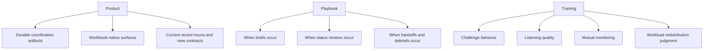
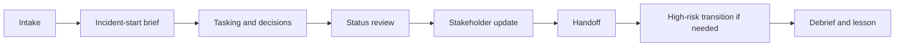
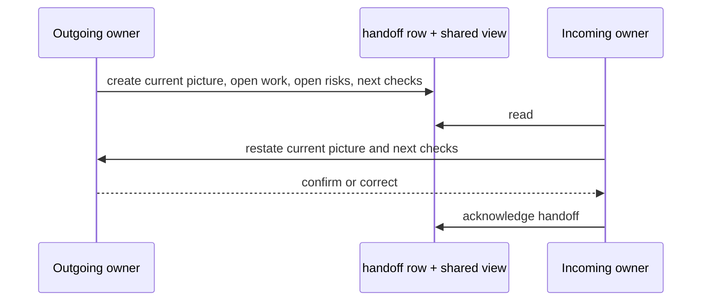
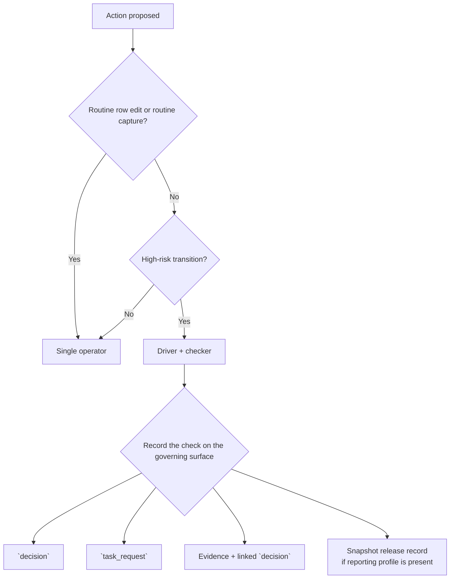

# Cartulary Team Behavior and Incident Handling

## Non-normative training deck

**SCN-001:** Cloud-identity-led incident with possible host impact

**Session intent:** Practice challenge, listening, workload redistribution, handoff quality, status discipline, and lesson follow-through without widening routine capture ceremony.

---

# SL-01 · Why Cartulary is grid-first and why the hot path must stay low ceremony

**Objective:** Explain why routine capture must stay fast, local, and workbook-first.

**SCN-001 beat:** A foreign sign-in, a rogue OAuth app, and a possible host tie to `WS-214` arrive before scope is clear.

- **Current surface truth:** built-in tabs stay **Timeline**, **Hosts**, **Identities**, **Evidence**, and **Notes**.
- **Good behavior:** make rough facts durable now; normalize later; keep work on the visible workbook surface.
- **Likely bad behavior:** form-gated capture, detached control panels, or approval ritual before facts are durable.
- **Surfaces involved:** Timeline, Notes, saved working view, built-in workbook frame.
- **Debrief:** What information had to become durable immediately, and what could wait for later normalization?
- **Observable:** Pass if the learner protects rough capture and can explain why later structure is acceptable; fail if first capture turns into ceremony.

<!--
**Intent:** Set the hot-path rule before any drill begins.

**Set-up:** Open with the first 20 minutes of SCN-001: the team has partial identity evidence, a possible host touchpoint, and no stable scope yet.

**Look for:** Participants should say that rough capture on the visible surface beats waiting for perfect fields, and that normalization can happen after durability.

**Correct if:** Anyone starts redesigning the capture path around detached forms, extra approvals, or richer first-entry structure.

**Debrief:** What information had to become durable immediately, and what could wait for later normalization?

**Current-surface boundary:** Do not imply that behavior training changes product conformance or that routine row edits need new workflow gates. Keep the boundary at low-ceremony workbook capture.

**[Sources]**
- `cartulary_team_behavior_training_deck_plan.md` §1, §4, §6, §10 MOD-01, §16.
- `03_workbook_interaction_collaboration_and_workflows.md` §1-2 on grid-first interaction and built-in tabs.
- `R04-responsive_browser_spreadsheet_ui_research_memo.md` thesis and executive summary on hot-path continuity.
- `R05-responsive-interface-design-report.cr.md` thesis and executive summary on direct manipulation and semantic continuity.
-->

---

# SL-02 · Product vs. playbook vs. training

**Objective:** Distinguish what Cartulary stores, what the playbook schedules, and what training teaches.

- **Good behavior:** keep durable coordination artifacts in Cartulary and cadence rules in the playbook layer.
- **Likely bad behavior:** inventing fake product workflow to solve a training problem.
- **Current surfaces:** `task_request`, `decision`, `party`, `comm_log`, `handoff`, `status_review`, `lesson`, plus note-backed incident-start brief, phase-change brief, and escalation note.
- **Guardrail:** saved-view scope is **not** access control; live visibility stays incident-scoped.
- **Debrief / Observable:** Pass if the learner routes each problem to the right layer; fail if they collapse behavior into product ritual.

<!--
**Intent:** Draw the line between durable product state, operating cadence, and human behavior so later drills do not overclaim the product.

**Set-up:** Use SCN-001 to ask where the next action belongs: as a durable artifact, as a timing rule, or as a coaching correction.

**Look for:** Participants should place ownership-bearing artifacts in product surfaces, timing rules in the playbook, and interpersonal skill in training.

**Correct if:** Someone treats note-backed patterns as first-class record types or claims that saved-view scope changes row or evidence access.

**Debrief:** Which part of this problem belongs to the product, which belongs to the playbook, and which belongs to human behavior?

**Current-surface boundary:** Do not imply hidden sub-workspaces, recipient-specific live visibility, or new approval choreography for ordinary capture.

**[Sources]**
- `cartulary_team_behavior_training_deck_plan.md` §2, §3, §6, §10 MOD-02, §16.
- `03_workbook_interaction_collaboration_and_workflows.md` §2 on workbook-native system views and saved-view semantics.
- `04_security_deployment_and_conformance.md` REQ-04-024..REQ-04-027 on incident-scoped visibility and saved-view scope boundaries.
- `R02-cartulary_crm_tem_dfir_research_report.md` §7-8 on product-model versus playbook/training split.
-->

---

# SL-03 · Safety voice

**Objective:** Raise a material concern clearly before hierarchy or tempo swallows it.

**SCN-001 beat:** The lead proposes immediate isolation of `WS-214`; a junior analyst thinks volatile browser artifacts may be lost.

- **Good behavior:** say the concern plainly, name the action at stake, and make follow-through durable.
- **Likely bad behavior:** vague challenge, hedging, or leaving the concern only in chat.
- **Route:** note-backed **escalation note** → `decision` or `task_request` with one owner and one next step.
- **Surfaces involved:** escalation note, `decision`, `task_request`, `status_review` if still open.
- **Debrief:** At what moment did the concern become operationally real, and where did the visible follow-through live?
- **Observable:** Pass if the concern becomes attributable and owned; fail if it is heard but not routed into durable follow-through.

<!--
**Intent:** Teach assertive challenge as a short, explicit move that becomes operational only when it lands on a durable surface.

**Set-up:** Narrate the proposed isolation of WS-214 and ask one participant to voice the evidence-preservation concern.

**Look for:** The best responses are plain, specific, and tied to a concrete action: what should pause, why it matters, and where the next step will live.

**Correct if:** Participants speak only in hints, ask the concern-holder to 'bring it up later,' or treat the conversation itself as sufficient evidence of follow-through.

**Debrief:** At what moment did the concern become operationally real, and where did the visible follow-through live?

**Current-surface boundary:** An escalation note is a note-backed pattern, not a first-class record type. The governing durable artifact is still the linked decision or task request.

**[Sources]**
- `cartulary_team_behavior_training_deck_plan.md` §10 MOD-03 and §12-13.
- `R02-cartulary_crm_tem_dfir_research_report.md` translation matrix rows on authority gradient, safety listening, and escalation ownership.
- `03_workbook_interaction_collaboration_and_workflows.md` §2 on workbook-native coordination surfaces.
-->

---

# SL-04 · Safety listening drill

**Drill prompt:** The analyst says, *“If we isolate now, we may lose the browser-session evidence that explains the rogue OAuth app.”*

- **Expected good behavior:** the lead acknowledges the concern, restates the risk, assigns an owner, and routes the issue into a `decision` or `task_request`.
- **Likely bad behavior:** defensive listening, “we’ll remember it,” or a pause with no owner.
- **Durable artifact:** one visible owner, one next step, one checkpoint if the concern stays open.
- **Surfaces involved:** escalation note, `decision`, `task_request`, `status_review`.
- **Debrief:** At what moment did the concern become operationally real, and where did the visible follow-through live?
- **Observable:** Pass if the team can point to the owner and the next check; fail if the concern disappears into conversation.

<!--
**Intent:** Run a short challenge/listening drill that forces the team to convert a voiced concern into owned follow-through.

**Set-up:** Assign one participant as analyst, one as lead, and optionally one as reviewer. Keep the exchange under sixty seconds before you ask where the issue now lives.

**Look for:** The lead should acknowledge the concern without defensiveness, restate the consequence, and route it into a durable artifact with an owner.

**Correct if:** The lead says 'good point' but records nothing, or the team debates the technical merits without deciding who owns the next action.

**Debrief:** At what moment did the concern become operationally real, and where did the visible follow-through live?

**Current-surface boundary:** Do not turn this into a generalized 'challenge button' on every row. The training point is behavior plus durable routing, not a new product primitive.

**[Sources]**
- `cartulary_team_behavior_training_deck_plan.md` §10 MOD-03 and §12-13.
- `R02-cartulary_crm_tem_dfir_research_report.md` rows on authority gradient, safety listening, and decision visibility.
-->

---

# SL-05 · Workload management and ownership visibility

**Objective:** Detect overload early, redistribute work, and keep the shared picture intact.

**SCN-001 beat:** Three new asks land while the incident lead is drafting the next update.

- **Good behavior:** convert each ask into a `task_request`, assign one owner, expose blocked reason and due state, and use shared views to show no-owner or blocked work.
- **Likely bad behavior:** work stays in notes, one person silently carries too many items, or blocked work is knowable only from memory.
- **Surfaces involved:** `task_request`, shared saved views, `status_review`.
- **Debrief:** Which signs showed overload early, and which surface made redistribution visible?
- **Observable:** Pass if the learner can point to owners, blocked work, and next actions; fail if the picture still depends on memory.

<!--
**Intent:** Teach workload as a coordination problem that becomes visible through owned tasks and shared views, not through heroic memory.

**Set-up:** Tell the room that three asks arrive at once: export Entra sign-in logs, confirm endpoint triage on WS-214, and draft the next holding update.

**Look for:** Participants should move quickly to one-owner task rows, visible blockers, and a saved view that makes queue state inspectable.

**Correct if:** Someone keeps the work inside a rolling note, says 'everyone knows who has what,' or leaves the lead as the default owner of all three asks.

**Debrief:** Which signs showed overload early, and which surface made redistribution visible?

**Current-surface boundary:** Do not imply that saved-view scope changes who can see incident data. The shared view is a coordination lens over incident-scoped visibility, not an ACL.

**[Sources]**
- `cartulary_team_behavior_training_deck_plan.md` §10 MOD-04 and §16.
- `R02-cartulary_crm_tem_dfir_research_report.md` translation matrix rows on workload management, task allocation, and shared situational awareness.
- `R06-spreadsheet_of_doom_dfir_research_report.md` sections on communication cadence, tracker hygiene, and companion artifacts.
-->

---

# SL-06 · Workload redistribution drill

**Drill prompt:** Reassign the three asks without losing the current picture.

- **Expected good behavior:** each ask becomes a `task_request`; one owner is visible; blocked reason and next action are visible; the saved view shows what changed.
- **Likely bad behavior:** the lead keeps all three asks, a blocked item stays hidden, or the work survives only as narrative prose.
- **Durable surfaces:** `task_request`, shared saved view, `status_review`.
- **Facilitation cue:** ask, *“If the next shift joined now, could they see overload without asking the room?”*
- **Debrief:** Which signs showed overload early, and which surface made redistribution visible?
- **Observable:** Pass if the team can prove redistribution from the workbook; fail if they can only describe it orally.

<!--
**Intent:** Turn workload theory into a quick redistribution exercise tied to visible ownership and blockers.

**Set-up:** Give participants thirty to sixty seconds to say who now owns each ask, what is blocked, and what the saved view should reveal.

**Look for:** Participants should describe a queue that another analyst could inspect without asking for oral reconstruction.

**Correct if:** They solve the drill by naming people only verbally or by keeping one important blocker outside the workbook surfaces.

**Debrief:** Which signs showed overload early, and which surface made redistribution visible?

**Current-surface boundary:** Do not widen this into a staffing doctrine. The product support is about visible owned work, not about prescribing team structure.

**[Sources]**
- `cartulary_team_behavior_training_deck_plan.md` §10 MOD-04 and §12-13.
- `R02-cartulary_crm_tem_dfir_research_report.md` workload/task-allocation rows.
- `R07-spreadsheet-of-doom-sod-report.cr.md` executive summary and socio-technical coordination sections.
-->

---

# SL-07 · Incident-start brief

**Objective:** Run a short incident-start brief that points the team into durable work.

- **SCN-001 beat:** Intake becomes active response.
- **Good behavior:** create a note-backed **incident-start brief** plus a saved working view; state priorities, risks, unknowns, posture, and next review time.
- **Likely bad behavior:** the brief becomes a permanent tracker instead of a short launch point.
- **Surfaces involved:** Notes, saved working view, `task_request`, `decision`.
- **Debrief / Observable:** Pass if another responder can join and explain the phase and next review without chat archaeology; fail if the brief carries work that should already live elsewhere.

<!--
**Intent:** Show the durable operating rhythm and position the incident-start brief as a short note-backed launch point, not a second tracker.

**Set-up:** Tell the room that SCN-001 has enough signal to open active response, but not enough certainty to claim full scope.

**Look for:** Participants should name priorities, risks, unknowns, and next review time, then move concrete asks into tasks and any posture choice into a decision.

**Correct if:** The brief turns into a long-running operational notebook or the room leaves concrete next steps embedded only in the note.

**Debrief:** What information belongs in the incident-start brief, and what must move immediately onto tasking or decision surfaces?

**Current-surface boundary:** The incident-start brief is a note-backed pattern, not a first-class record type. The brief should stay short and should not absorb ongoing operational state.

**[Sources]**
- `cartulary_team_behavior_training_deck_plan.md` §6, §10 MOD-05, §11-16.
- `R02-cartulary_crm_tem_dfir_research_report.md` rows on briefing discipline and operating-model boundaries.
- `03_workbook_interaction_collaboration_and_workflows.md` §2 on saved views and workbook-native coordination surfaces.
-->

---

# SL-08 · Phase-change brief drill

**Drill prompt:** Evidence now supports token theft and containment is next.

- **Expected good behavior:** create a note-backed **phase-change brief** plus the saved view that proves current state; link the `decision` that authorizes the posture change; move concrete actions into `task_request`.
- **Likely bad behavior:** phase change as narrative flourish, or a brief that becomes a second tracker.
- **Durable surfaces:** Notes, saved working view, `decision`, `task_request`.
- **Debrief:** What changed in posture, and which work or decision proves that change?
- **Observable:** Pass if another responder can join and explain the new phase and next review without reconstructing the shift from chat; fail if the brief carries live state that should live elsewhere.

<!--
**Intent:** Run the phase-change moment as a bounded coordination action: short note, explicit posture shift, linked decision, visible next work.

**Set-up:** Advance SCN-001: the team has enough evidence to move from investigation into containment planning.

**Look for:** Participants should state the posture change, show the decision that authorizes it, and surface the resulting tasks.

**Correct if:** They describe a mood change rather than a posture change, or they leave the authorizing choice implicit.

**Debrief:** What changed in posture, and which work or decision proves that change?

**Current-surface boundary:** Do not imply a first-class phase-change record. Keep the pattern note-backed and link the durable work to existing surfaces.

**[Sources]**
- `cartulary_team_behavior_training_deck_plan.md` §10 MOD-05 and §12-13.
- `R02-cartulary_crm_tem_dfir_research_report.md` rows on briefing discipline, decisions, and milestone-based coordination.
-->

---

# SL-09 · Status review

**Objective:** Checkpoint current state from the workbook rather than from memory.

**SCN-001 beat:** The team owes an internal checkpoint before the next stakeholder touchpoint.

- **Good behavior:** start from a saved view; record one `status_review` row per checkpoint; link blocked tasks, pending evidence, open decisions, and next review time.
- **Likely bad behavior:** rolling status note, chat-only commitments, or “nothing changed” without visible comparison.
- **Surfaces involved:** `status_review`, shared saved views, linked `task_request`, linked `decision`, pending evidence references.
- **Debrief:** What changed since the last checkpoint, and what promises did the update create?
- **Observable:** Pass if the learner can point to changed state, blockers, pending evidence, open decisions, and next-review timing; fail if the checkpoint is only narrative.

<!--
**Intent:** Teach status review as a repeatable workbook checkpoint, not a memory dump or a rolling prose artifact.

**Set-up:** Tell participants that the team must say what changed, what is blocked, and what still needs evidence before the next external update.

**Look for:** Good answers begin from a saved view and end with one visible status-review row that links the live coordination state.

**Correct if:** Participants recreate a rolling note or list disconnected facts without showing the change since the prior checkpoint.

**Debrief:** What changed since the last checkpoint, and what promises did the update create?

**Current-surface boundary:** A status review is a workbook-native coordination artifact. Do not imply that audience-specific visibility should be handled by hiding live rows.

**[Sources]**
- `cartulary_team_behavior_training_deck_plan.md` §10 MOD-06 and §12-13.
- `R02-cartulary_crm_tem_dfir_research_report.md` rows on shared situational awareness and communication cadence.
- `03_workbook_interaction_collaboration_and_workflows.md` §2 on workbook-native surfaces.
-->

---

# SL-10 · Stakeholder update drill

**Drill prompt:** A stakeholder asks, *“What changed, what is blocked, and when will the next update arrive?”*

- **Expected good behavior:** translate workbook truth into a `comm_log` entry with audience, summary, commitments, and next report time.
- **Likely bad behavior:** chat-only promise, update drift from workbook truth, or hiding live workspace content instead of using snapshot/release controls when needed.
- **Durable surfaces:** `comm_log`, linked `status_review`, linked `task_request`, linked `decision`.
- **Debrief:** What changed since the last checkpoint, and what promises did the update create?
- **Observable:** Pass if the update points to changed state, blockers, pending evidence, open decisions, and next-report timing; fail if it is narrative without durable links.

<!--
**Intent:** Teach the conversion from internal checkpoint to stakeholder-facing update without letting the narrative drift away from workbook truth.

**Set-up:** Use the existing SCN-001 checkpoint and ask one participant to deliver the update while another records where the commitments should live.

**Look for:** Participants should anchor the update in visible current state and commit to a next report time that becomes durable in the communications log.

**Correct if:** They promise a next step that is not linked anywhere durable, or they solve disclosure concerns by imagining hidden live-workspace visibility.

**Debrief:** What changed since the last checkpoint, and what promises did the update create?

**Current-surface boundary:** Live workspace visibility remains incident-scoped. Recipient-specific withholding belongs at snapshot, render, and release time, not in ad hoc live hiding.

**[Sources]**
- `cartulary_team_behavior_training_deck_plan.md` §10 MOD-06 and §16.
- `04_security_deployment_and_conformance.md` REQ-04-024..REQ-04-027 on incident-scoped live visibility and release-time withholding.
- `R02-cartulary_crm_tem_dfir_research_report.md` rows on communication cadence and status reporting.
-->

---

# SL-11 · Handoff principles

**Objective:** Transfer ownership in a way that shortens re-orientation time and preserves the current picture.

- **SCN-001 beat:** The current analyst rotates off shift during containment preparation.
- **Good behavior:** concise durable transfer from the current shared view.
- **Likely bad behavior:** oral recap only, chat-only recap, or a handoff longer than the time it saves.
- **Surfaces involved:** `handoff`, shared saved view, linked open tasks, linked open decisions, linked risk references.
- **Debrief / Observable:** Pass if the incoming owner can restate open work, open decisions, and next checks before acknowledging; fail if ownership changes without a durable transfer record.

<!--
**Intent:** Show that actor order matters in handoff: create, read, restate, correct, acknowledge.

**Set-up:** Tell the room that containment preparation continues but the current analyst is ending shift.

**Look for:** A good handoff is short, grounded in the current shared view, and complete only after the incoming owner accurately restates the current picture.

**Correct if:** Participants treat acknowledgement as a courtesy rather than proof that the current picture transferred correctly.

**Debrief:** What did the incoming owner have to be able to restate before the handoff counted as complete?

**Current-surface boundary:** Do not imply a hidden shift-private space. The handoff is still incident-scoped workbook coordination state.

**[Sources]**
- `cartulary_team_behavior_training_deck_plan.md` §10 MOD-07 and §14.
- `R02-cartulary_crm_tem_dfir_research_report.md` rows on handoff discipline and shared situational awareness.
- `R06-spreadsheet_of_doom_dfir_research_report.md` sections on cadence and tracker hygiene.
-->

---

# SL-12 · Handoff drill

**Drill prompt:** The outgoing owner leaves with one blocked collection task, one open containment decision, and one next check due in thirty minutes.

- **Expected good behavior:** the outgoing owner creates the `handoff` row from the current shared view; the incoming owner reads it, restates the picture, and acknowledges only after accurate restatement.
- **Likely bad behavior:** oral recap only, missing next checks, or ownership change without a durable record.
- **Durable surfaces:** `handoff`, shared saved view, linked `task_request`, linked `decision`.
- **Debrief:** What did the incoming owner have to be able to restate before the handoff counted as complete?
- **Observable:** Pass if the room can point to open work, open decisions, and next checks on the workbook surface; fail if the handoff survives only as conversation.

<!--
**Intent:** Run the handoff as a short exercise that proves whether the durable record is actually sufficient for re-entry.

**Set-up:** Assign one participant as outgoing owner and one as incoming owner. Give the outgoing owner a sixty-second limit to create the transfer.

**Look for:** The incoming owner should restate blocked work, open decisions, and the next two checks before acknowledging the handoff.

**Correct if:** The outgoing owner narrates history rather than current state, or the incoming owner acknowledges without restating anything.

**Debrief:** What did the incoming owner have to be able to restate before the handoff counted as complete?

**Current-surface boundary:** Do not let the drill drift into a long narrative dump. The point is fast re-orientation from durable state, not comprehensive storytelling.

**[Sources]**
- `cartulary_team_behavior_training_deck_plan.md` §10 MOD-07 and §12-14.
- `R02-cartulary_crm_tem_dfir_research_report.md` handoff-discipline row.
-->

---

# SL-13 · Selective second-person review

**Objective:** Distinguish routine single-operator work from the narrow class of actions that merit a driver/checker split.

- **SCN-001 beat:** The team is preparing a high-impact action.
- **Good behavior:** routine edits stay single-operator; only high-risk transitions get a checker.
- **Likely bad behavior:** generalized approval workflow or checker review on ordinary edits.
- **Debrief:** Why was this action eligible for a second-person check, and why would the same rule be harmful on routine edits?
- **Observable:** Pass if the learner can explain the narrow trigger and point to the governing surface; fail if review becomes always-on ritual.

<!--
**Intent:** Make second-person review restrictive and explicit so the team does not import cockpit ritual into routine workbook work.

**Set-up:** Ask the room which actions actually merit a checker in SCN-001 and which do not.

**Look for:** Participants should name high-risk transitions only: destructive containment, evidence release, or snapshot/external-release gating when the reporting profile is present.

**Correct if:** They propose checker review for ordinary edits, rough capture, or everyday status maintenance.

**Debrief:** Why was this action eligible for a second-person check, and why would the same rule be harmful on routine edits?

**Current-surface boundary:** Do not imply a generalized approval system. Snapshot release records matter only when that profile is present; routine workbook work remains single-operator.

**[Sources]**
- `cartulary_team_behavior_training_deck_plan.md` §10 MOD-08 and §14.
- `R02-cartulary_crm_tem_dfir_research_report.md` rows on mutual monitoring, selective review, and high-risk transitions.
- `04_security_deployment_and_conformance.md` §2.1 on bounded artifact-scoped release gate.
-->

---

# SL-14 · High-risk transition drill

**Drill prompt:** The team is ready to revoke active sessions and disable the rogue OAuth app after one final evidence pull.

- **Expected good behavior:** one driver executes, one checker verifies trigger, governing surface, and evidence posture, and the check is recorded durably.
- **Likely bad behavior:** no durable record of the check, or the same review rule spread back onto routine edits.
- **Durable surfaces:** `decision`, `task_request`, Evidence + linked `decision`, snapshot release records when that profile is present.
- **Debrief:** Why was this action eligible for a second-person check, and why would the same rule be harmful on routine edits?
- **Observable:** Pass if the team can show both the narrow trigger and the governing surface; fail if review becomes generic ceremony.

<!--
**Intent:** Run one bounded driver/checker exercise and then push the room to defend why the same pattern should not apply everywhere else.

**Set-up:** Advance SCN-001 to the moment just before revocation and app disablement. If useful, mention external release as the parallel case only when the reporting profile exists.

**Look for:** The checker should verify the trigger and the governing surface, not become a second primary operator.

**Correct if:** Participants treat the checker as a general approver or forget to record the review on the surface that governs the action.

**Debrief:** Why was this action eligible for a second-person check, and why would the same rule be harmful on routine edits?

**Current-surface boundary:** This is not a generalized workflow engine. Keep the review narrow, explicit, and tied to specific high-risk transitions.

**[Sources]**
- `cartulary_team_behavior_training_deck_plan.md` §10 MOD-08 and §16.
- `R02-cartulary_crm_tem_dfir_research_report.md` rows on selective review and high-risk action patterns.
- `04_security_deployment_and_conformance.md` on narrow release-gate scope.
-->

---

# SL-15 · Debrief and lessons-to-follow-up

**Objective:** Turn a lesson into owned follow-through rather than durable prose with no consequence.

**SCN-001 beat:** Closure finds one early evidence-handling miss that should change future practice.

- **Good behavior:** create a `lesson` row with summary, owner, linked follow-up `task_request`, and supporting evidence refs.
- **Likely bad behavior:** lessons stay in free text or close with no linked follow-through.
- **Surfaces involved:** `lesson`, linked `task_request`, supporting Evidence or source rows.
- **Debrief:** What changed because of this lesson, and where is that change visible?
- **Observable:** Pass if the lesson is linked to real follow-through or is explicitly observational-only; fail if it is durable prose with no operational consequence.

<!--
**Intent:** Teach closure as a loop back into future operations through owned lessons and linked follow-up work.

**Set-up:** Tell the room that the incident is stabilizing and one early evidence-handling mistake is now visible enough to name.

**Look for:** Participants should create one lesson with an owner, supporting refs, and a linked follow-up task when change is actually required.

**Correct if:** They treat the lesson as a prose archive or close it immediately without deciding whether any work now exists because of it.

**Debrief:** What changed because of this lesson, and where is that change visible?

**Current-surface boundary:** Do not turn TEM-style threat/error language into mandatory row taxonomy. The lesson surface is for milestone learning and follow-through, not per-row ritual.

**[Sources]**
- `cartulary_team_behavior_training_deck_plan.md` §10 MOD-09 and §16.
- `R02-cartulary_crm_tem_dfir_research_report.md` rows on debrief and lessons-learned follow-through.
-->

---

# SL-16 · Closure drill

**Drill prompt:** Close SCN-001 without losing the one change future responders actually need.

- **Expected good behavior:** create or update the `lesson`, link the follow-up `task_request`, preserve supporting refs, and close the lesson only when work is done or explicitly canceled.
- **Likely bad behavior:** “lesson learned” with no owner, no task, or no proof of what should change.
- **Durable surfaces:** `lesson`, linked `task_request`, supporting Evidence or source rows.
- **Debrief:** What changed because of this lesson, and where is that change visible?
- **Observable:** Pass if the team can show the owner, the follow-up, and the evidence basis; fail if closure produces only narrative residue.

<!--
**Intent:** Run the last mile of the scenario so participants feel the difference between narrative closure and operational closure.

**Set-up:** Ask the room to write the closure move for SCN-001 in one minute: what is learned, who owns the follow-up, and where the supporting refs live.

**Look for:** The room should link exactly one concrete change into a task or explicitly state that the lesson is observational-only and why.

**Correct if:** They confuse closure with forgetting. Press for owner, support refs, and follow-up state.

**Debrief:** What changed because of this lesson, and where is that change visible?

**Current-surface boundary:** Do not imply that every lesson must create new work. Observational-only lessons are valid if that status is explicit and honest.

**[Sources]**
- `cartulary_team_behavior_training_deck_plan.md` §10 MOD-09 and §11-13.
- `R02-cartulary_crm_tem_dfir_research_report.md` rows on lessons-learned follow-through.
-->

---

# SL-17 · Anti-patterns and misuse signals

**Objective:** Recognize when the team is drifting back toward an undisciplined Spreadsheet of Doom operating model.

- **Chat-only decision** → create a `decision` with owner and next step.
- **Ownerless work** → create or repair the `task_request` and show blocked reason.
- **Rolling status note** → checkpoint into `status_review` and link live blockers.
- **Handoff longer than the time it saves** → rebuild from the current shared view into one concise `handoff`.
- **Routine edits sent for review** → return to single-operator work; keep checker review for high-risk transitions only.
- **Saved-view scope treated as access control** → remember that scope changes discoverability and mutability of the view object only.
- **Debrief / Observable:** Pass if the learner proposes the smallest correct repair on the right surface; fail if the repair adds new ritual or hides the real problem.

<!--
**Intent:** Convert the whole session into a misuse detector: spot drift early and repair it with the smallest valid move.

**Set-up:** Revisit SCN-001 and ask the room where the team could still drift into chat-only state, ownerless work, ritualized review, or ACL-like thinking about saved views.

**Look for:** Participants should diagnose the misuse signal quickly and pick the smallest surface-correct repair rather than proposing a new module or heavier process.

**Correct if:** They answer with more ceremony, a new record type, or a hidden workspace concept that the product does not claim.

**Debrief:** Which misuse signal creates the most operational risk here, and what is the smallest correct repair?

**Current-surface boundary:** Keep the product truth intact: workbook-native surfaces, incident-scoped live visibility, and narrow review only for high-risk transitions.

**[Sources]**
- `cartulary_team_behavior_training_deck_plan.md` §10 MOD-10, §16-17.
- `04_security_deployment_and_conformance.md` REQ-04-024..REQ-04-027 on visibility and scope boundaries.
- `R06-spreadsheet_of_doom_dfir_research_report.md` and `R07-spreadsheet-of-doom-sod-report.cr.md` on tracker hygiene and common operating picture drift.
-->

---

# SL-18 · Summary and operating commitments

**Session close:** turn the deck into four durable operating commitments.

1. **Capture rough facts fast** on the workbook surface; normalize later.
2. **Make coordination durable** in workbook-native surfaces: `task_request`, `decision`, `comm_log`, `handoff`, `status_review`, `lesson`.
3. **Keep visibility honest:** saved-view scope is not access control, and recipient-specific withholding happens at snapshot or release time.
4. **Keep extra ceremony narrow:** high-risk transitions may need a checker; routine edits do not.

**Final debrief:** What is one behavior your team will change on the next live incident, and which surface will prove it happened?

**Observable:** Pass if the learner can name one concrete behavior change and one surface that will carry it; fail if the commitment stays generic or tool-tour oriented.

<!--
**Intent:** Leave the room with a small set of durable operating commitments tied to explicit surfaces and bounded product claims.

**Set-up:** Ask each participant or small group to name one change they will make on the next real incident and the workbook-native surface that would prove it.

**Look for:** Good answers are concrete, surface-bound, and narrow: one behavior, one surface, one proof of follow-through.

**Correct if:** The answer is generic ('communicate better') or turns into a feature tour rather than an operating commitment.

**Debrief:** What is one behavior your team will change on the next live incident, and which surface will prove it happened?

**Current-surface boundary:** This remains a non-normative training deck. It does not redefine product conformance, create new record types, or widen routine ceremony.

**[Sources]**
- `cartulary_team_behavior_training_deck_plan.md` §16-18.
- `03_workbook_interaction_collaboration_and_workflows.md` §2 on workbook-native coordination surfaces.
- `04_security_deployment_and_conformance.md` on visibility and release-time withholding boundaries.
- `R02-cartulary_crm_tem_dfir_research_report.md` on translated CRM/TEM behaviors worth keeping.
-->