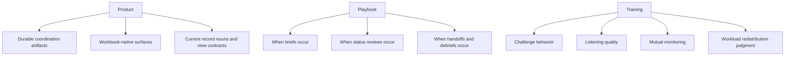
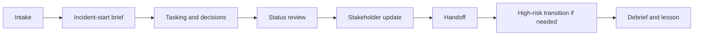

# Cartulary Team Behavior and Incident Handling Training Deck Production Plan

Status: Draft production plan.

Artifact class: Non-normative production plan for a non-normative training deck.

Target output: One Slidev deck in plain-text Markdown with speaker notes and mermaid diagrams only where role flow, decision flow, or operating rhythm is easier to understand visually.

## 1. Purpose

This plan defines how to produce a **Team Behavior and Incident Handling Training Deck** for Cartulary. The deck is not a product spec, not a playbook, and not a feature tour. Its job is to train the human behaviors that the product can support but cannot teach on its own: assertive challenge, non-defensive listening, mutual monitoring, workload redistribution, handoff quality, status-update discipline, and debrief quality.[^1][^2]

The deck MUST remain aligned with the current Cartulary core. It MUST teach current product facts exactly as they exist now: Cartulary is grid-first; the built-in tabs remain Timeline, Hosts, Identities, Evidence, and Notes; coordination surfaces such as `task_request`, `decision`, `party`, `comm_log`, `handoff`, `status_review`, and `lesson` remain workbook-native surfaces rather than separate modules.[^3][^4][^5]

The deck MUST also preserve the hot-path boundary. It MUST NOT introduce cockpit-style ritual on routine row edits, feature new approval choreography for ordinary capture, or imply that behavior training changes product conformance. The training layer explains how teams should behave while using Cartulary. It does not redefine the product.[^1][^3][^6][^7]

## 2. Governing drafting contract

### 2.1 Source precedence for deck facts

The deck MUST follow this authority order for any statement about Cartulary behavior: current normative core first, then non-normative operating guidance and playbook material, then the research reports as rationale and example support. The deck MUST treat research as explanatory evidence, not as authority to invent new product behavior.[^8][^9]

### 2.2 Source precedence for drafting method

The **NLSpec document is the governing drafting guide** for how this deck is specified and built. In this plan, that means the deck specification MUST satisfy five NLSpec properties:

- behavioral completeness,
- unambiguous interfaces,
- explicit defaults and boundaries,
- mapping tables for translations across concepts,
- testable acceptance criteria.[^10]

The plan also applies the NLSpec recreatability test. A second instructor who did not help author the deck SHOULD be able to deliver a materially equivalent session from the final Slidev file and speaker notes alone. If that is not possible, the deck plan is incomplete.[^10]

## 3. Scope, boundary, and non-goals

The deck MUST cover these teaching areas because they are the clearest behavior gaps identified by the CRM/TEM transfer work and by the SoD operating-model research: authority gradient and challenge, listening quality, mutual monitoring for high-risk actions, workload management and task shedding, briefing and handoff discipline, shared situational awareness, communication cadence, and lessons-learned follow-through.[^1][^11][^12]

The deck MUST NOT do the following:

- become a generic Cartulary feature walkthrough,
- imply that saved-view scope is access control,
- imply that live workspace visibility is recipient-specific,
- imply that second-person review applies to routine edits,
- imply that incident-start brief, phase-change brief, or escalation note are first-class record types,
- imply that raw coordination text is externally releasable by default.[^3][^5][^6][^7]

## 4. Output contract

The production output SHOULD be one Slidev source file. A recommended filename is `cartulary_team_behavior_and_incident_handling_training_deck.md`, but the exact repo-relative path MAY change later without changing this plan.

The deck MUST remain plain-text source. The authoritative artifact is the Markdown file, not a binary slide export. Mermaid MAY be used for operating rhythm, decision trees, and role-transfer diagrams. Images are optional. If images are used later, they SHOULD support the scenario directly rather than turning the deck into a UI gallery.[^13][^14]

The deck MUST include speaker notes for every non-title slide. Those notes MUST contain, at minimum:

- the teaching intent,
- the scenario setup,
- the expected good behavior,
- the likely bad behavior,
- the correction or facilitation cue,
- the debrief question,
- a `[Sources]` block for non-trivial claims and any external assets.

## 5. Audience and delivery assumptions

This plan assumes a mixed operational audience: incident leads, analysts, stakeholder liaisons, evidence custodians, and review partners. Those overlays are already reflected in the operating guide and playbook, so the deck SHOULD use them as its human role frame rather than inventing new role classes.[^6][^15]

This plan also assumes one coherent incident story spanning intake, active response, containment or release risk, handoff, and closure. A single scenario is preferable to disconnected vignettes because it keeps the training coherent and mirrors how SoD-style investigation work actually accumulates state, ownership, reporting pressure, and follow-through over time.[^11][^12][^16][^17]

### Assumptions

- Default scenario domain: a cloud-identity-led incident with possible host impact. This is a planning default, not a product requirement.
- Default delivery length: 60 to 75 minutes.
- Default deck size: 19 primary slides, with up to 4 optional appendix slides.

## 6. Content architecture

The deck MUST begin with behavior framing, not interface enumeration. The first content slide MUST explain why Cartulary is grid-first and why the hot path must remain low ceremony. The second content slide MUST clarify the product vs. playbook vs. training split. Only after those two framing moves should the deck introduce the behavior modules.[^1][^3][^4][^13][^14]

The deck MUST use the following conceptual split early and explicitly.[^1][^6][^11][^12]

The deck MUST teach one operating rhythm repeatedly so the scenario remains coherent.[^6][^15]

## 7. Source-to-role mapping

The following source-role mapping governs how content is selected and where each source should influence the deck.[^1][^3][^6][^10][^11][^12][^13][^14][^16][^17]

| Source | Role in deck production | What it should control |
| --- | --- | --- |
| Core 00-04 | Product truth | Current nouns, boundaries, surfaces, authorization, and release-gate facts |
| Operating model guide | Operating patterns | Current coordination rhythm, note-backed patterns, and operator-facing procedures |
| Incident coordination playbook | Operator compression | Shorter operator framing, misuse signals, and definition-of-done style checks |
| R02 | Primary behavior rationale | Challenge, listening, monitoring, workload, brief/handoff/debrief, and split of product vs playbook vs training |
| R04 | Hot-path and semantic-continuity constraint | Why the deck must not advocate ceremony on routine capture |
| R05 | Cognitive continuity and direct-manipulation constraint | Why training should keep the work surface central and avoid detached control metaphors |
| R01 | Workbook-centric IR exemplar | How an IR tool can remain workbook-shaped while supporting derived views and reporting |
| R03 | Text-native companion-artifact exemplar | Why Markdown notes, playbooks, and report outputs fit naturally beside workbook-centric IR tooling |
| R06 and R07 | SoD socio-technical model | Ownership, cadence, tracker hygiene, companion-artifact boundaries, and the shared operating picture |
| NLSpec | Drafting governor | Completeness, explicit defaults, mapping tables, and acceptance criteria |

## 8. Deck structure and slide budget

The default deck SHOULD use this exact primary slide map.

- `SL-00` Title and session intent.
- `SL-01` Why Cartulary is grid-first and why the hot path must stay low ceremony.
- `SL-02` Product vs. playbook vs. training split.
- `SL-03` Safety voice.
- `SL-04` Safety listening drill.
- `SL-05` Workload management and ownership visibility.
- `SL-06` Workload redistribution drill.
- `SL-07` Incident-start brief.
- `SL-08` Phase-change brief drill.
- `SL-09` Status review.
- `SL-10` Stakeholder update drill.
- `SL-11` Handoff principles.
- `SL-12` Handoff drill.
- `SL-13` Selective second-person review.
- `SL-14` High-risk transition drill.
- `SL-15` Debrief and lessons-to-follow-up.
- `SL-16` Closure drill.
- `SL-17` Anti-patterns and misuse signals.
- `SL-18` Summary and operating commitments.

Optional appendix slides MAY cover glossary, exact `view_schema_id` references, or a facilitation quick-reference sheet, but they MUST NOT carry new instructional content required for the main session.

## 9. Module specification template

Every behavior module from `MOD-01` through `MOD-10` MUST be authored using the same specification shape.

- `module_id`
- `title`
- `learning_objective`
- `scenario_beat`
- `expected_good_behavior`
- `likely_bad_behavior`
- `cartulary_surfaces_involved`
- `required_debrief_prompt`
- `pass_fail_observable`
- `speaker_note_requirements`

This template is mandatory because NLSpec requires the deck boundary between instructor, participant, scenario, and product surface to be explicit rather than implicit.[^10]

## 10. Detailed module plan

### MOD-01. Why Cartulary is grid-first and why the hot path must stay low ceremony

**Learning objective:** the learner can explain why routine capture must stay fast, local, and workbook-first.

**Scenario beat:** the incident begins with messy, partial facts. The team does not yet know whether the initial indicator is isolated or systemic.

**Expected good behavior:** capture rough facts immediately, keep work on the visible surface, and avoid delaying capture until every field is perfect.

**Likely bad behavior:** forcing full structure up front, moving into detached forms, or adding approval ritual before rough facts are durable.

**Cartulary surfaces involved:** Timeline, Notes, saved working view, and the built-in workbook frame.

**Required debrief prompt:** “What information had to become durable immediately, and what could wait for later normalization?”

**Pass/fail observable:** pass if the learner preserves rough capture and can explain why later structure is acceptable; fail if the learner turns first capture into form-gated ceremony.

**Slide requirement:** one framing slide only. It MUST establish the hot-path rule before any behavior drill begins.[^1][^3][^13][^14]

### MOD-02. Product vs. playbook vs. training split

**Learning objective:** the learner can distinguish what Cartulary stores, what the playbook schedules, and what training teaches.

**Scenario beat:** the team must decide whether a problem belongs in a durable product artifact, in an operating step, or in a coaching correction.

**Expected good behavior:** keep durable coordination artifacts in Cartulary, keep cadence decisions in the playbook layer, and keep judgment or interpersonal skill in training.

**Likely bad behavior:** inventing product behavior to compensate for a training problem, or treating note-backed patterns as first-class record types.

**Cartulary surfaces involved:** `task_request`, `decision`, `party`, `comm_log`, `handoff`, `status_review`, `lesson`, plus note-backed incident-start brief, phase-change brief, and escalation note.

**Required debrief prompt:** “Which part of this problem belongs to the product, which belongs to the playbook, and which belongs to human behavior?”

**Pass/fail observable:** pass if the learner routes each item to the correct layer; fail if they try to solve behavior gaps with fake product workflow.

**Slide requirement:** one framing slide only. It MUST appear before the first drill slide.[^1][^5][^6][^11][^12]

### MOD-03. Safety voice and safety listening

**Learning objective:** the learner can raise a material concern clearly and can acknowledge, route, and resolve that concern without hierarchy swallowing it.

**Scenario beat:** a junior analyst sees evidence suggesting that an apparently safe containment action may destroy useful evidence.

**Expected good behavior:** the analyst states the concern plainly; the lead acknowledges it; the team records the issue in an escalation note and routes it into a `decision` or `task_request` with an owner and next step.

**Likely bad behavior:** vague challenge, dismissive listening, no owner, or leaving the issue only in chat.

**Cartulary surfaces involved:** linked note for escalation, `decision`, `task_request`, and `status_review` if the issue remains open at the next checkpoint.

**Required debrief prompt:** “At what moment did the concern become operationally real, and where did the visible follow-through live?”

**Pass/fail observable:** pass if the concern becomes attributable and owned; fail if it is heard but not routed into durable follow-through.

**Slide requirement:** two slides. One MUST teach the principle. One MUST run the drill.[^1][^6]

### MOD-04. Workload management and ownership visibility

**Learning objective:** the learner can detect overload, redistribute work, and make ownership visible without losing the shared picture.

**Scenario beat:** three new collection asks arrive while the incident lead is also preparing a stakeholder update.

**Expected good behavior:** move concrete asks onto `task_request`, assign one owner per item, expose blockers and due state, and use shared views to reveal no-owner or blocked work.

**Likely bad behavior:** work stays in narrative notes, one person silently carries too many items, or the team cannot say what is blocked.

**Cartulary surfaces involved:** `task_request`, shared saved views, and `status_review`.

**Required debrief prompt:** “Which signs showed overload early, and which surface made redistribution visible?”

**Pass/fail observable:** pass if the learner can point to owners, blocked work, and next actions; fail if the operational picture still depends on memory.

**Slide requirement:** two slides. One MUST teach the tasking model. One MUST run the redistribution drill.[^1][^6][^11][^12]

### MOD-05. Incident-start brief and phase-change brief drills

**Learning objective:** the learner can run a brief that is short, phase-appropriate, and linked to durable work.

**Scenario beat:** the incident moves from intake into active response, then later from investigation into containment.

**Expected good behavior:** create a brief note plus saved view; state priorities, risks, unknowns, next review time, and posture; move concrete asks into `task_request`; link a `decision` when the phase change depends on an explicit choice.

**Likely bad behavior:** the brief becomes a permanent tracker, or the team treats phase change as a narrative flourish without linked work.

**Cartulary surfaces involved:** Notes, saved working view, `task_request`, and `decision`.

**Required debrief prompt:** “What changed in posture, and which work or decision proves that change?”

**Pass/fail observable:** pass if another responder can join and explain the current phase and next review without reconstructing it from chat; fail if the brief contains ongoing operational state that should already live elsewhere.

**Slide requirement:** two slides. One slide MUST cover incident-start brief. One slide MUST cover phase-change brief.[^6][^15]

### MOD-06. Status review and stakeholder update drills

**Learning objective:** the learner can checkpoint current state from the workbook rather than from memory, and can convert that checkpoint into a stakeholder-facing update without drift.

**Scenario beat:** the team owes an update and must explain what changed, what is blocked, and when the next report will come.

**Expected good behavior:** start from a saved view; record `status_review` as one row per checkpoint; link blocked tasks, pending evidence, and open decisions; record external or internal updates in `comm_log` with audience, summary, commitments, and next report time.

**Likely bad behavior:** rolling status note, chat-only commitments, or stakeholder updates that drift from workbook truth.

**Cartulary surfaces involved:** `status_review`, `comm_log`, shared saved views, linked `task_request`, linked `decision`.

**Required debrief prompt:** “What changed since the last checkpoint, and what promises did the update create?”

**Pass/fail observable:** pass if the learner can point to changed state, blockers, pending evidence, open decisions, and next-report timing; fail if the update is only narrative without durable links.

**Slide requirement:** two slides. One MUST cover status review. One MUST cover stakeholder update drill.[^6][^11][^12][^15]

### MOD-07. Handoff drills

**Learning objective:** the learner can transfer ownership in a way that reduces re-orientation time and preserves the current picture.

**Scenario beat:** the current analyst rotates off shift during active containment preparation.

**Expected good behavior:** the outgoing owner creates a `handoff` row from the current shared view; the incoming owner reads it, restates the current picture and next checks, and acknowledges only after accurate restatement.

**Likely bad behavior:** oral recap only, chat-only recap, or a handoff so long that it saves no time.

**Cartulary surfaces involved:** `handoff`, linked open tasks, linked open decisions, linked risk references, shared saved view.

**Required debrief prompt:** “What did the incoming owner have to be able to restate before the handoff counted as complete?”

**Pass/fail observable:** pass if open work, open decisions, and next checks are visible and acknowledged; fail if ownership changed without a durable transfer record.

**Slide requirement:** two slides. One MUST teach the handoff contract. One MUST run the handoff drill.[^6][^15]

### MOD-08. Selective second-person review for high-risk transitions

**Learning objective:** the learner can distinguish routine single-operator work from the narrow class of actions that merit a targeted driver/checker split.

**Scenario beat:** the team is about to execute destructive containment or release evidence that could alter legal or evidentiary posture.

**Expected good behavior:** keep routine edits single-operator; for high-risk transitions, use one driver and one checker; record the check on the governing surface, which is usually `decision`, `task_request`, Evidence plus linked `decision`, or snapshot release records.

**Likely bad behavior:** spreading review to ordinary edits, inventing a generalized approval workflow, or failing to record the check on the governing surface.

**Cartulary surfaces involved:** `decision`, `task_request`, Evidence, and snapshot release records when the reporting profile is present.

**Required debrief prompt:** “Why was this action eligible for a second-person check, and why would the same rule be harmful on routine edits?”

**Pass/fail observable:** pass if the learner can explain the narrow trigger and point to the governing surface; fail if they apply review as an always-on ritual.

**Slide requirement:** two slides. One MUST teach the rule. One MUST run the high-risk drill.[^1][^6][^7][^15]

### MOD-09. Debrief and lessons-to-follow-up drills

**Learning objective:** the learner can turn a lesson into durable follow-through rather than prose with no owner.

**Scenario beat:** the incident closes, and one failure in early evidence handling needs to become a change in future practice.

**Expected good behavior:** create a `lesson` row with summary, owner, follow-up tasks, and supporting evidence refs; create linked `task_request` rows for operational follow-through; close the lesson only when the work is done or explicitly canceled.

**Likely bad behavior:** lessons stay in free text, or closure happens with no linked follow-through.

**Cartulary surfaces involved:** `lesson`, linked `task_request`, supporting Evidence or source rows.

**Required debrief prompt:** “What changed because of this lesson, and where is that change visible?”

**Pass/fail observable:** pass if the lesson is linked to real follow-through or explicitly observational-only; fail if the lesson is durable prose with no operational consequence.

**Slide requirement:** two slides. One MUST teach lesson capture. One MUST run the closure drill.[^1][^6][^15]

### MOD-10. Anti-patterns and misuse signals

**Learning objective:** the learner can recognize when the team is turning Cartulary into another spreadsheet of doom rather than a disciplined shared operating picture.

**Scenario beat:** the session revisits the same incident and identifies where the team could drift into chat-only decisions, ownerless work, rolling status notes, ritualized review, and handoffs longer than the time they save.

**Expected good behavior:** diagnose the misuse signal and name the correct repair using current surfaces and current behavior rules.

**Likely bad behavior:** accepting drift because the information still exists “somewhere.”

**Cartulary surfaces involved:** all surfaces already taught, especially `task_request`, `decision`, `status_review`, `comm_log`, `handoff`, and `lesson`.

**Required debrief prompt:** “Which misuse signal creates the most operational risk here, and what is the smallest correct repair?”

**Pass/fail observable:** pass if the learner proposes a repair that uses the right surface and does not widen ceremony; fail if the repair adds new ritual or hides the real problem.

**Slide requirement:** one anti-pattern slide plus one summary slide. The summary slide MUST convert the session into operating commitments.[^6][^15][^17]

## 11. Scenario design contract

The deck MUST use one primary scenario, identified as `SCN-001`, that traverses the full incident arc. The scenario SHOULD include all of the following beats:

- intake with partial facts,
- incident-start brief,
- at least one concern that requires challenge and listening,
- at least one workload spike,
- a material phase change,
- a formal status checkpoint,
- a stakeholder update with a next-report commitment,
- a shift or owner handoff,
- one high-risk transition that may justify second-person review,
- closure and at least one lesson with follow-through.

The scenario MUST be realistic enough that a learner can believe the operational tradeoffs, but it MUST remain generic enough that the deck does not become vertical-specific product marketing.

## 12. Slide authoring rules

Every teaching slide MUST satisfy the following rules:

- It teaches one main behavior only.
- It names only current record nouns and current surfaces.
- It introduces UI or surface detail only when that detail is necessary to support a behavior point.
- It avoids dense prose that would belong in a written playbook instead.
- It uses exact current terms for note-backed patterns such as incident-start brief, phase-change brief, and escalation note.
- It does not claim saved-view scope changes access semantics.
- It does not claim live recipient-specific withholding in the base workspace.

Every drill slide MUST satisfy the following rules:

- It states the scenario beat clearly.
- It states the expected good behavior.
- It states the likely bad behavior.
- It names the Cartulary surfaces that should carry the durable artifact.
- It ends with one concrete debrief prompt.

## 13. Speaker note contract

Speaker notes are the main place where the deck becomes instructionally complete. For each non-title slide, the notes MUST include:

1. `Intent`: one sentence describing what the slide teaches.
2. `Set-up`: the scenario context the instructor must state aloud.
3. `Look for`: what a good answer or good behavior sounds like.
4. `Correct if`: the most likely misconception.
5. `Debrief`: one exact debrief question.
6. `Current-surface boundary`: any fact the instructor must not overclaim.
7. `[Sources]`: source list for claims or assets.

This note shape is required because the deck is supposed to pass the recreatability test for another instructor.[^10]

## 14. Mermaid and visual policy

The deck SHOULD prefer plain text, simple layout, and mermaid for relationship-heavy explanations. Mermaid is justified for:

- the product vs. playbook vs. training split,
- the incident operating rhythm,
- selective second-person review decision logic,
- handoff or status-flow explanation where sequence matters.

The deck SHOULD NOT rely on large UI screenshots for introductory teaching. If screenshots are used later, they SHOULD appear only after the learner already understands the behavior being illustrated.

## 15. Production workflow

The deck SHOULD be produced in five phases.

### Phase 1. Source extraction and fact lock

Create a short evidence matrix keyed by module ID. Confirm the exact current product nouns, boundary rules, and note-backed patterns. Lock those facts before slide writing begins.

**Exit condition:** every module has at least one authoritative source for current product facts and at least one rationale source for why that behavior matters.

### Phase 2. Scenario brief

Write `SCN-001` as a short incident narrative with named phases, one workload spike, one handoff, one stakeholder update, one high-risk transition, and one closure lesson.

**Exit condition:** the scenario covers every module without requiring disconnected example stories.

### Phase 3. Slide map and module cards

Create one card for each module using the required module template. Map each card to its slide IDs.

**Exit condition:** the 19-slide structure is stable and every slide has a defined learning role.

### Phase 4. Slidev draft

Draft the Slidev Markdown deck. Add speaker notes as each slide is created rather than as a later pass.

**Exit condition:** every non-title slide has notes, every module has a pass/fail observable, and the deck can be walked end to end without missing transitions.

### Phase 5. Review and QA

Run a review pass against the acceptance criteria below. Remove any slide that functions mainly as a feature tour or duplicates playbook prose.

**Exit condition:** the deck is facilitation-ready and does not overclaim product behavior.

## 16. Acceptance criteria for the final deck

The training deck is ready for review only when all of the following are true:

- It is one Slidev Markdown file in plain text.
- It is visibly non-normative.
- It follows the 19-slide primary structure or an explicitly justified equivalent.
- It begins with grid-first and low-ceremony framing before behavior drills.
- It states the product vs. playbook vs. training split explicitly.
- It covers every required module from this plan.
- Every module states a learning objective, scenario beat, expected good behavior, likely bad behavior, surfaces involved, debrief prompt, and pass/fail observable.
- Every non-title slide has speaker notes with a `[Sources]` block.
- It uses only current built-in tabs, current coordination surfaces, and current note-backed pattern names.
- It keeps saved-view scope separate from access semantics.
- It keeps live visibility incident-scoped and routes recipient-specific withholding to snapshot or release time.
- It keeps second-person review narrow and high-risk only.
- It does not turn the deck into a UI-first feature tour.
- A second instructor can deliver a materially equivalent session from the deck and notes alone.[^3][^5][^6][^7][^8][^10]

## 17. Risks and anti-patterns during production

The deck will fail its purpose if any of the following happens:

- slide writing starts from UI surfaces instead of from behaviors,
- the scenario becomes a collection of unrelated mini-demos,
- the deck invents new record types or workflow gates,
- the deck confuses note-backed patterns with first-class objects,
- the deck turns second-person review into routine approval,
- the deck uses long prose where a playbook or note would be clearer,
- the deck relies on memory rather than notes to explain how to facilitate a slide,
- the deck omits pass/fail observables and therefore cannot be assessed consistently.

## 18. Recommended next deliverable after this plan

The next production artifact SHOULD be the actual Slidev source deck, built directly from this plan, not an intermediate prose outline. The fastest correct path is:

1. write `SCN-001`,
2. build module cards,
3. draft the 19-slide Slidev deck with notes,
4. run the acceptance checklist above.

## Sources

[^1]: [`R02-cartulary_crm_tem_dfir_research_report.md`](sandbox:/mnt/data/R02-cartulary_crm_tem_dfir_research_report.md), lines 4-14, 38-66, and 68-120.

[^2]: [`R02-cartulary_crm_tem_dfir_research_report.md`](sandbox:/mnt/data/R02-cartulary_crm_tem_dfir_research_report.md), lines 120-210 and 223-260.

[^3]: [`03_workbook_interaction_collaboration_and_workflows.md`](sandbox:/mnt/data/03_workbook_interaction_collaboration_and_workflows.md), lines 3-20 and 27-76.

[^4]: [`02_domain_model_schema_and_history.md`](sandbox:/mnt/data/02_domain_model_schema_and_history.md), lines 16-46.

[^5]: [`04_security_deployment_and_conformance.md`](sandbox:/mnt/data/04_security_deployment_and_conformance.md), lines 142-160 and 179-218.

[^6]: [`cartulary_non_normative_operating_model_guidance.md`](sandbox:/mnt/data/cartulary_non_normative_operating_model_guidance.md), lines 110-173, 175-252, 277-379, 381-552, 554-600, and 604-690.

[^7]: [`incident_coordination_playbook.md`](sandbox:/mnt/data/incident_coordination_playbook.md), lines 68-110, 414-452, and 520-540.

[^8]: [`00_document_set_status_and_precedence.md`](sandbox:/mnt/data/00_document_set_status_and_precedence.md), lines 3-22 and 24-34.

[^9]: [`cartulary_non_normative_operating_model_guidance.md`](sandbox:/mnt/data/cartulary_non_normative_operating_model_guidance.md), lines 1-45.

[^10]: [`nlspec-spec.md`](sandbox:/mnt/data/nlspec-spec.md), lines 30-72, 75-91, and 94-120.

[^11]: [`R06-spreadsheet_of_doom_dfir_research_report.md`](sandbox:/mnt/data/R06-spreadsheet_of_doom_dfir_research_report.md), lines 8-26, 30-42, 79-97, and 112-116.

[^12]: [`R07-spreadsheet-of-doom-sod-report.cr.md`](sandbox:/mnt/data/R07-spreadsheet-of-doom-sod-report.cr.md), lines 8-18, 37-40, and 79-97.

[^13]: [`R04-responsive_browser_spreadsheet_ui_research_memo.md`](sandbox:/mnt/data/R04-responsive_browser_spreadsheet_ui_research_memo.md), lines 7-21 and 25-49.

[^14]: [`R05-responsive-interface-design-report.cr.md`](sandbox:/mnt/data/R05-responsive-interface-design-report.cr.md), lines 3-19 and 29-39.

[^15]: [`incident_coordination_playbook.md`](sandbox:/mnt/data/incident_coordination_playbook.md), lines 68-110, 257-340, 414-452, and 520-540.

[^16]: [`R01-aurora_incident_response_report.md`](sandbox:/mnt/data/R01-aurora_incident_response_report.md), lines 5-9 and 21-25.

[^17]: [`R03-Kanvas_technical_research_report.md`](sandbox:/mnt/data/R03-Kanvas_technical_research_report.md), lines 4-8, 24-28, 56-60, and 76-86.
