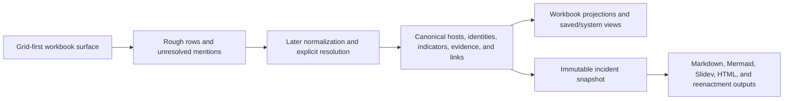
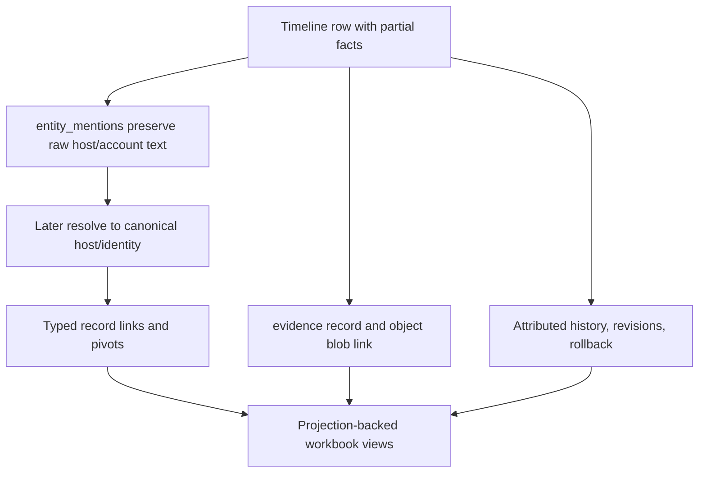
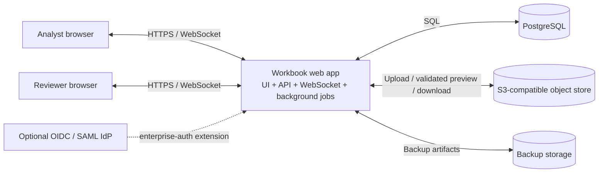
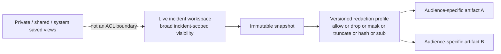

# Cartulary

Cartulary is an open-source, specification-first incident-response workbook system intended to replace the spreadsheet-centric coordination pattern widely known in DFIR as the **Spreadsheet of Doom**.

The project currently exists as a natural-language specification. No runnable implementation exists yet. This README explains what the current specification is designed to achieve, how the system is intended to work, and how it is meant to replace spreadsheet-based incident coordination with minimal friction for working responders.

## Why the Spreadsheet of Doom persists

The Spreadsheet of Doom persists because it solves an operational problem honestly. Excel and similar workbook tools are familiar, widely available, instantly shareable, and tolerant of incomplete information. In active incident response, the ability to type directly into cells with almost no ceremony is the difference between capturing a fact now and intending to capture it later.

In practice, the Spreadsheet of Doom is usually a multi-tab workbook used as the mutable common operating picture for notes, scope, identities, systems, indicators, evidence, tasking, and timeline events. It works because rough capture stays on the hot path and because it fits familiar Microsoft Office and M365 ways of working. It becomes fragile because the same workbook is forced to carry structure, linking, history, coordination, and reporting duties that spreadsheets handle badly.

## What Cartulary is for

Cartulary is designed to preserve the low-friction strengths of the Spreadsheet of Doom while replacing its main limitations with a database-backed system designed for live incident work.

The design center is straightforward:

- keep rough capture fast;
- keep the workbook metaphor at the view layer;
- move the source of truth out of cell positions and into stable records;
- allow later normalization, linking, analysis, audit, and reporting without erasing original analyst input.

This is not a forms-first case management tool. It is a workbook-shaped system for incident response in which rough capture remains valid and later structure is added explicitly.

## Workbook interaction model

Cartulary centers rough, high-speed incident data capture through a live grid-oriented web interface. The base workbook exposes a small set of built-in sheets and a broader set of contract-backed system views and coordination surfaces, all identified by stable `view_schema_id` rather than by visible tab names or column labels.

The base profile defines **fourteen** pack-independent standardized workbook surfaces:

**Built-in sheets** provide the primary grid surfaces for core incident data: **Timeline**, **Hosts**, **Identities**, **Evidence**, and **Notes**.

**Contract-backed system views** expose additional structured record types through the same workbook interaction model without adding built-in tabs: **Indicators**, **Compromise Assessments**, **Task Requests**, **Decisions**, and **Parties**. Parties is an incident-scoped coordination-identity surface for requester, collector, source, audience, and similar party-like references; it is not deployment-local user administration.

**Artifact-backed coordination surfaces** provide workbook-native views for structured coordination artifacts: **Communications Log**, **Handoff**, **Status Review**, and **Lesson**.

Beyond the fourteen required surfaces, three **standardized optional** artifact-backed surfaces are defined for implementations that choose to expose them: **Findings**, **Investigative Queries**, and **Forensic Keywords**. These remain artifact-backed and do not require additional built-in sheets.

Each visible sheet is a denormalized projection over relational source state. Write-back is intent-aware and contract-driven. Edits are routed by stable `view_schema_id` and `field_key`, not by visible tab names, column labels, or cell position.

Operationally, the important interaction rules are:

- **Grid first, forms second.** Inline editing, keyboard navigation, and paste are primary. Enrichment belongs in an inspector, not in the default entry path.
- **Rough capture is valid.** Null timestamps, uncertain text, unresolved host strings, and incomplete details are legitimate first-pass records.
- **Mentions before entities.** Typing a host or identity token on the Timeline creates an unresolved mention, not an implicit canonical record. Resolution is later and explicit.
- **Evidence without navigation.** Screenshot attachment is drag-and-drop or clipboard paste onto the current row, with preview handled adjacent to the grid.
- **Clipboard paste is day-one behavior.** Bulk paste from existing spreadsheets remains on the hot path.

This is the core architectural thesis of the project: the spreadsheet metaphor survives at the view layer, but not at the storage layer.

## Architecture

Cartulary uses a **modular monolith**. The intended base deployment is one web application deployable containing the browser UI, API surface, WebSocket collaboration hub, and background-job runners, backed by PostgreSQL for authoritative structured state and an S3-compatible object store for binary evidence.

PostgreSQL is a deliberate architectural choice. DFIR incident data is heterogeneous: typed records, free-text fields, semi-structured metadata, case-insensitive identifiers, partial uniqueness rules, append-only history, and projection-backed workbook views all need to coexist in one operationally simple system. PostgreSQL supports that breadth without forcing a more specialized stack.

Binary evidence belongs outside the relational store. In disconnected deployments the intended object store is MinIO. In on-premises or cloud deployments, equivalent managed services can replace PostgreSQL and object storage so long as the data and behavioral contracts remain unchanged.

Microservice decomposition is out of scope. The hard problems here are mutation semantics, projection maintenance, concurrency, and interaction design, not horizontal service partitioning.

## Coordination as a first-class concern

Cartulary is not only a data system. It is also a socio-technical coordination tool.

Traditional spreadsheet-based workflows are good at rough capture and weak at observable, auditable coordination. Tasking, ownership, decision trace, handoff quality, and work distribution are often buried in chat, side notes, or analyst memory. Cartulary is intended to improve those coordination failures without displacing rough capture from the operational hot path.

The project draws selectively on **crew resource management** and **threat and error management** concepts from aviation. The transfer is not about importing cockpit ritual into DFIR. It is about making coordination state more explicit under pressure: who owns what, what is blocked, what changed, what needs review, and what must be handed off or briefed next.

That design direction produces workbook-native artifacts and views for:

- **Task requests and decisions.** Both are first-class record types with lifecycle machines defining state sets, legal transitions, and post-commit guards. Task requests support queue-oriented filtering by status, owner, priority, workstream, and due date. Decisions track type, rationale, review state, and supersession.
- **Communications logs.** Structured records for audience, channel or meeting context, summary, referenced decisions, and action follow-up.
- **Handoffs and status reviews.** Handoff records carry current state, open work, open risks, and next checks. Status reviews surface blocked work, pending evidence, open decisions, risk summary, and next report timing.
- **Lessons learned.** Structured follow-up tasks, evidence references, and closure state.
- **Queue-oriented saved views** for blocked work, no-owner work, overdue items, pending evidence, and shift-change focus.

The specification also defines a **hypothesis boundary**: current-profile hypotheses are artifact-backed through `finding.kind='hypothesis'` rather than being a separate first-class record type. That preserves the "capture first, structure later" principle for analytic reasoning while keeping the door open for promotion if later usage demonstrates the need.

The boundary is strict: coordination surfaces must stay adjacent to the grid and must not add measurable ceremony to routine capture. Non-normative operating-model guidance for tracker hygiene, companion findings-document discipline, handoff quality, status-review cadence, and related practices is provided separately in Appendix H.

## Visibility, release, and redaction

Within a live incident workspace, data is meant to remain broadly visible to authenticated incident participants in core response roles such as analysts, reviewers, incident leads, evidence custodians, and stakeholder liaisons. The base incident role model is `viewer`, `editor`, `reviewer`, and `admin`. Saved views support discoverability and working sets, but they are not access-control boundaries.

External release is handled separately from live workspace visibility. Cartulary treats reporting as a snapshot-and-render problem, not as a direct read from live workbook tables. The system captures an immutable incident snapshot, materializes a canonical export model, and applies versioned redaction profiles before any release artifact is rendered.

For multi-party incidents, the same snapshot can produce different recipient-specific artifacts. The specification expresses that through disclosure partitions and a closed redaction vocabulary of `allow`, `drop`, `mask`, `truncate`, `hash`, and `stub`. In practice, that means the system can exclude, mask, or pseudonymize other parties' material, including their PII, at release time without hiding the live internal workspace from the incident team.

## Deployment and security posture

The minimum useful deployment model is an **air-gapped flyaway kit**: one application container, one PostgreSQL container, and one MinIO container on encrypted storage. This is the smallest deployment that preserves binary evidence handling, collaboration, authentication, and auditable source-of-truth behavior without collapsing back into a workbook file.

The broader deployment posture is intentionally flexible:

- disconnected flyaway deployment is the minimum baseline;
- optional offline reference packs and datasets support enrichment without live network dependency;
- on-premises deployments may substitute managed PostgreSQL or object storage equivalents;
- cloud deployments may run behind the same logical contracts;
- enterprise authentication is an extension, not a base dependency.

Base authentication uses local user accounts stored in PostgreSQL, Argon2id password hashing, and offline-capable TOTP MFA. OIDC is the preferred enterprise authentication extension, with SAML as the secondary path when required.

Administrative scope is deliberately separated from incident scope. The current specification defines a narrow deployment-local `deployment_admin` capability for local account administration. It does not, by itself, grant incident data access. Incident membership and incident roles remain the boundary for viewing or mutating incident data.

### Backup and restore

Operational backup and restore are base-profile requirements, not optional operational extras. Each successful backup produces a retained `backup_set` bound to a single `consistency_point_at` across PostgreSQL and the object store. A durable `backup_attestation` record carries restore anchors, a retention floor, and restore-verification state. The specification requires at least one successful `backup_set` within the past 24 hours, a minimum 30-day retention period for each successful set, and full restore verification in an isolated environment at least every 7 days. Backup and restore are distinct from whole-incident portability.

### Security posture

The security posture is explicit:

- incident-authored content is rendered as untrusted content;
- active content is blocked from executing in the application origin;
- spreadsheet and CSV export neutralize formula-injection characters by default;
- upload, preview, import, and archive-extraction paths fail closed on path-traversal or invalid-root behavior;
- reference-pack activation fails closed on checksum or signature mismatch;
- invalid deployment configuration fails before the application starts;
- flyaway and disconnected deployments must keep all storage roots on encrypted storage.

The deployment-configuration contract declares explicit runtime roots for database storage, object storage, backup storage, reference-pack storage, temporary work files, and export outputs. Missing or invalid configuration fails startup rather than falling back to hidden defaults.

## Reporting direction

Reporting is a subsystem, not an afterthought. Cartulary's intended reporting path is:

1. capture immutable snapshot;
2. materialize canonical export model;
3. render deterministic outputs from that frozen state.

The supported output directions include Markdown reports, Mermaid diagram sources, Slidev presentation decks, HTML reports, and operator-facing reenactment outputs such as Asciinema-style terminal walkthroughs generated from selected command-line evidence. Reenactment outputs are visibly marked as generated presentation material and are not eligible for external release.

Generated presentations may reorganize snapshot facts and render deterministic summaries from approved fields, but they must not invent facts, infer unobserved activity, or present generated material as operator-observed evidence. Generated report artifacts must be self-contained: they cannot depend on remote JavaScript, CSS, or font assets at render time.

Post-MVP reporting direction includes internal incident-start briefings, phase-change briefings, and deterministic local generation of daily briefing artifacts from timeline and status-review updates.

## Specification structure

Cartulary is currently a specification repository. The normative core is organized as:

- `00_document_set_status_and_precedence.md`
- `01_architecture_storage_and_view_contracts.md`
- `02_domain_model_schema_and_history.md`
- `03_workbook_interaction_collaboration_and_workflows.md`
- `04_security_deployment_and_conformance.md`

A normative companion document governs claim-bearing publication for timed or fixture-sensitive criteria:

- `05_claim_publication_and_benchmark_reproducibility.md`

Core 05 is not part of base-profile or extension-profile implementation conformance. It governs only the conditions under which public performance claims may be made, including benchmark fixtures, benchmark-profile identifiers, measurement-predicate registries, and audit-bundle retention.

Supporting appendices preserve rationale, diagrams, schema reference material, workflow illustrations, the roadmap, the source traceability matrix, the original exploratory design artifact, and operating-model guidance:

- `A_problem_framing_rationale_tradeoffs_and_sanity_check.md`
- `B_architecture_diagrams_and_explanatory_source_extract.md`
- `C_schema_reference_and_ddl_source_extract.md`
- `D_workflow_and_ui_illustrations_source_extract.md`
- `E_roadmap_open_questions_and_decision_backlog.md`
- `F_source_traceability_matrix.md`
- `G_source_archive_exploratory_design_artifact.md`
- `H_operating_model_supporting_guidance.md`

The current core also defines bounded extension profiles for:

- **Import** — file-based structured import from spreadsheet and CSV sources through a session-based contract.
- **Snapshot and Reporting** — immutable snapshot capture, canonical export-model materialization, redaction, template rendering, and release-gate approval.
- **Incident Portability** — full-fidelity administrative whole-incident export and import between trusted Cartulary deployments.
- **Reference Pack** — reference-pack activation, refresh, verification lifecycle, and overlay behavior.
- **Enterprise Authentication** — OIDC and SAML provider integration.

## Project status

Cartulary is in a pre-implementation planning phase. The repository currently defines the intended architecture, data model, workbook behavior, security posture, deployment model, and conformance boundaries. There is no runnable product yet.

At this stage, the repository should be read as a buildable specification corpus rather than as an implementation tree. The immediate value is in design review, contradiction repair, implementation planning, and eventual translation of the current normative core into code.

## License

Apache-2.0. All runtime dependencies use permissive-only licenses.

## Acknowledgements

Cartulary was informed by prior art and adjacent work that helped clarify both the operational problem and the specification method used to describe the solution.

In particular, the project benefited from study of [Aurora Incident Response](https://github.com/cyb3rfox/Aurora-Incident-Response) and [Kanvas](https://github.com/WithSecureLabs/Kanvas), two concrete DFIR workbook tools that preserve spreadsheet-centered investigation workflow while adding structure, visualization, and reporting around it.

The specification-writing approach used for Cartulary also draws on the [NLSpec-Spec](https://github.com/TG-Techie/NLSpec-Spec) project and its grounding document on natural-language specifications. That work helped shape the corpus structure, requirement discipline, and expectation that the specification should be authoritative enough to drive later implementation.

These acknowledgements recognize prior art and method influence, not shared code or implementation dependency.